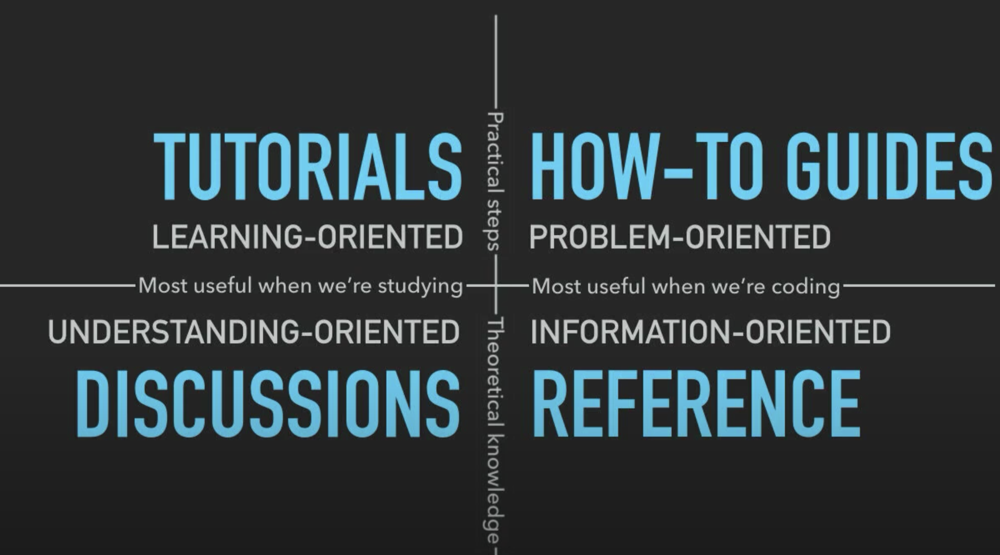

> If you want them to read the freaking manual , make a better freaking manual.

> If people don’t know why your project exists,
> they won’t use it.
> If people can’t figure out how to install your code,
> they won’t use it.
> If people can’t figure out how to use your code,
> they won’t use it.

> Code tells what, docs tell why

Although not the most favorite part for some developers, documentation is no less important than code. It's the key to a great developer experience. We wrote a few articles regarding how to approach documenting Webiny code and features.

## Docs-First Methodology

We employ a documentation-first methodology to help ensure the documentation remains a complete and trusted resource. It makes communicating about the use of Webiny more efficient.

What does it mean in practice?

1. If the answer to a question exists in the documentation, share the link to the documentation instead of rephrasing the information.

2. When you encounter new information not available in the documentation (for example, when working on a support case or testing a feature), your first step should be to create a pull request to add this information to the documentation. You can then share the PR to communicate this information.

3. New information that would be useful toward the future usage or troubleshooting of Webiny should not be written directly in a forum or other messaging system, but added to a documentation PR and then referenced, as described above.

The more we reflexively add useful information, the more (and more successfully) the documentation is used.

Having a knowledge base in any form that is separate from the documentation would be against the documentation-first methodology. This includes sharing knowledge on the community forum or the community slack.

### Troubleshooting Section

Often there are questions from users on particular topics. We find ourselves answering those same questions repeatedly, and this is something we should avoid. But we can't do it by not answering and supporting our users. Instead, we are taking a different approach.

Going forward, for any article we write, if there are issues reported by users, even if it's a mistake on their end. Find the article that they followed and add a Troubleshooting section at the bottom of the article. Paste their question/problem there, provide the answer, and then share the link with the user.

If an article covering this topic doesn't exist - create one.

In certain cases, you might not be ready to write down the answer and create the article. It might be because you're working on something at the moment. In such situations you might think to just write a 2-line response to the user -> **please don't do that. You might be saving time in the short term, but in the long term, you're just creating another form of technical debt.**

If you don't have the time to create the article - ask the user to open an issue under our docs portal with the question. Once we document this and close the issue, the user receives a notification.

## Building the Documentation App

Webiny docs repository uses [docusaurus](https://v2.docusaurus.io/) as the system to manage the documentation.

To run the docs portal locally on your machine:

1. `git clone https://github.com/webiny/docs.webiny.com.git`
2. `cd docs.webiny.com/website`
3. `npm install`
4. `npm start`

All the articles are inside the `/docs` folder. Edit `/website/sidebars.js` if you need to manage the items in the sidebar.

### Linters

Besides the documentation app you need to install [Vale](https://docs.errata.ai/vale/install) to help with style checks and "linting" of your articles.

To run the lint execute this command in the root of the documentation app:

`$ vale docs`

:::info
There is also a very handy VS Code extension for Vale: https://github.com/errata-ai/vale-vscode
:::

## How To Approach Writing an Article?

Before jumping in you should first do some planning and ask yourself a set of basic questions. Those questions are your guides. They help you structure your article in a much better way, and your readers will have a more pleasant experience reading it.

### Question 1: Who?

Picture the ideal persona who's going to read your article. Here are some common questions to help you determine who your reader is?

1. Are they a developer, a designer, or of some other profession?
2. What is their background?
3. How experienced are they with the technology?
4. What is it they are trying to learn?
5. What kind of problem they have?

### Question 2: What?

What should you be writing?

1. **Scope** - know what things you plan to write about. Make a list of topics, and stick to them. In case some other basic knowledge is required to understand this article, it's good to point this out to the reader and provide links to those resources.

2. **Type of the document** - There are many different types of documents that you can write. Choose one, and focus on its format. (see document types below)

3. **Goal** - Once you know the scope and the type of the document, it's time to put things to paper. First, define the goal of your article. If you ever get stuck with moving forward with the article, try reflecting back on the goal. Often we can stray away from the original path.

4. **Use-cases** - List at least one use-cases (but more is better). What is the problem/issue the user has experienced that this article addresses. Think about what is the potential query a user has googled that took him to your page.

Once you have this backing information, you're ready to start producing the content. The first things you should address are: title and intro. This gives you the initial form you can follow to create your article.

### Question 3: What's Next?

You have your article ready - what to do next?

**Read, Review, Publish** - Once you've written your article, read it. Start from the beginning, ensure it makes sense and there are no loose ends in the flow. Once ready, send a PR for the team to review before it's merged and published.

**How and when to ask for reviews?** At 30% done (your first draft or outline). At this point, you’re not asking for in-depth feedback or reviewing for typos and grammar. The goal is for the reviewer to engage in the broader outline, flow, and structure of the document. At 90% done (your final draft), you’re asking them to go over the documentation with a fine-tooth comb and nit-pick any issues.

### Document Types

Source: https://www.youtube.com/watch?v=t4vKPhjcMZg

There are several types of documents that we follow at Webiny. Each type is described below.

**Tutorials** - Learning-oriented. The writer sets a scene. It usually takes several steps to get solved. Focuses on reproducible examples. Tutorials are intended for true beginners. Those users don't yet know how to ask Webiny related questions, they are just getting started. The tutorial guides them from the very start to a ready-made solution. This is like a cake recipe, you start at the very beginning and provide a series of steps till the cake is done.

Examples:

- How to build an eCommerce with Webiny Headless CMS
- How to build a google maps plugin for Webiny Page Builder

**How to guides** - Problem-oriented. Addresses particular use-cases. Guides are intended for users that have gone through Webiny tutorials, and now are building their solution or a project. Through that journey, they have a series of concrete questions. The answers to these questions already take several assumptions the user has of the platform. This is similar to a recipe, but focuses on one particular item, say creating a frosting for the cake. You don't need the whole recipe, you start at a reasonable point.

Examples:

- How to implement authentication in front of Webiny pages
- How to connect Gatsby to Webiny Headless CMS

**References** - Information oriented. Describes the classes, APIs...

**Key topics** - How stuff works under the hood. The architecture and the technical decision of certain key implementations. As you will - the theory of things.

Examples:

- Webiny architecture
- Page Builder - build system
- Stacks
- Environments
- States

**Usage examples** - These articles are focused on non-technical users. They teach them how to use the Webiny apps like Page Builder and similar.

Examples:

- How to use the Page Builder editor
- How to build forms

### Structure

This is a simple and good way to structure your article:

- **Title**: What is it?
- **Overview**: What you will learn
- **Table of contents**: Internal navigation (automatically generated)
- **Features**: Each section of the document
- **Read next / Learn more**: Related documents that might help the user
- **Troubleshooting**: User questions, common mistakes, and solutions

### Language

- Great writers use less words, and not more. Try to keep your sentences short and concise.
- User US English and grammar.
- Use inclusive language (they, them instead of his, hers).
- Use the second-person point of view (you, yours)

### Style Guide

To help everyone write and use the same writing style, Webiny documentation has a defined style guide.

There are many style guides on the internet. Instead of creating a new one, we decided to opt-in and use one of the publicly available ones.

For Webiny documentation, please follow the style guide defined by GitLab:
https://docs.gitlab.com/ee/development/documentation/styleguide.html#language

Many of the guide definitions are tested via the `Vale` tool.

## References

- [book] Conversation and Community by Anne Gentle
- https://www.sohamkamani.com/blog/how-to-write-good-documentation/
- https://www.joelonsoftware.com/2000/10/02/painless-functional-specifications-part-1-why-bother/
- https://plan.io/blog/technical-documentation/
- https://dev.to/cjbrooks12/5-tips-for-writing-good-documentation-2clm
- https://opensource.com/business/15/5/write-better-docs
- https://www.youtube.com/watch?v=G49RUPv5-NU&ab_channel=BigThink
- https://www.writethedocs.org/guide/writing/beginners-guide-to-docs/
- https://codeascraft.com/2018/10/10/etsys-experiment-with-immutable-documentation/
- https://medium.com/larimaza-en/how-to-write-good-documentation-e19c70dc67f0
- https://blog.jooq.org/2013/02/26/the-golden-rules-of-code-documentation/
- https://hackernoon.com/write-good-documentation-6caffb9082b4
