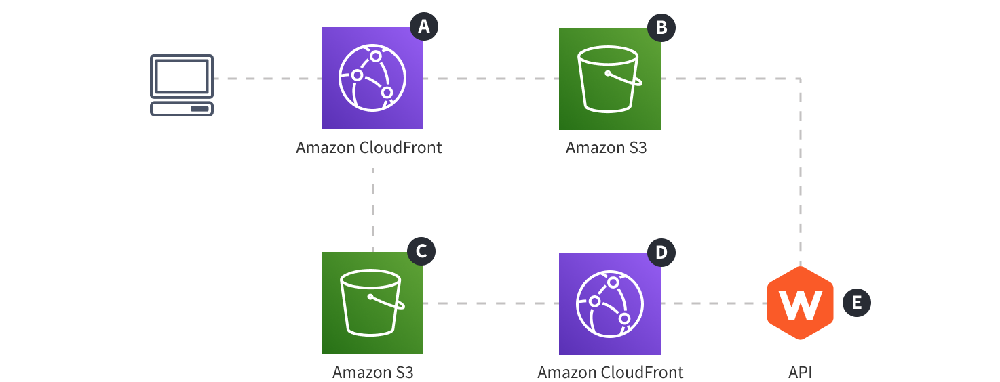

import { Alert } from "@/components/Alert";

<Alert type="success" title="What you’ll learn">

- the necessary cloud infrastructure resources on which the **Website** project application relies on

</Alert>

## Diagram

## Description

The diagram gives an overview of the complete cloud infrastructure that's needed to host the **Website** project application and, in combination with the **API** project application, that makes prerendering of pages possible.

As we can see, the cloud infrastructure consists of five resources - two Amazon CloudFront distributions <diagram-letter>A</diagram-letter> <diagram-letter>D</diagram-letter>, two Amazon S3 buckets <diagram-letter>B</diagram-letter> <diagram-letter>C</diagram-letter>, and the **API** project application.

The **API** project application is included in the diagram because this is the application that's hosting the mentioned **Prerendering Service**, which coordinates the whole prerendering process.

<Alert type="info">

To learn more about the API project application's cloud infrastructure, check out the [API](/docs/{version}/architecture/api/introduction) section.

</Alert>

Select the **Prerendering Pages** diagram in the above diagram selector to see how it works.
