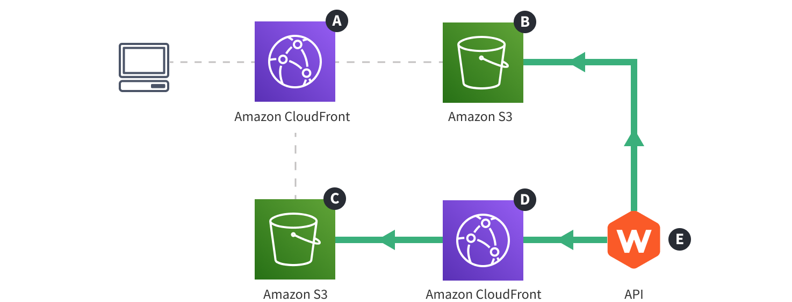

import { Alert } from "@/components/Alert";

<Alert type="success" title="What you’ll learn">

- how the Prerendering Service (located in the **API** project application) utilizes **Website**'s cloud infrastructure resources in order to prerender your public website's pages and store their HTML and relevant metadata

</Alert>

## Diagram

## Description

The diagram shows how the Prerendering Service, located in the **API** project application <diagram-letter>E</diagram-letter>, interacts with the **Website** application's cloud infrastructure, in order to prerender pages and store static HTML and related data files into the Amazon S3 bucket <diagram-letter>B</diagram-letter>, ready to be served to actual website users.

<Alert type="info">

To learn more about the API project application's cloud infrastructure, check out the [API](../../architecture/api/overview) section.

</Alert>

## Steps

1. A user first publishes a page from the Admin Area. This is a simple GraphQL request, issued to the GraphQL Server that's located in the **API** application <diagram-letter>E</diagram-letter>.
2. This triggers a prerendering request, meaning, a separate Lambda function (again, located in the **API** application <diagram-letter>E</diagram-letter>) issues an HTTP request to the Amazon CloudFront distribution <diagram-letter>D</diagram-letter>.
3. The request is forwarded to the Amazon S3 bucket <diagram-letter>C</diagram-letter>. This is where the actual React application, with all of its code and static assets, is hosted.
4. The mentioned Lambda function waits until the React application, served via the Amazon CloudFront distribution <diagram-letter>D</diagram-letter> has been completely rendered.
5. Finally, it stores the generated HTML and some additional data into the Amazon S3 bucket <diagram-letter>B</diagram-letter>.

With these steps completed, the page is ready to be served to actual website visitors. Learn more about this flow by selecting **Serving Pages** in the upper diagram selector.
