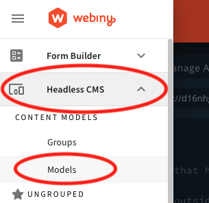
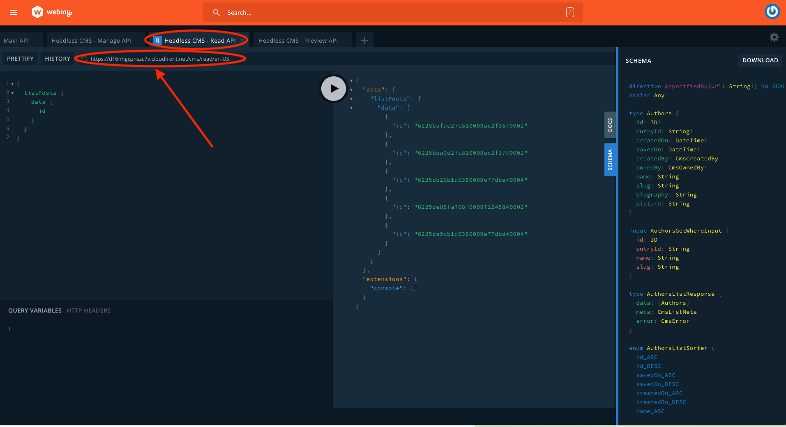
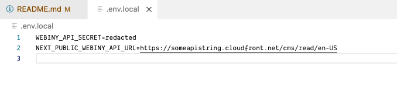
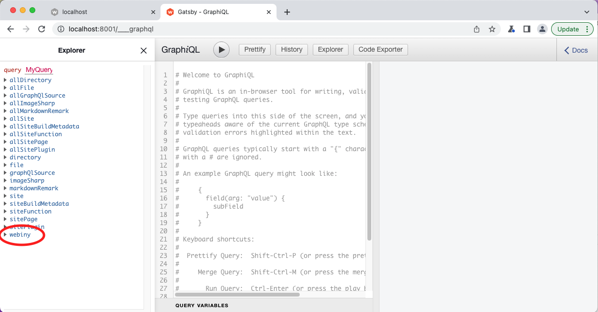
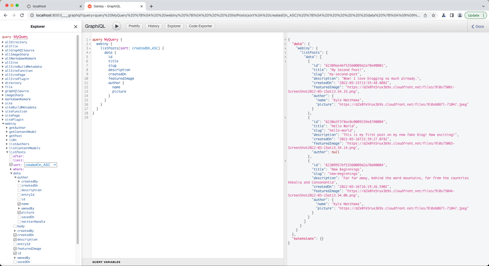

import { Alert } from "@/components/Alert";

<Alert type="success" title="What you'll learn">

- how to fetch data from Webiny
- how to render data using Gatsby's data layer
- how to parse data including rich text

</Alert>

## Overview

In this article we'll learn how to integrate a GatsbyJS application that uses Webiny as a Headless CMS. We'll go through the following:

1. Getting started with Webiny
2. Setting up a GatsbyJS project
3. Fetching data
4. Rendering data using Gatsby's data layer
5. Rendering Webiny's rich text field

## Getting started with Webiny

Webiny works really well as a headless CMS with [GatsbyJS](http://gatsbyjs.com),

The easiest way to get started is to use the [official starter](https://github.com/webiny/gatsby-starter-webiny), but we're going to walk through a similar custom implementation here.

<Alert type="info">

Use the [official starter](https://github.com/webiny/gatsby-starter-webiny) for 1-click install on Gatsby Cloud.

</Alert>

For this tutorial, we're going to assume you have already done the following:

1. [Set up your AWS credentials locally](/docs/{version}/infrastructure/aws/configure-aws-credentials)
2. [Deployed a Webiny instance to a dev environment](/docs/{version}/core-development-concepts/basics/project-deployment)

Once you have an app up and running, click into the "Headless CMS" app in the sidebar, click on _models_.



Add the following models and fields: (Skip this step if you already have content models defined)

### Authors

- A `text` field with the value "name"
- A `text` field with the value "slug" (optionally add a validator using this regex which will make sure you have valid urls: `^(?!.*--)[a-z0-9\-]+$`)
- a `files` field with the value "picture"
- a `text` field with the value "description"
- a `text` field with the value "twitterHandle"

### Posts

- A `text` field with the value "title"
- A `text` field with the value "slug" (optionally use the regex above as a validator)
- A `files` field with the value "featured image"
- A `rich text` field with the value "body"
- A `reference` field with the value "author"
- A `text` field with the value "description"

Next, add some content by going to Headless CMS > Ungrouped and choosing a content model.

Before we spin up our Gatsby project, let's go to the API playground and see how our GraphQL API is structured. In the sidebar menu, choose "API Playground" to open the GraphQL explorer.



Notice that there are four APIs listed in the tabs at the top of the page. Choose **HeadlessCMS - Read API**. From here you can explore your content structure and the schema (via the right side panel). Directly below the tabs is a URL string. That's the URL you can use to fetch data. Make a note of this URL, you'll need it soon.

<Alert type="info">

For more information about the [Headless CMS GraphQL API, see this page of our docs](/docs/{version}/headless-cms/basics/graphql-api).

</Alert>

Next, let's configure API credentials. Choose **API Keys** in the sidebar. Add an API key with any name and description. Select "Headless CMS" and choose a Custom access level for all content model groups with the values `read` and `preview`. Make sure to leave "manage" unchecked. This will help secure our Webiny instance.

If you're planning to source images from Webiny too, scroll down to the "File Manager" section and enable Custom access to all files with `read` as the primary action.

Save the API token and the Token itself will be revealed. You can use the same API token for both published and draft posts.

## Set up a GatsbyJS project

You can [follow the "Quick Start" page on the Gatsby site](https://www.gatsbyjs.com/docs/quick-start), or run `npm init gatsby` to spin up a basic project.

Once you've done one of these, add a new file `.env` to the project root. Gatsby will look for environment variables in that location.

<Alert type="info">

[You can read more about how Gatsby uses Environment Variables here](https://www.gatsbyjs.com/docs/how-to/local-development/environment-variables/).

</Alert>

Add the API endpoint URL (maybe call it `WEBINY_API_URL`), and the API token (maybe as `WEBINY_API_TOKEN`).

```bash .env.local
WEBINY_API_TOKEN=<your-url-here>
WEBINY_API_URL=<your-token-here>
```

Make sure you don't commit this file to your project's git repository otherwise anyone could gain access to your API. You can do that by adding it to the `.gitignore` file.



## Fetching data

We're going to be using the plugin `gatsby-source-graphql` to fetch data from the GraphQL endpoint in our webiny instance. Run the following command to add the plugin:

```bash
  npm install gatsby-source-graphql
```

Next, open the file `gatsby-config.js` and add the following. First we need to import `dotenv` and specify where we have put our environment variables so we can access them. Then inside the exported object we're going to define our new plugin and the configuration we need to fetch data:

```javascript gatsby-config.js
  require("dotenv").config({
    path: `.env`,
  })

  module.exports = {
    // other config
    plugins: [
      {
        resolve: `gatsby-source-graphql`,
        options: {
          typeName: "Webiny",
          fieldName: "webiny",
          url: process.env.WEBINY_API_URL,
          headers: {
            Authorization: `Bearer ${process.env.WEBINY_API_TOKEN}`
          }
        }
      },
```

As you can see, we're going to pass our environment variables to the plugin to fetch from the url and use the authorization token. But we also have made sure our data is easy to find in the datalayer by prefixing our fields and types with the `webiny` string.

If you start developing and visit the graphql endpoint in Gatsby you will see how this changes our graphql data:

```bash
  npm run develop
```

Open the browser at the url `http://localhost:8000/___graphql` (that's three underscores) and if successful you will see the `webiny` content source:



## Rendering data using Gatsby's data layer

Gatsby's approach to data is quite unique but very useful. Now that we have data available in the datalayer, we can test queries locally without having to contact the remote server.



To create pages, we need to modify the `gatsby-node.js` file so that it fetches and renders our posts.

To do that, we will need to import `path` and `gatsby-source-filesystem`, and export a function named `createPages` like so:

```javascript gatsby-node.js
const path = require(`path`);
const { createFilePath } = require(`gatsby-source-filesystem`);

exports.createPages = async ({ graphql, actions, reporter }) => {
  const { createPage } = actions;

  // Define a template for blog post
  const blogPost = path.resolve(`./src/templates/blog-post.js`);

  // Get all blog posts sorted by created date
  const result = await graphql(
    `
      query Posts {
        webiny {
          listPosts(sort: createdOn_DESC) {
            data {
              id
              title
              slug
              description
              createdOn
              featuredImage
              author {
                name
                picture
              }
            }
          }
        }
      }
    `
  );

  if (result.errors) {
    reporter.panicOnBuild(`There was an error loading your blog posts`, result.errors);
    return;
  }

  const posts = result.data.webiny.listPosts.data;

  // Create blog posts pages
  if (posts.length > 0) {
    posts.forEach((post, index) => {
      createPage({
        path: post.slug,
        component: blogPost,
        context: {
          id: post.id,
          createdOn: post.createdOn,
          slug: post.slug
        }
      });
    });
  }
};
```

The final step is to create a template for your created nodes and pass the data to the component:

```jsx /src/templates/blog-post.js
export default BlogPostTemplate = ({ data, location }) => {
  const post = data.webiny.getPost.data;

  return <h1>{post.title}</h1>;
};

export const pageQuery = graphql`
  query PostBySlug($slug: String, $id: ID, $createdOn: Webiny_DateTime) {
    webiny {
      getPost(where: { slug: $slug }) {
        data {
          id
          title
          slug
          description
          createdOn
          featuredImage
          body
          author {
            name
            picture
          }
        }
      }
    }
  }
`;
```

If this is successful you should be able to start your development server and see pages rendered with URL paths that correspond to your posts.

<Alert type="info">

For more information about creating pages from data, [see the Gatsby documentation](https://www.gatsbyjs.com/docs/programmatically-create-pages-from-data/).

</Alert>

## Rendering rich text fields

You may have noticed that we chose a `rich-text` field for the **body** of the post. You can copy the code from below into a new component:

```jsx /src/components/rich-text-renderer.jsx
import React from "react";
import classNames from "classnames";
import { OutputBlockData as BaseOutputBlockData } from "@editorjs/editorjs";

interface OutputBlockData extends BaseOutputBlockData {
  data: {
    className?: string,
    textAlign?: string,
    text: string,
    caption?: string,
    file?: string,
    level: number,
    items: string[],
    style: string
  };
}

interface RenderParagraphProps {
  style: {
    [key: string]: string
  };
  className: string;
}
const renderParagraph = (block: OutputBlockData): React.ReactElement => {
  const props: RenderParagraphProps = { style: {}, className: "" };

  if (block.data.textAlign) {
    props.style["textAlign"] = block.data.textAlign;
  }
  if (block.data.className) {
    props.className = block.data.className;
  }
  return (
    <p
      {...props}
      className={classNames("rte-block-paragraph", props.className)}
      dangerouslySetInnerHTML={{ __html: block.data.text }}
    />
  );
};

const renderDelimiter = () => {
  return <div className="rte-block-delimiter" />;
};

interface RenderHeaderProps {
  style: {
    [key: string]: string
  };
  className: string;
}

const renderHeader = (block: OutputBlockData) => {
  const props: RenderHeaderProps = { style: {}, className: "" };

  if (block.data.textAlign) {
    props.style["textAlign"] = block.data.textAlign;
  }
  if (block.data.className) {
    props.className = block.data.className;
  }

  switch (block.data.level) {
    case 1:
      return (
        <h1
          {...props}
          className={classNames(props.className, "rte-block-heading rte-block-heading--h1")}
          dangerouslySetInnerHTML={{ __html: block.data.text }}
        />
      );

    case 2:
      return (
        <h2
          {...props}
          className={classNames(props.className, "rte-block-heading rte-block-heading--h2")}
          dangerouslySetInnerHTML={{ __html: block.data.text }}
        />
      );

    case 3:
      return (
        <h3
          {...props}
          className={classNames(props.className, "rte-block-heading rte-block-heading--h3")}
          dangerouslySetInnerHTML={{ __html: block.data.text }}
        />
      );

    case 4:
      return (
        <h4
          {...props}
          className={classNames(props.className, "rte-block-heading rte-block-heading--h4")}
          dangerouslySetInnerHTML={{ __html: block.data.text }}
        />
      );

    case 5:
      return (
        <h5
          {...props}
          className={classNames(props.className, "rte-block-heading rte-block-heading--h5")}
          dangerouslySetInnerHTML={{ __html: block.data.text }}
        />
      );

    case 6:
      return (
        <h6
          {...props}
          className={classNames(props.className, "rte-block-heading rte-block-heading--h6")}
          dangerouslySetInnerHTML={{ __html: block.data.text }}
        />
      );
    default:
      return null;
  }
};

function renderImage(block: OutputBlockData) {
  return ;
}

function renderList(block: OutputBlockData) {
  switch (block.data.style) {
    case "unordered":
      return (
        <ul className={"rte-block-list"}>
          {block.data.items.map((text, i) => (
            <li key={i}>{text}</li>
          ))}
        </ul>
      );

    case "ordered":
      return (
        <ol className={"rte-block-list"}>
          {block.data.items.map((text, i) => (
            <li key={i}>{text}</li>
          ))}
        </ol>
      );
    default:
      return null;
  }
}

function renderQuote(block: OutputBlockData) {
  return (
    <blockquote className={"rte-block-blockquote"}>
      <p>{block.data.text}</p>
    </blockquote>
  );
}

const defaultRenderers: Record<string, RichTextBlockRenderer> = {
  delimiter: renderDelimiter,
  header: renderHeader,
  image: renderImage,
  list: renderList,
  paragraph: renderParagraph,
  quote: renderQuote
};

export interface RichTextBlockRenderer {
  (block: OutputBlockData): React.ReactNode;
}

interface RichTextRendererProps {
  data: OutputBlockData[];
  renderers?: Record<string, RichTextBlockRenderer>;
}

export const RichTextRenderer: React.FC<RichTextRendererProps> = props => {
  // Combine default renderers with custom renderers
  const renderers = Object.assign({}, defaultRenderers, props.renderers);

  return (
    <React.Fragment>
      {props.data.map((block, index) => {
        const renderer = renderers[block.type];
        if (!renderer) {
          return null;
        }

        const node = renderer(block);
        if (React.isValidElement(node)) {
          return React.cloneElement(node, { key: index });
        }

        return null;
      })}
    </React.Fragment>
  );
};
```

And use that in your template like this:

```jsx /src/templates/blog-post.js
// import the renderer
import { RichTextRenderer } from "../components/rich-text-renderer";

export default BlogPostTemplate = ({ data, location }) => {
  const post = data.webiny.getPost.data;

  return <RichTextRenderer content={post.body} />;
};
```

<Alert type="info">

[For more information about the rich text renderer, see this documentation](/docs/{version}/headless-cms/extending/render-rich-text-content)

</Alert>

## Conclusion

Using Webiny for a Headless CMS using GatsbyJS is an easy, cost-effective and scalable solution.

As well as the basics we've discussed here, you have virtually no limit on the amount of records you store, or even the amount of images you store inside Webiny. You can also have multiple locales to support multiple languages, and other apps are included such as the [page builder](/docs/{version}/page-builder/theming/introduction). Also, we have [pricing plans that scale](https://www.webiny.com/pricing) if you're a small business owner or enterprise customer.

We hope you enjoy using Webiny to create your next website!
