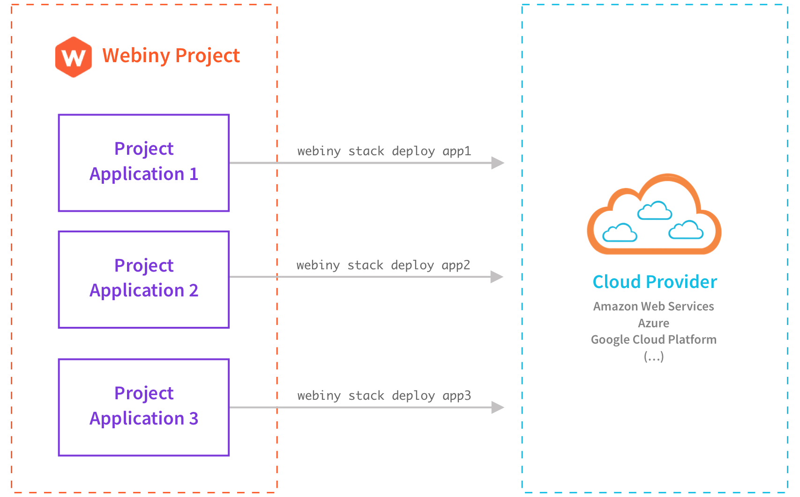

import { Alert } from "@/components/Alert";

<Alert type="success" title="What you’ll learn">

- what does it mean to deploy a project application
- what does it mean to deploy a Webiny project

</Alert>

<Alert type="warning" title="Just want to deploy?">

This key topics section provides general information on deployments, how they work in a Webiny project, what are environments, and other relevant topics. If you just want to learn how to deploy your project using [Webiny CLI](/docs/{version}/core-development-concepts/basics/webiny-cli), please visit the [Deploy your project](/docs/{version}/core-development-concepts/basics/project-deployment) guide.

</Alert>

## Overview

Project deployment is an important part of an application development lifecycle.

Essentially, deploying your project entails the deployment of necessary cloud infrastructure resources with the application code you wrote. It can be done from your machine directly, which is usually the case when developing, or from a remote environment, for example CI/CD systems, that, based on provided instructions, deploy your project automatically for you.

Whatever the case, Webiny makes it easy to both build and deploy your project, using the [Webiny CLI](/docs/{version}/core-development-concepts/basics/webiny-cli) and [Pulumi](/docs/{version}/infrastructure/pulumi-iac/iac-with-pulumi) as the default infrastructure as code and deployment solution. Additionally, without any special configuration, you can also easily deploy your project into multiple [environments](/docs/{version}/infrastructure/basics/environments).

<Alert type="info" title="Cloud Infrastructure">

After a new Webiny project was set up, the next step is to deploy it. Learn what gets deployed into the cloud (your AWS account) and how it all works in the [Cloud Infrastructure](/docs/{version}/architecture/introduction) key topics section.

</Alert>

## Deploying project applications - not projects

As explained in the [Project Applications and Packages](/docs/{version}/core-development-concepts/project-organization/project-applications-and-packages) section, every Webiny project can consist of one or more project applications. Furthermore, every project application consists of [application code and the necessary infrastructure](/docs/{version}/core-development-concepts/project-organization/project-applications) that's needed in order to run it.

With that in mind, it's important to note that when talking about deployments, we're talking about **deploying project applications, not projects**. Meaning, if your project consisted of three project applications, in order to deploy the project completely, you would need to execute three separate Webiny CLI commands.

<Alert type="info">

If you just want to learn how to deploy your project using [Webiny CLI](/docs/{version}/core-development-concepts/basics/webiny-cli), please visit the [Deploy your project](/docs/{version}/core-development-concepts/basics/project-deployment) guide.

</Alert>

## Dependent project applications

As stated in the section above, fully deploying a Webiny project entails deploying all of its project applications.

Although it might sound simple enough, one thing we still have to take into consideration are dependent applications. In the [Project Applications and Packages](/docs/{version}/core-development-concepts/project-organization/project-applications-and-packages#package-and-project-application-dependencies) key topic, it's shown that applications can be dependent on each other. For example, if we had two applications, where one represents an HTTP API, and the other a React application that relies on the API, that means the former needs to be deployed before the latter. We can't deploy a React application and expect it to work if we don't know the URL of the API to which it needs to talk to.

So, as we can see, the order of deploying does matter.

This is the reason why, out of the box, Webiny does not provide any CLI commands for complete project deployment. The order is something Webiny cannot predict and it's up to the developers to come up with a process for complete project deployment if need be.

<Alert type="info">

Still, to make it a bit easier for new users, every new Webiny project does include a helper `yarn webiny deploy` command. This command deploys the three applications that are included in a Webiny project by default. To learn more, visit the [Deploy your project](/docs/{version}/core-development-concepts/basics/project-deployment) guide.

</Alert>

## FAQ

### What does Webiny use to deploy cloud infrastructure?

Webiny uses Pulumi, a modern infrastructure as code solution. Find out more in the following [IaC with Pulumi](/docs/{version}/infrastructure/pulumi-iac/iac-with-pulumi) key topic.

### Is there a built-in command that destroys the whole project?

At the moment, there is not. To do that, run separate `webiny destroy` commands on each project application. Please visit the [Deploy your project](/docs/{version}/core-development-concepts/basics/project-deployment) guide to learn more.
