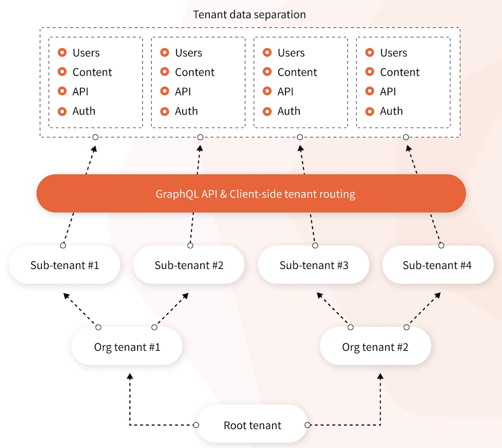
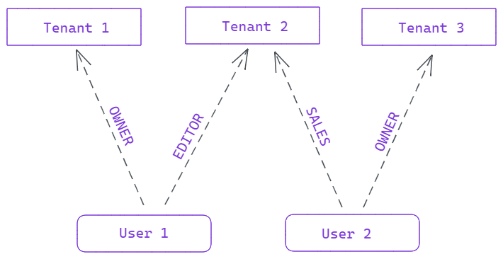

import { Alert } from "@/components/Alert";

<Alert type="success" title="WHAT YOU'LL LEARN">

- Overview of Webiny's multi-tenancy feature

</Alert>

<Alert type="warning" title="BUSINESS AND ENTERPRISE EDITION ONLY">

This feature is only available in Webiny Business and Enterprise packages. The feature is not available in the Open Source edition.

</Alert>

Why have dozens of CMS installations to manage when you can have only one?

This is exactly what multi-tenancy is solving.

Multi-tenancy is a core feature of Webiny CMS. It allows you to have multiple instances of Webiny CMS with complete data separation between instances, but all are running from the same code-base. It’s a powerful cost-saving feature as it means there’s only one instance to manage, regardless of whether you have 10 or 100 websites.

Multi-tenancy applies whenever you need multiple Headless CMS projects or multiple Page Builder pages.

The multi-tenancy feature comes with a flat hierarchy of tenants out of the box. However, in the Webiny Enterprise edition, this hierarchy can be modified to have several levels of depth and inheritance between the tenants.

## What is Multi-Tenancy?

Multi-tenancy is an architecture which allows you to serve multiple customers, called `tenants`, using a single instance (deployment) of your software.

Think of a SaaS (Software as a Service) application you may be using: G-Suite, Contentful, even AWS itself. These are all good examples of multi-tenant systems. You have an account (which represents a single user, or an organization), you have your collaborators, and you share some kind of data. Different collaborators have different permissions on the data. All the users of these platforms share the same code base, and it's running on the same hardware.

## Multi-Tenancy in Webiny

All Webiny apps are designed to support multi-tenancy. It is implemented as a very thin layer that sits at the very beginning of the API request lifecycle. Every HTTP request must specify a tenant it's communicating with, using the `X-Tenant` header. Once a request reaches the request handler, Webiny extracts the header and loads the tenant from the database.

From this point on, every storage operation (be it a database query, or a search engine query), uses the tenant ID to store and filter data specific to that particular tenant.

<Alert type="info" title="What if I don't use multi-tenancy?">

Every Webiny project has tenancy baked in. Even if you don't need multi-tenancy, there's always a `root` tenant behind the scenes, and all your data is stored in a multi-tenant manner. Your custom apps, however, don't need to worry about it if you don't plan to run them in a multi-tenant environment.

</Alert>

---

Although this is all tenancy does on a high level, we need to take a quick trip into a completely separate, but still relevant topic to get the complete picture of how tenancy works.

## Tenancy and User Management

It's important to note that _tenants_ and _users_ are two very different concepts. A _tenant_ can be anything: an organization, a project, a restaurant - anything that needs to have its data isolated. It very much depends on what you're developing and the specifics of your project. A _tenant_ is a generic word that describes a unit with isolated data.

Tenants can have many _users_ assigned to them, and each user can have different permissions when accessing different tenants. Here's a diagram that depicts this concept:

And why is all this important? Because when _authorization_ kicks in, we need to be able to provide permissions that an authenticated user has on the given tenant. This is all Webiny needs to work. A tenant ID and a set of permissions to be able to perform authorization and business logic checks.

### Admin User Management

Out of the box, Webiny provides an implementation of user management for Admin Area users. The implementation contains the concept of users, personal access tokens, API keys and user groups. Each user is assigned to a user group, and during authorization it is able to load the permissions that are configured for that user group.

### Custom User Management

How you manage permissions and links between users and tenants is completely up to you. Every project is very individual, and many things depend on project requirements so Webiny can't provide a generic implementation that will work for everyone. Moreover, your app can run on a different database, while default Webiny setup runs on DynamoDB.
