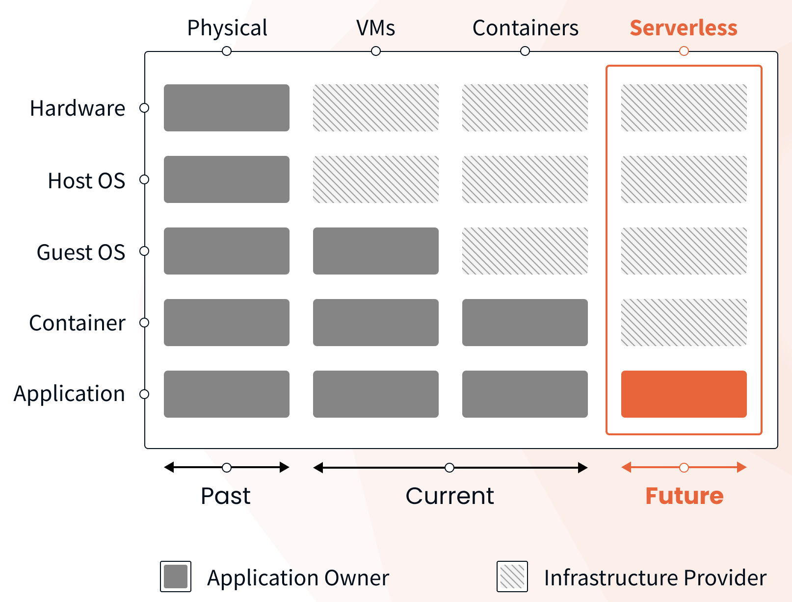

import { Alert } from "@/components/Alert";

<Alert type="success" title="WHAT YOU'LL LEARN">

- Benefits of serverless infrastructure

</Alert>

Serverless services are the infrastructure on top of which Webiny CMS runs. Serverless brings many advantages over more traditional infrastructure like virtual machines or containers:

1. Up to 80% cheaper cloud infrastructure costs when compared to using VMs
2. Up to 60% savings on devops efforts to manage and maintain the solution
3. Built on top of fault-tolerant services
4. Highly scalable architecture

Think about the amount of effort required to create a fault-tolerant architecture that can scale in and out in milliseconds and costs a fraction of the price to run and maintain. With serverless, you get all of that at the point of your fingertips, and you don't need to do anything.

You might ask yourself, why isn't everyone using serverless?
The thing is, existing apps that are built for traditional infrastructures can't run on serverless. Serverless is a breaking change for those applications. Therefore only applications that are architected specifically for serverless and built from the ground up to run in such an environment can take this advantage.

At Webiny, we believe that serverless is the future of web development. So we wanted to get there early and enable everyone a quick and easy way to experience how great serverless can be. It's a future-proof infrastructure that grows with the needs of your business and eliminates many of the maintenance operations that the traditional infrastructure requires.
