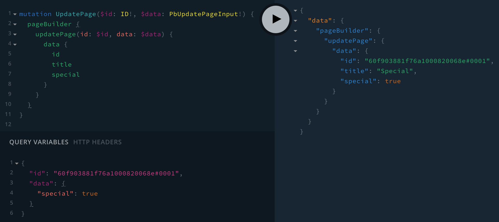
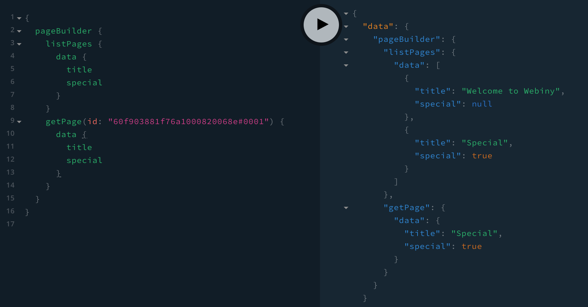
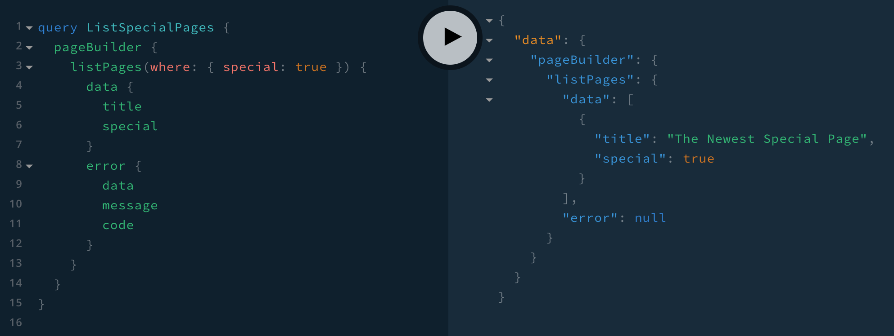
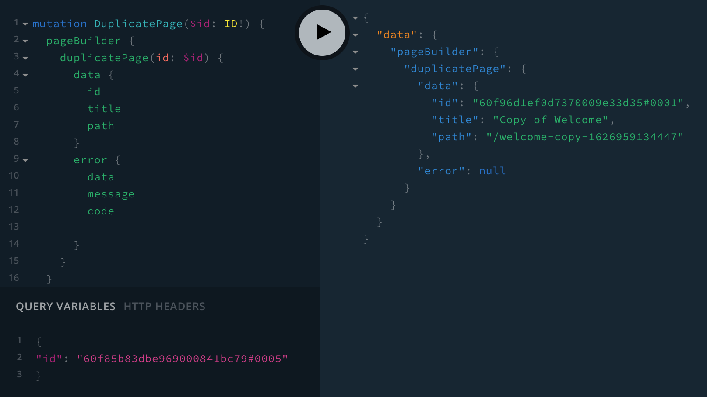
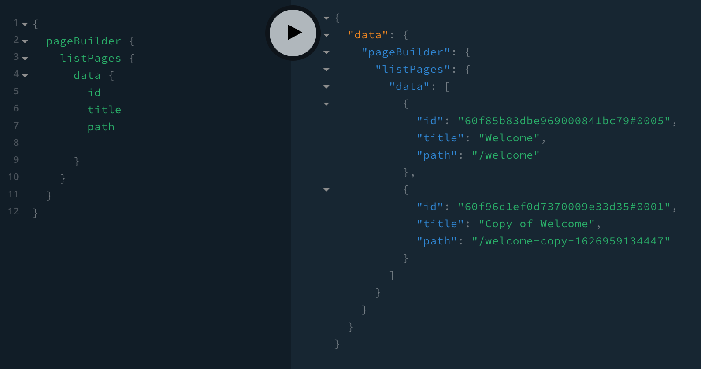

import { Alert } from "@/components/Alert";

<Alert type="success" title="What you'll learn">

- how to extend the Page Builder-related GraphQL types and operations

</Alert>

<Alert type="info">

Use the [`webiny watch`](/docs/{version}/core-development-concepts/basics/watch-command) command to continuously deploy application code changes into the cloud and instantly see them in action. For quick (manual) testing, you can use the built-in [API Playground](/docs/{version}/admin-area/basics/api-playground).

</Alert>

## Adding New Page Fields

In this example, we'll add a new `special` boolean field to the central `PbPage` GraphQL type. As the name suggests, the field will tell us whether a page is special or not.

It all starts with the [`GraphQLSchemaPlugin`](https://github.com/webiny/webiny-js/blob/v5.11.0/packages/handler-graphql/src/plugins/GraphQLSchemaPlugin.ts#L10), which we'll need to register within our GraphQL API's application code. Once we have that, optionally, we might want to register the [`IndexPageDataPlugin`](https://github.com/webiny/webiny-js/blob/v5.11.0/packages/api-page-builder/src/plugins/IndexPageDataPlugin.ts#L14) plugin, which will enable us to get the value of the new `special` field also while listing pages.

```ts api/code/graphql/src/plugins/pages.ts
import { GraphQLSchemaPlugin } from "@webiny/handler-graphql/plugins";
import { IndexPageDataPlugin } from "@webiny/api-page-builder/plugins/IndexPageDataPlugin";
import { Page } from "@webiny/api-page-builder/types";

// Make sure to import the `Context` interface and pass it to the `GraphQLSchemaPlugin`
// plugin. Apart from making your application code type-safe, it will also make the
// interaction with the `context` object significantly easier.
import { Context } from "~/types";

interface ExtendedPage extends Page {
  special: boolean;
}

export default [
  // Adding a new `special` field to the PbPage type consists of three steps:
  // 1. Extend the fundamental `PbPage` type.
  // 2. Extend the `PbPageListItem` type which is used when listing pages.
  // 3. In order to update the field, we also need to extend the `PbUpdatePageInput` input.
  new GraphQLSchemaPlugin<Context>({
    typeDefs: /* GraphQL */ `
      extend type PbPage {
        special: Boolean
      }

      extend type PbPageListItem {
        special: Boolean
      }

      extend input PbUpdatePageInput {
        special: Boolean
      }
    `
  }),

  // This step is only required if you're using DynamoDB + ElasticSearch setup and you want
  // to be able to get the value of the `special` field while listing pages.
  // With this plugin, we ensure that the value of the `special` field is also stored in
  // ElasticSearch, which is where the data is being retrieved from while listing pages.
  new IndexPageDataPlugin<ExtendedPage>(({ data, page }) => {
    // `data` represents the current page's data that will be stored in ElasticSearch.
    // Let's modify it, by adding the value of the new `special` flag to it.
    data.special = page.special;
  })
];
```

<Alert type="info">

The code above can be placed in the [`api/code/graphql/src/plugins/pages.ts`](https://github.com/webiny/webiny-examples/blob/master/page-builder/extend-graphql-api/extend-page/api/code/graphql/src/plugins/pages.ts) file, which doesn't exist by default, so you will have to create it manually. Furthermore, once the file is created, make sure that it's actually imported and registered in the [`api/code/graphql/src/index.ts`](https://github.com/webiny/webiny-examples/blob/master/page-builder/extend-graphql-api/extend-page/api/code/graphql/src/index.ts) entrypoint file.

</Alert>

With all the changes in place, we should be able to update an existing Page Builder page and mark it as special, with the following mutation:

```graphql
mutation UpdatePage($id: ID!, $data: PbUpdatePageInput!) {
  pageBuilder {
    updatePage(id: $id, data: $data) {
      data {
        id
        title
        special
      }
    }
  }
}
```

For example:



Running the above mutation should mark the page with the `60f903881f76a1000820068e#0001` ID as special, which we should be able to see afterwards while performing queries:



## Modifying GraphQL Queries

If needed, existing pages-related GraphQL queries can be modified too.

Continuing from the [previous](#adding-new-page-fields) example, let's say we also wanted to be able to list special pages only. We can do that with the help of the [`SearchLatestPagesPlugin`](https://github.com/webiny/webiny-js/blob/v5.11.0/packages/api-page-builder/src/plugins/SearchLatestPagesPlugin.ts#L3) and [`SearchPublishedPagesPlugin`](https://github.com/webiny/webiny-js/blob/v5.11.0/packages/api-page-builder/src/plugins/SearchPublishedPagesPlugin.ts#L3) plugins (both extending [`SearchPagesPlugin`](https://github.com/webiny/webiny-js/blob/v5.11.0/packages/api-page-builder/src/plugins/SearchPagesPlugin.ts#L22)):

```diff-ts api/code/graphql/src/plugins/pages.ts
import { GraphQLSchemaPlugin } from '@webiny/handler-graphql/plugins'
import { IndexPageDataPlugin } from '@webiny/api-page-builder/plugins/IndexPageDataPlugin'
import { Page } from '@webiny/api-page-builder/types'
import { SearchLatestPagesPlugin } from '@webiny/api-page-builder/plugins/SearchLatestPagesPlugin'
import { SearchPublishedPagesPlugin } from '@webiny/api-page-builder/plugins/SearchPublishedPagesPlugin'

// Make sure to import the `Context` interface and pass it to the `GraphQLSchemaPlugin`
// plugin. Apart from making your application code type-safe, it will also make the
// interaction with the `context` object significantly easier.
import { Context } from '~/types'

interface ExtendedPage extends Page {
  special: boolean
}

export default [
  // We can extend the `PbListPagesWhereInput` and `PbListPublishedPagesWhereInput`
  // types in order to enable filtering pages by the `special` field. Note that in order for this
  // to work, we'll also need `SearchLatestPagesPlugin` and `SearchLatestPagesPlugin` (see below).
  new GraphQLSchemaPlugin<Context>({
    typeDefs: /* GraphQL */ `
      extend type PbPage {
        special: Boolean
      }

      extend type PbPageListItem {
        special: Boolean
      }

      extend input PbUpdatePageInput {
        special: Boolean
      }

+     extend input PbListPagesWhereInput {
+       special: Boolean
+     }
+
+     extend input PbListPublishedPagesWhereInput {
+       special: Boolean
+     }
    `,
  }),

  new IndexPageDataPlugin<ExtendedPage>(({ data, page }) => {
    data.special = page.special
  }),

+ // Query modifiers must be applied to both latest and published pages queries.
+ // Both of these make sure that if the GraphQL query contains `special: true` in the `where`
+ // input, that the ElasticSearch query is modified accordingly.
+ new SearchLatestPagesPlugin({
+   modifyQuery({ query, args }) {
+     if (args.where && args.where.special) {
+       query.must.push({
+         term: {
+           special: true,
+         },
+       })
+     }
+   },
+ }),
+ new SearchPublishedPagesPlugin({
+   modifyQuery({ query, args }) {
+     if (args.where && args.where.special) {
+       query.must.push({
+         term: {
+           special: true,
+         },
+       })
+     }
+   },
+ }),
]
```

With all the changes in place, we should be able to run the following GraphQL query:

```graphql
query ListSpecialPages {
  pageBuilder {
    listPages(where: { special: true }) {
      data {
        title
        special
      }
      error {
        data
        message
        code
      }
    }
  }
}
```

For example:



Note that because we've created both the [`SearchLatestPagesPlugin`](https://github.com/webiny/webiny-js/blob/v5.11.0/packages/api-page-builder/src/plugins/SearchLatestPagesPlugin.ts#L3) and [`SearchPublishedPagesPlugin`](https://github.com/webiny/webiny-js/blob/v5.11.0/packages/api-page-builder/src/plugins/SearchPublishedPagesPlugin.ts#L3) plugins, we can also apply the same `special: true` filter within the `listPublishedPages` GraphQL query.

<Alert type="info">

The difference between the [`listPages`](https://github.com/webiny/webiny-js/blob/v5.11.0/packages/api-page-builder/src/graphql/graphql/pages.gql.ts#L320) and [`listPublishedPages`](https://github.com/webiny/webiny-js/blob/v5.11.0/packages/api-page-builder/src/graphql/graphql/pages.gql.ts#L329) is in the returned results. The former will always return latest revisions of a pages, which is more useful while listing pages inside the Admin Area application. The latter always returns published revisions of pages, which is more suitable for public applications and websites.

</Alert>

## Custom GraphQL Mutations

Let's say we wanted to extend our GraphQL schema with the custom `duplicatePage` mutation, which, as the name suggests, would enable us to make copies of pages.

We can achieve this with a single [`GraphQLSchemaPlugin`](https://github.com/webiny/webiny-js/blob/v5.11.0/packages/handler-graphql/src/plugins/GraphQLSchemaPlugin.ts#L10) plugin.

```ts api/code/graphql/src/plugins/pages.ts
import { GraphQLSchemaPlugin } from "@webiny/handler-graphql/plugins";
import { PbContext } from "@webiny/api-page-builder/types";
import { Response, ErrorResponse, NotFoundResponse } from "@webiny/handler-graphql/responses";

// Make sure to import the `Context` interface and pass it to the `GraphQLSchemaPlugin`
// plugin. Apart from making your application code type-safe, it will also make the
// interaction with the `context` object significantly easier.
import { Context } from "~/types";

export default [
  new GraphQLSchemaPlugin<Context>({
    // Extend the `PbMutation` type with the `duplicatePage` mutation.
    typeDefs: /* GraphQL */ `
      extend type PbMutation {
        # Creates a copy of the provided page.
        duplicatePage(id: ID!): PbPageResponse
      }
    `,
    // In order for the `duplicatePage` to work, we also need to create a resolver function.
    resolvers: {
      PbMutation: {
        duplicatePage: async (_, args: { id: string }, context: PbContext) => {
          // Retrieve the original page. If it doesn't exist, immediately exit.
          const pageToDuplicate = await context.pageBuilder.pages.get(args.id);
          if (!pageToDuplicate) {
            return new NotFoundResponse("Page not found.");
          }

          try {
            // We only need the `id` of the newly created page.
            const newPage = await context.pageBuilder.pages.create(pageToDuplicate.category);

            // Set data that will be assigned to the newly created page.
            const data = {
              title: `Copy of ${pageToDuplicate.title}`,
              path: `${pageToDuplicate.path}-copy-${new Date().getTime()}`,
              content: pageToDuplicate.content,
              settings: pageToDuplicate.settings
            };

            // Finally, update the newly created page.
            const updatedNewPage = await context.pageBuilder.pages.update(newPage.id, data);

            return new Response(updatedNewPage);
          } catch (e) {
            return new ErrorResponse(e);
          }
        }
      }
    }
  })
];
```

<Alert type="info">

The code above can be placed in the [`api/code/graphql/src/plugins/pages.ts`](https://github.com/webiny/webiny-examples/blob/master/page-builder/extend-graphql-api/custom-mutations/api/code/graphql/src/plugins/pages.ts) file, which doesn't exist by default, so you will have to create it manually. Furthermore, once the file is created, make sure that it's actually imported and registered in the [`api/code/graphql/src/index.ts`](https://github.com/webiny/webiny-examples/blob/master/page-builder/extend-graphql-api/custom-mutations/api/code/graphql/src/index.ts) entrypoint file.

</Alert>

With all the changes in place, we should be able to run the following GraphQL mutation:

```graphql
mutation DuplicatePage($id: ID!) {
  pageBuilder {
    duplicatePage(id: $id) {
      data {
        id
        title
        path
      }
    }
  }
}
```

For example:



After the mutation has been executed, we should be able to see the created copy in the list of pages:



## FAQ

### What is the `context` object and where are all of its properties coming from?

In the shown examples, you may have noticed we were using the `context` object in GraphQL resolver functions. This object contains multiple different properties, mainly being defined from different Webiny applications that were imported in the GraphQL API's [`api/code/graphql/src/index.ts`](https://github.com/webiny/webiny-examples/blob/master/page-builder/extend-graphql-api/custom-mutations/api/code/graphql/src/index.ts) entrypoint file.

That's why, for example, we were able to utilize the [`context.pageBuilder.pages.get`](https://github.com/webiny/webiny-js/blob/v5.11.0/packages/api-page-builder/src/graphql/crud/pages.crud.ts#L134) and [`context.pageBuilder.pages.update`](https://github.com/webiny/webiny-js/blob/v5.11.0/packages/api-page-builder/src/graphql/crud/pages.crud.ts#L606) methods, in the [Custom Mutations](#custom-graph-ql-mutations) section.

For easier discovery and type safety, we suggest a type is always assigned to the `context` object in your GraphQL resolver functions.
