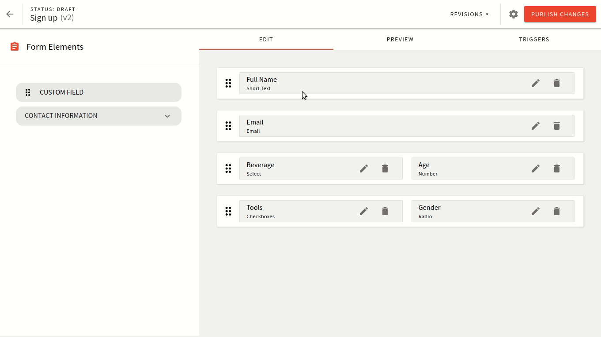

import { Alert } from "@/components/Alert";

<Alert type="danger" title="Article Update In Progress">

With the [5.34.0](/docs/release-notes/5.34.0/changelog) release and the introduction of the [new page rendering engine](/docs/release-notes/5.34.0/changelog#page-elements-a-brand-new-page-rendering-engine-2898), we've changed the way developers approach theme creation for their website.

Please hold on while we update this article with the latest information. Until then, you can take a closer look at the new theme object, located in the [`apps/theme/theme.ts`](https://github.com/webiny/webiny-js/blob/v5.34.0/apps/theme/theme.ts) file.

</Alert>

<!-- Always include this section on top of the page. -->

<Alert type="success" title="What You’ll Learn">

- what is a Form Builder theme
- how a theme is used in Form Builder
- how to register a Form Builder theme

</Alert>

## Overview

In this section, you learn all about the Form Builder theme and its basic concepts. You get all the knowledge needed to create your own theme.

When you're creating forms in the Form Builder, you have the option to preview forms right there inside the same interface.

How the form looks visually is controlled via the form layout that is selected for that form. This is defined inside the form settings as shown below:



Similar to how the layouts for pages work, the form layouts control how that form renders. This includes all elements as inputs, dropdown, submit button, and the success message.

The default theme includes a single form layout which should fit most use-cases. If you wish to do any visual tweaks, it's best to just modify the stylesheets.

For more advance case you might want to create a custom form layout. The best approach would be to copy the existing one and update the things you need to adapt. There are comments inside the default form layout that helps you find your way around.

## Registering a Theme

The default Form Builder theme is located at [`apps/theme/formBuilder/index.ts`](https://github.com/webiny/webiny-js/blob/next/apps/theme/formBuilder/index.ts) with the following content:

```ts apps/theme/formBuilder/index.ts
import DefaultFormLayout from "./layouts/DefaultFormLayout";

export default [
  {
    name: "form-layout-default",
    type: "form-layout",
    layout: {
      name: "default",
      title: "Default layout",
      component: DefaultFormLayout
    }
  }
];
```

The default theme comes with a single form layout. To learn more about form layouts proceed to the next page.
