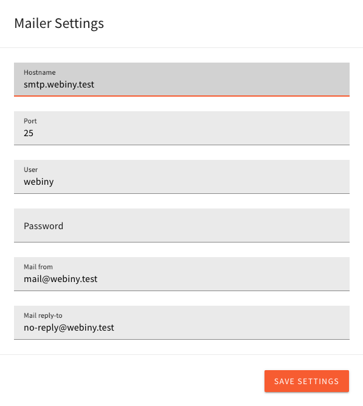

import {Alert} from "@/components/Alert";

<Alert type="success" title="What You’ll Learn">

- How to use api-mailer to send e-mails
- How to use api-mailer with basic configuration
- How to use api-mailer with advanced configuration

</Alert>

## About

Starting from 5.30.0 version of Webiny we have a mailer package (`@webiny/api-mailer`) via which you can send e-mails.

The package uses `transports` to send e-mails. The `transport` is an implementation of sending the e-mails, and we have few built-in ones.

## Available Transports

- Dummy Transport - does not send e-mails, just records them in an array which you can access later
- SMTP Transport - sends e-mails with the use of [nodemailer](https://github.com/nodemailer/nodemailer) library

<Alert type="info" title="Our built-in transport is not working for you?">

  We provide a default STMP transport, which might not work for you. If that is the case, you can create your own transport.

  Please check the [The Default Transport Is Not Working for Me!](#the-default-transport-is-not-working-for-me) section for more information.

</Alert>

### Dummy Transport

A transport which pretends to be sending e-mails.

It is used for testing and as a backup in case no other transport exists or is not configured.

### SMTP Transport

A transport which sends e-mails via the [nodemailer](https://github.com/nodemailer/nodemailer) library. It requires credentials to be defined, which we will go through.
If this transport fails to be created, it falls back to the `Dummy Transport`.

#### Basic Configuration Via Environment Variables

The simplest, and most rudimentary, configuration is done via the environment variables:

```dotenv
# required
WEBINY_MAILER_HOST=smtp.webiny.com
WEBINY_MAILER_PORT=25
WEBINY_MAILER_USER=root
WEBINY_MAILER_PASSWORD=password
WEBINY_MAILER_REPLY_TO=reply-to@webiny.com
# optional
WEBINY_MAILER_FROM=mailing-list@webiny.com
```

Variables `WEBINY_MAILER_HOST`, `WEBINY_MAILER_USER`, `WEBINY_MAILER_PASSWORD` and `WEBINY_MAILER_REPLY_TO` **must** be defined for SMTP Transport to work.

The `WEBINY_MAILER_FROM` variable is an optional one.

When applying the variables we run them through the validation process, so if any are invalid (for example, you do not put e-mail in `WEBINY_MAILER_FROM`), the creation process of the transport will fail.

<Alert type="info">
  When configuring transport via the environment variables, that configuration is used for all
  tenants in the system.
</Alert>

#### Basic Configuration Via Admin UI

Configuring `SMTP Transport` via the UI is the easiest way to configure the transport.

The "downside" is that, in multi-tenancy systems, you need to store configuration for each tenant.
If you do not want to do that, use the configuration via environment variables.



<Alert type="warning">

Configuration via the UI is not available until you have the `WEBINY_MAILER_PASSWORD_SECRET` environment variable set.
Since we are storing the password in the database, we need to encrypt it. The `WEBINY_MAILER_PASSWORD_SECRET` is used as a secret in the `crypto-js` library's AES algorithm.

</Alert>

#### Advanced Configuration Via Code

The advanced configuration is done by creating your own SMTP Transport with custom config. You can use our `createSmtpMailer` method, you just need to pass the custom configuration.

```typescript
import { createTransport, createSmtpTransport } from "@webiny/api-mailer";

const transport = createTransport(async ({ settings, context }) => {
  return createSmtpTransport({
    ...settings,
    host: "my.changed.host",
    headers: {
      ["my-header"]: "value"
    }
    // ... or what ever you want to change in the SMTP Transport
  });
});

// register in your handler

const handler = createHandler({
  plugins: [
    // existing plugins
    transport
  ]
});
```

When creating the transport via `createTransport`, you will get the `settings` and the `context` variables. The `settings` variable contains whatever was defined in either environment variables or the values which were stored via the Mailer Settings UI.

### The Default Transport Is Not Working For Me!

If the default transport is not working for you, you can create your own transport.

We cannot implement all the possible services and providers, so we provide our users with the ability to create their own transports.

Please read the [Custom Transport](#custom-transport) section for more information.


## Custom Transport

You can create your own transport if you do not like ours. You just need to use the `createTransport` method which returns the transport.

```typescript
import { createTransport } from "@webiny/api-mailer";

const transport = createTransport(async params => {
    const { context, settings } = params;

    if (!settings?.user || !settings?.password) {
        throw new Error("There are no username and password in the settings. This will not work.");
    }
    
    const myCustomSender = initializeYourCustomSender();

    return {
        name: "webiny.mailer.myCustomTransport",
        send: async data => {
            try {
                const result = await myCustomSender({
                    ...data,
                    envelope: {
                        user: settings.user,
                        pass: settings.password
                    }
                });
                return {
                    result,
                    error: null,
                };
            } catch (ex) {
                return {
                    result: null,
                    error: ex
                };
            }
        }
    };
});


// register in your handler

const handler = createHandler({
  plugins: [
    // existing plugins
    transport
  ]
});
```

Make sure that your transport is at the end of the plugins list, as it will then override our default transport.

## Usage

For example, let's say you want to send an e-mail when user creates an entry in the `Person` model.
You would want to subscribe to the `onEntryAfterCreate` event and send an e-mail only when added entry to that certain model.

```typescript
const plugin = new ContextPlugin<MailerContext>(async context => {
  context.cms.onEntryAfterCreate.subscribe(async ({ entry, model }) => {
    if (model.modelId !== "person") {
      return;
    }
    try {
      const response = await context.mailer.sendMail({
        to: ["me@test.local"],
        from: "webiny@test.local",
        subject: `A new entry in the ${model.name} model was created`,
        text: `A new entry in the ${model.name} was created. ID of the entry is ${entry.id}`,
        html: `<h2>A new entry in the ${model.name}</h2>
                  <p>Entry ID is ${entry.id}, url is ${createEntryUrl(entry)}</p>`
      });
      if (response.result) {
        return;
      } else if (!response.error) {
        console.log("E-mail was not sent, but there is no error in the response.");
        return;
      }
      console.log(response.error);
    } catch (ex) {
      console.log(ex.message);
    }
  });
});
```
