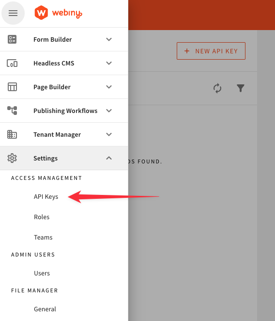
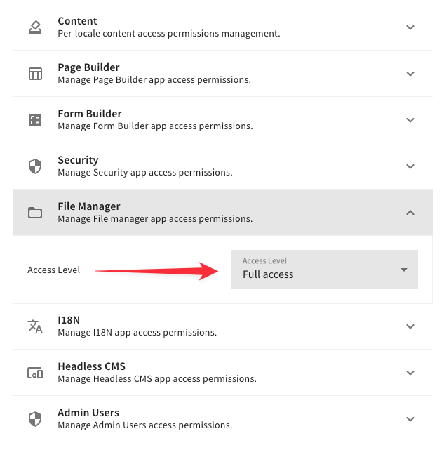
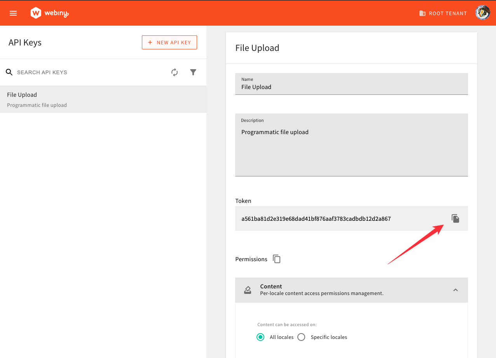

import { Alert } from "@/components/Alert";

<Alert type="info" title="Can I Use This?">

This feature is available since Webiny **v5.36.0**.

</Alert>

<Alert type="success" title="What you'll learn">

- how to programmatically upload files into the File Manager

</Alert>

## Overview

Upload of files into the File Manager is a 3-step process, which is described, from the architectural point of view, in the [File Upload](/docs/{version}/architecture/api/file-upload) article. Very often, files can be several gigabytes (or even terabytes) large, which makes it impossible to use the GraphQL API, or even a REST API, to upload binary content using the Lambda functions, which power our API, due to its physical limitations.

To make it possible to handle files of all sizes, up to 5TB in size, we have to upload those binary payloads directly to the AWS S3 service. The three steps to upload a file into the File Manager are as follows:

- Create a pre-signed POST payload for the file you're uploading.

- Send the file directly to AWS S3, using the pre-signed POST payload.

- Create a file record in the system, so the File Manager is aware of the file in the AWS S3 bucket.

## Creating an API key

Since the GraphQL API sits behind a security layer, that forbids unauthorized access, we need to create an API key, which we'll then use in our file upload process.

An API key is a random non-human-readable string, which essentially contains a list of allowed operations that its user (a real user or an application) can perform. Once created, we include it as the `Authorization` header on every HTTP request we issue (with our GraphQL client of choice), for example:

```
Authorization: Bearer {random-non-human-readable-api-token}
```

<Alert type="info">

Make sure to include the required `Bearer` keyword, placed before our actual API token.

</Alert>

<Alert type="warning">

Failing to correctly include the API key via the `Authorization` HTTP request header will prevent you from performing any sensitive GraphQL query or mutation.

Check your GraphQL client's documentation in order to ensure that the API token is correctly included in every HTTP request.

</Alert>

API Tokens are created via the Security Webiny application, by opening the **API Keys** section:



Once selected, we're redirected to the API Keys section, where we can create a new, or update an existing API key. But most importantly, we get fine-grained control over which operations our API keys can, or cannot, perform. For example, the following selection allows API key users to perform all File Manager actions exposed by the GraphQL API:



Once the API key has been created, the key token is automatically generated, and you should see it in the user interface:



From there, you can easily grab it by clicking on the **Copy** button, located on the right side of the API token, and paste it in an appropriate place, somewhere where your GraphQL client can access it.

## Upload File to the File Manager

To make it really easy for developers to dive right into the upload process, we've created this script, which covers all 3 steps, which you can copy/paste, update the required variables, and run.

The script uses two external packages, which you will need to install from `npm`:

- [node-fetch](https://www.npmjs.com/package/node-fetch) to send HTTP requests
- [form-data](https://www.npmjs.com/package/form-data) to create a file upload form

<Alert type={"warning"} title={"Please note!"}>
  This script does not include error handling, or multi-part upload of large files, where you need
  to utilize file chunking (files larger than 5GB). This script is a solid starting point, but is
  not a final product.
</Alert>{" "}

```js fileUpload.js
const fs = require("fs");
const fetch = require("node-fetch");
const FormData = require("form-data");

// This is the Webiny API token, described in the previous section of the article.
const TOKEN = "YOUR_WEBINY_API_TOKEN"; // <---- Make sure you replace this value with your own!

// This is your Webiny GraphQL API endpoint.
const API_URL = "YOUR_WEBINY_API_URL/graphql"; // <---- Make sure you replace this value with your own!

// For demo purposes, this contains the path to a physical file which we'll be uploading.
const FILE_PATH = __dirname + "/video.mp4";

// This GraphQL query is used to create pre-signed POST payloads using the basic file information (name, type, and size).
const GetPreSignedPostPayload = `
  query GetPreSignedPostPayload($data: PreSignedPostPayloadInput!) {
    fileManager {
      getPreSignedPostPayload(data: $data) {
        data {
          data
          file {
            id
            name
            type
            size
            key
          }
        }
        error {
          code
          data
          message
        }
      }
    }
  }
`;

// This GraphQL mutation is used to store file information in the File Manager, after the file is uploaded to the S3 bucket.
const CreateFile = `
  mutation CreateFile($data: FmFileCreateInput!) {
    fileManager {
      createFile(data: $data) {
        data {
          id
          createdOn
          savedOn
          src
          name
          key
          type
          size
          tags
          location {
            folderId
          }
        }
        error {
          code
          message
          data
        }
      }
    }
  }
`;

async function getPreSignedPostPayload(data) {
  console.log("Getting pre-signed POST payload...");
  const response = await fetch(API_URL, {
    method: "POST",
    headers: {
      "Content-Type": "application/json",
      Accept: "application/json",
      Authorization: `Bearer ${TOKEN}`
    },
    body: JSON.stringify({
      query: GetPreSignedPostPayload,
      variables: {
        data
      }
    })
  }).then(r => r.json());

  return response.data.fileManager.getPreSignedPostPayload.data;
}

async function createFileInFileManager(file) {
  console.log("Creating file record in the File Manager...");
  const response = await fetch(API_URL, {
    method: "POST",
    headers: {
      "Content-Type": "application/json",
      Accept: "application/json",
      Authorization: `Bearer ${TOKEN}`
    },
    body: JSON.stringify({
      query: CreateFile,
      variables: {
        data: file
      }
    })
  }).then(r => r.json());

  return response.data.fileManager.createFile.data;
}

function uploadFileToS3(buffer, preSignedPostPayload) {
  console.log("Uploading file to S3...");
  // Create a form object, which we'll send to the AWS S3.
  const formData = new FormData();
  // Add all pre-signed payload fields to "FormData".
  Object.keys(preSignedPostPayload.fields).forEach(key => {
    formData.append(key, preSignedPostPayload.fields[key]);
  });
  // Add file content to "FormData".
  formData.append("file", buffer);

  // Finally make the upload request to S3.
  return fetch(preSignedPostPayload.url, {
    method: "POST",
    body: formData
  });
}

(async () => {
  // Read the size of the file, so we can request a pre-signed POST payload.
  const { size } = fs.statSync(FILE_PATH);

  // `data` represents S3 related data; `file` represents File Manager related information.
  const { data, file } = await getPreSignedPostPayload({
    name: "video.mp4",
    type: "video/mp4",
    size
  });

  // Read the file from the filesystem.
  const buffer = fs.readFileSync(FILE_PATH);

  // Upload the file binary data to AWS S3, using the pre-signed POST payload.
  await uploadFileToS3(buffer, data);

  const fileInput = {
    ...file,
    // Optionally, set file aliases. This allows you to set SEO friendly file paths.
    aliases: ["/videos/promo.mp4"],
    // Optionally, tag your file with some tags, for easier filtering in the File Manager UI.
    tags: ["programmatic"],
    // Optionally, specify an exact `folderId` to store the file into a specific folder.
    location: {
      folderId: "root"
    }
  };

  const createdFile = await createFileInFileManager(fileInput);

  console.log(`Your file is now accessible at the following URL:\n${createdFile.src}`);
})();
```

Once you run this script in your CLI, using a simple `node fileUpload.js` command, the file from the script will be uploaded to the File Manager, and will be accessible via the public URL. You will also find the uploaded file in your File Manager UI.
