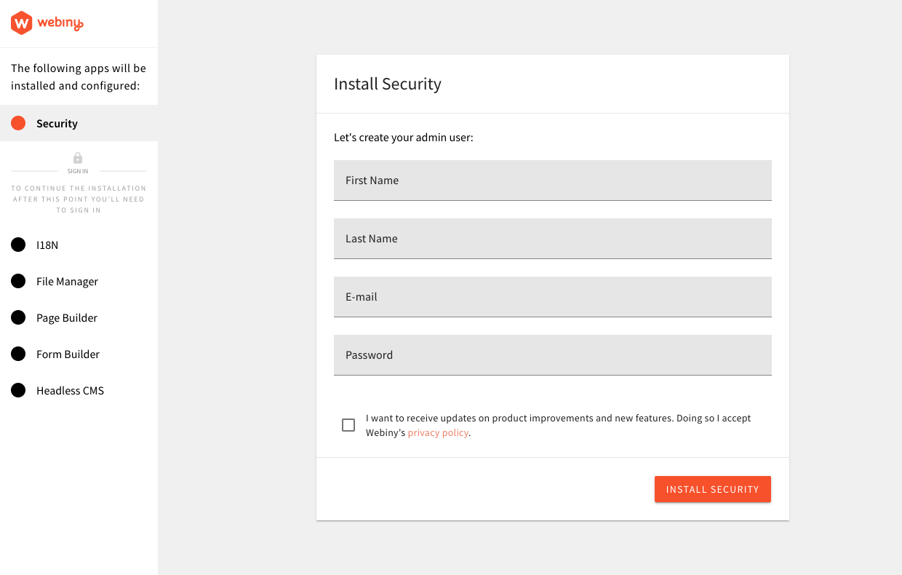

import { Alert } from "@/components/Alert";

<Alert type="success" title="WHAT YOU’LL LEARN">

- how to create a brand new Webiny project
- how to deploy it to your [AWS](https://aws.amazon.com/) account

</Alert>

---

## Prerequisites

Before proceeding, make sure you have the following:

1. **Node.js >=18**

- Node.js versions **v18.19.0** or greater
- If you don't have Node.js installed, the easiest way to install it is by [downloading the official binary](https://nodejs.org/en/)

2. **yarn ^1.22.21 || >=2**

- Webiny works with both yarn versions [1 (classic)](https://yarnpkg.com/en/docs/install) and [>=2 (berry)](https://yarnpkg.com/)
- for version 1 - **1.22.21** or later is required

3. **AWS account and user credentials**

- in order to deploy Webiny, you must have a valid [AWS account and user credentials](/docs/infrastructure/aws/configure-aws-credentials) set up on your system

## Project Setup

Once you have all the prerequisites in place, we recommend creating a new Webiny project using `create-webiny-project` - a tool that sets everything up automatically for you. So, in your terminal of choice, run the following command:

```bash
npx create-webiny-project my-new-project
```

From there, follow the on-screen setup instructions, which includes answering a couple of project-related questions, and doing your first deployment.

### Pick Your Database Setup

Webiny supports two database setups:

1. **Amazon DynamoDB** (for small and medium sized projects)
2. **Amazon DynamoDB + Amazon OpenSearch** (for large / enterprise-level projects)

If you're building a small project (couple of thousands of database records) or just giving Webiny a try, we suggest you go with the **Amazon DynamoDB** database setup. On the other hand, if you're building a larger project and you know you will be dealing with hundreds of thousands or even millions of database records, choose the **Amazon DynamoDB + Amazon OpenSearch** database setup.

Please choose your database setup with consideration for both present and future project requirements. The decision you make at this point **cannot** be changed later on without recreating your project from scratch.

#### Amazon DynamoDB + Amazon OpenSearch - Monthly Cost❗

Although Webiny is designed to rely on serverless cloud infrastructure resources, the **Amazon DynamoDB + Amazon OpenSearch** database setup relies on [Amazon OpenSearch Service](https://aws.amazon.com/opensearch-service/), which is not serverless.

More precisely, it doesn't scale to zero and it's billed per hour of usage. The cheapest configuration (which Webiny deploys for your development-related environments) amounts to roughly **$25/month**. For more information, please refer to the [Amazon OpenSearch Service pricing](https://aws.amazon.com/opensearch-service/pricing/) page.

## First Deployment

Once your new project has been created, it's time to deploy it into your AWS account. You can do that simply by running the following command in your terminal:

```
yarn webiny deploy
```

<Alert type="success" title="Cloud Infrastructure">

Learn what gets deployed into your AWS account and how it all works in the [Cloud Infrastructure](/docs/{version}/architecture/introduction)
key topics section.

</Alert>

Note that the first deployment can take up to 15-30 minutes! So, even though it might look nothing is happening in the terminal, please be patient and let the process finish. If something went wrong, an error will be shown.

Ultimately, once the deployment has been done, you are presented with the URL over which you can access your Admin Area, and finish the installation.



<Alert type="info" title="Misplaced Admin area URL?">

Running the `yarn webiny open admin --env dev` command in your Webiny project folder will open the Admin Area URL in
your default browser.

You can also run `yarn webiny info` to get a list of all important URLs.

</Alert>

<Alert type="warning" title="Telemetry">

Please note that, by default, Webiny collects anonymous usage information, which is exclusively used for improving the
product and understanding usage patterns. Please take a look at our [Telemetry](/docs/{version}/webiny-telemetry/webiny-telemetry)
page for more information on this subject.

If, at any point in time, you wish to disable this behaviour, you can do it with the [Webiny CLI](/docs/{version}/core-development-concepts/basics/webiny-cli),
by running the following command: `yarn webiny disable-telemetry`.

</Alert>

## Troubleshooting

### SubscriptionRequiredException: The AWS Access Key Id needs a subscription for the service

In some cases, upon deploying a new Webiny project, it's possible for users to experience the following error being thrown in their terminal:

```
SubscriptionRequiredException: The AWS Access Key Id needs a subscription for the service
```

The following are some of the reasons why you might be receiving this error:

1. you didn't verify your phone number
2. you didn't verify your payment method
3. you didn't select a support subscription (free or other)
4. if you created a brand new AWS account, it wasn't yet processed on the AWS side

The account signup and verification process can be completed via https://portal.aws.amazon.com/billing/signup?type=resubscribe#/resubscribed.

### Pulumi is throwing a `syscall.loadsystemlibrary` exception

There could be various reasons why this error was thrown. But, if deploying from a Windows machine, we've seen that it could be
caused by an anti-virus software that you might have installed on your machine. Our suggestion is to try to temporary disable it and see if that produces any positive outcome.
