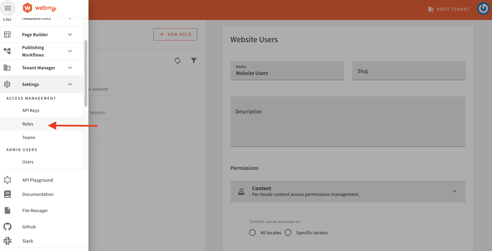
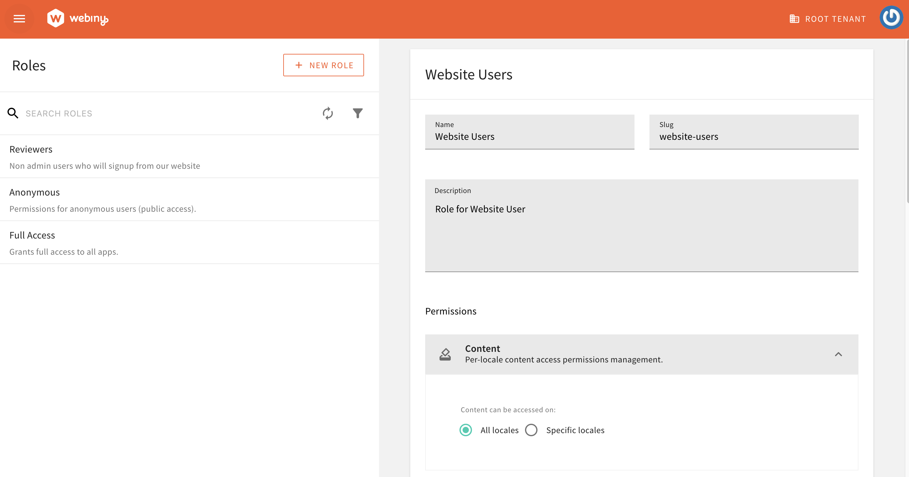
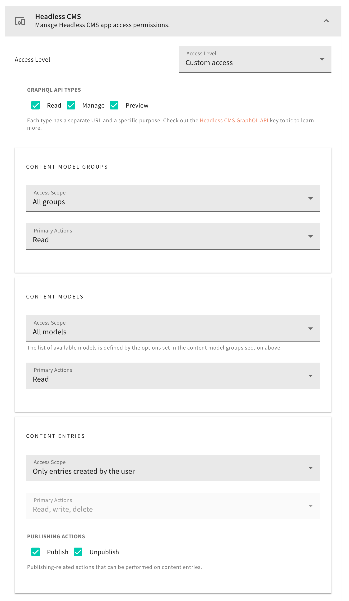

import { Alert } from "@/components/Alert";
import notesReactApp from "./assets/website-users/notes-react-app.mp4";
import signUpSignInForm from "./assets/website-users/sign-up-sign-in-form.mp4";
import { ExternalLink } from "@/components/ExternalLink";

<Alert type="info" title="Can I Use This?">

This feature has been available since Webiny **v5.39.0** and is available in Business & Enterprise tier.

</Alert>

<Alert type="success" title="What you will learn">

- how to set up a new User Pool in Webiny for website users authentication
- how to limit website users' access to only the content they've created
- how to use Amplify UI in React App to build a Sign-Up and Login form
- how to build a notes React application where users can create, read, and delete notes after signing up

</Alert>

## Overview

Imagine an end-user-facing application such as an E-Commerce site, Instagram, Twitter (X), or similar, where users can sign up themeself and interact with the app. If you have this kind of requirement, then this guide is for you.

To achieve this functionality in Webiny, we need to create a new User Pool and enable authentication for this pool.
In this guide, we will look into the step-by-step instructions on how to make all the necessary changes to your Webiny side. And we will create a React App using the Amplify UI library, demonstrating how to create Sign-Up and Login form. This React App is a notes application, allowing users to sign up themselves and perform operations such as creating, reading, and deleting notes that they have created.

This guide is devided into two parts.
- **Webiny Infrastructure Setup** - The first part focuses on creating the necessary infrastructure on the Webiny side and enabling authentication for these new website users.
- **Building a React Notes Application with Amplify UI library** - The second part will cover creating a Notes React application using the Amplify UI library.


## Webiny Infrastructure Setup

<Alert type="info">

The code that we cover in this tutorial can also be found in our [GitHub examples repository](https://github.com/webiny/webiny-examples/tree/master/headless-cms/website-users/5.39.0).

</Alert>

### Website User Pool and User Pool Client
The first step is to setup an AWS Cognito User Pool and User Pool Client specifically for website users.
All the users who will sign up from our end user facing App will be created in this User Pool.

1. Create a `pulumi/src` directory in `webiny-project-home/packages` directory.

2. Create `configureWebsiteCognitoUserPool.ts` & `applyWebsiteEnvVariables.ts` files in `packages/pulumi/src`.

```tsx configureWebsiteCognitoUserPool.ts
import * as aws from "@pulumi/aws";
import * as pulumi from "@pulumi/pulumi";
import { CorePulumiApp } from "@webiny/pulumi-aws";

// We mark resources as protected if deploying via CI/CD and into one of the specified environments.
const protectResource = (app: CorePulumiApp) => {
    return "CI" in process.env && ["prod", "staging"].includes(app.params.run["env"]);
};

export type CustomCoreOutput = {
    websiteUserPoolId: string;
    websiteUserPoolRegion: string;
    websiteUserPoolClient: string;
    websiteUserPoolArn: string;
};

export const configureWebsiteCognitoUserPool = (app: CorePulumiApp) => {

    const userPool = app.addResource(aws.cognito.UserPool, {
        name: "website-users",
        config: {
            schemas: [
                {
                    attributeDataType: "String",
                    name: "email",
                    required: false,
                    developerOnlyAttribute: false,
                    mutable: true,
                    stringAttributeConstraints: {
                        maxLength: "2048",
                        minLength: "0"
                    }
                },
                {
                    attributeDataType: "String",
                    name: "family_name",
                    required: false,
                    developerOnlyAttribute: false,
                    mutable: true,
                    stringAttributeConstraints: {
                        maxLength: "2048",
                        minLength: "0"
                    }
                },
                {
                    attributeDataType: "String",
                    name: "given_name",
                    required: false,
                    developerOnlyAttribute: false,
                    mutable: true,
                    stringAttributeConstraints: {
                        maxLength: "2048",
                        minLength: "0"
                    }
                },
                {
                    attributeDataType: "String",
                    name: "wby_tenant",
                    required: false,
                    developerOnlyAttribute: false,
                    mutable: true,
                    stringAttributeConstraints: {
                        maxLength: "30",
                        minLength: "0"
                    }
                },
                {
                    attributeDataType: "String",
                    name: "wby_website_group",
                    required: false,
                    developerOnlyAttribute: false,
                    mutable: true,
                    stringAttributeConstraints: {
                        maxLength: "50",
                        minLength: "0"
                    }
                }
            ],
            passwordPolicy: {
                minimumLength: 8,
                requireLowercase: false,
                requireNumbers: false,
                requireSymbols: false,
                requireUppercase: false,
                temporaryPasswordValidityDays: 7
            },
            autoVerifiedAttributes: ["email"],
            aliasAttributes: ["preferred_username"],
        },
        opts: { protect: protectResource(app) }
    });

    const userPoolClient = app.addResource(aws.cognito.UserPoolClient, {
        name: "website",
        config: {
            userPoolId: userPool.output.id,
            explicitAuthFlows: [
                "ALLOW_USER_SRP_AUTH",
                "ALLOW_CUSTOM_AUTH",
                "ALLOW_REFRESH_TOKEN_AUTH"
            ],

            supportedIdentityProviders: ["COGNITO"]
        }
    });

    app.addOutputs({
        websiteUserPoolId: userPool.output.id,
        websiteUserPoolRegion: String(process.env.AWS_REGION),
        websiteUserPoolArn: userPool.output.arn,
        websiteUserPoolClient: userPoolClient.output.id
    });
};
```

``` tsx applyWebsiteEnvVariables.ts

import { ApiPulumiApp } from "@webiny/pulumi-aws";
import { getStackOutput } from "@webiny/cli-plugin-deploy-pulumi/utils";

export const applyWebsiteEnvVariables = (app: ApiPulumiApp) => {
    const core = getStackOutput({
        folder: "apps/core",
        env: app.params.run["env"]
    });

    if (!core) {
        throw new Error("Core application is not deployed.");
    }

    app.setCommonLambdaEnvVariables({
        WEBSITE_COGNITO_REGION: core["websiteUserPoolRegion"],
        WEBSITE_COGNITO_USER_POOL_ID: core["websiteUserPoolId"]
    });

    // Add permission to GraphQL Lambda policy to interact with the Website User Pool
    app.resources.graphql.policy.config.policy(policy => {
        if (typeof policy === "string") {
            return policy;
        }

        return {
            ...policy,
            Statement: [
                ...policy.Statement,
                {
                    Sid: "PermissionForWebsiteCognitoUserPool",
                    Effect: "Allow",
                    Action: "cognito-idp:*",
                    Resource: `${core["websiteUserPoolArn"]}`
                }
            ]
        };
    });
};
```

3. Create `packages/pulumi/src/index.ts` file and export `configureWebsiteCognitoUserPool` and `applyWebsiteEnvVariables`.

``` tsx index.ts
export * from "./configureWebsiteCognitoUserPool";
export * from "./applyWebsiteEnvVariables";
```

4. Create `packages/pulumi/tsconfig.json` file.

```json tsconfig.json
{
  "extends": "../../tsconfig",
  "include": ["."],
  "compilerOptions": {
    "composite": false
  }
}
```

5. Run `yarn` command from Webiny project home.

6. In the core app configuration add the Cognito User Pool for website users.
Update the `apps/core/webiny.application.ts` file with following changes.

``` diff-tsx apps/core/webiny.application.ts
import { createCoreApp } from "@webiny/serverless-cms-aws";
+ import { configureWebsiteCognitoUserPool } from "@plugins/pulumi"

export default createCoreApp({
-    pulumiResourceNamePrefix: "wby-"
+    pulumiResourceNamePrefix: "wby-",
+    pulumi(app) {
+        configureWebsiteCognitoUserPool(app);
+    }
});

```

7. Add environment variables related to the website's Cognito User Pool to the Webiny API application. 
Update the `apps/api/webiny.application.ts` file with following changes.

``` diff-tsx apps/api/webiny.application.ts
import { createApiApp } from "@webiny/serverless-cms-aws";
+ import { applyWebsiteEnvVariables } from "@plugins/pulumi";

export default createApiApp({
-    pulumiResourceNamePrefix: "wby-",
+    pulumiResourceNamePrefix: "wby-",
+    pulumi(app) {
+        applyWebsiteEnvVariables(app);
+    }
});
```

### Add Cognito Authenticator for Website users
Add the Cognito Authenticator for Website users, this Authenticator will be resposible for authencating & authorising the website users. Add the following Cognito Authenticator in `apps/api/graphql/src/security.ts` file.

```diff-tsx apps/api/graphql/src/security.ts
    cognitoAuthentication({
        region: String(process.env.COGNITO_REGION),
        userPoolId: String(process.env.COGNITO_USER_POOL_ID),
        identityType: "admin"
    }),
+    cognitoAuthentication({
+        region: String(process.env.WEBSITE_COGNITO_REGION),
+        userPoolId: String(process.env.WEBSITE_COGNITO_USER_POOL_ID),
+        identityType: "website-users",
+        getIdentity({ token, identityType}) {
+            return {
+                id: token.sub,
+               type: identityType,
+               displayName: `${token.given_name} ${token.family_name}`,
+               email: token.email,
+               firstName: token.given_name,
+               lastName: token.family_name,
+               group: token["custom:wby_website_group"]
+           }
+       }
+   }),

```

### Deploy the Core and API application

As a next step, we will deploy the Core and API application. This will create necessary infrastructure and enable the Cognito authenticator for website users that we created earlier.

Please run the following commands to deploy the Core and API app in the development environment. If you are deploying it on another environment, replace "dev" with the appropriate environment in the command.

```bash
yarn webiny deploy apps/core --env dev
yarn webiny deploy apps/api --env dev
```

<Alert type="info">

After deployment, you will receive the following values as output:
- websiteUserPoolId
- websiteUserPoolRegion
- websiteUserPoolArn
- websiteUserPoolClient 

Please save these values somewhere, as we will need them when we create the React App.

</Alert>

<Alert type="success">

With the [`webiny watch`](/docs/{version}/core-development-concepts/basics/watch-command) command up and running, the performed application code changes will be automatically rebuilt and redeployed into the cloud.

</Alert>

### Create Role for Website User

Now we will create a Role for Website users. Under this role, we will define the users' permissions for our case. In our scenario, the user can read, write, and delete only the content entries created by them.

Navigate to the Roles section under Access Management.



**Step 1:** Enter the Role Name, Slug, Description, and set All locales or Specific locales permissions based on your use case. 

**Please note that the `slug` is important and should be the same as the one we defined in the [Cognito Authenticator for website users above](/docs/{version}/headless-cms/extending/website-users#add-cognito-authenticator-for-website-users). For our use case, the `slug` should be `website-users`.**



**Step 2:** Set the Custom access level for Headless CMS. Set Read access to content model group and content model. For Content Entries, set the scope to `Only entries created by the user`. Please refer to the screenshot below for details.



## Building a Notes App in React with AWS Amplify UI

Great, we're all set from the Webiny side. Now, let's build the Notes App in React with the <ExternalLink href={"https://ui.docs.amplify.aws/react/connected-components/authenticator"}>AWS Amplify UI Authenticator</ExternalLink>.

### Demo Application Preview
Here is a preview of the React application that we will be building.

<Video src={notesReactApp} controls={true}/>

<Alert type="info">

The code that we cover in this tutorial can also be found in our [GitHub examples repository](https://github.com/webiny/webiny-examples/tree/master/headless-cms/website-users/5.39.0/react-app).

</Alert>

### Setup and Configuration

1. **Create a new React app**: If you haven't already, start by creating a new React app by running `npx create-react-app my-notes-app`.

2. **Install dependencies**: Navigate to your project directory and install AWS Amplify and Apollo client libraries.

   ```bash
   npm install @aws-amplify/ui-react aws-amplify @apollo/client
   ```

3. **Amplify Configuration**: Configure Amplify with your AWS account details. Create an `aws-config.js` file in your `src` directory with the following configuration, replacing the placeholders with your actual AWS settings.

<Alert type="info">

You can find these config values from [this step](/docs/{version}/headless-cms/extending/website-users#deploy-the-core-and-api-application).

</Alert>

  ```javascript aws-config.js
  const config = {
      "aws_project_region": "us-east-1",
      "aws_cognito_region": "us-east-1",
      "aws_user_pools_id": "us-east-1_XXXXXXX",
      "aws_user_pools_web_client_id": "XXXXXXXXXXXXXXXXXXXXX",
  };

  export default config;
  ```

4. **Initialize Amplify**: In your `index.js`, import and configure Amplify.

```diff-javascript index.js
import App from './App';

+ import { Amplify } from 'aws-amplify';
+ import config from './aws-config';
+ Amplify.configure(config);

const root = ReactDOM.createRoot(document.getElementById('root'));
```

### Styling

Use the provided `App.css` for styling your application. It contains styles for headers, notes listing, and animations.

```css App.css

.App-logo {
  height: 40vmin;
  pointer-events: none;
}

@media (prefers-reduced-motion: no-preference) {
  .App-logo {
    animation: App-logo-spin infinite 20s linear;
  }
}

.App-header {
  background-color: #282c34;
  min-height: 100vh;
  display: flex;
  flex-direction: column;
  align-items: center;
  justify-content: center;
  font-size: calc(10px + 2vmin);
  color: white;
}

.App-link {
  color: #61dafb;
}

@keyframes App-logo-spin {
  from {
    transform: rotate(0deg);
  }
  to {
    transform: rotate(360deg);
  }
}

h2 {
  text-align: center;
}

[data-amplify-container] {
  margin-top: 70px;
}

/* App.css */

.header {
  background-color: #293845;
  color: #fff;
  padding: 20px;
  text-align: center;
  margin-bottom: 20px;
  display: flex;
  justify-content: space-between; /* Aligns items to each end of the flex container */
  align-items: center; /* Aligns items vertically */
}

.header h1 {
  margin: 0;
  font-size: 24px;
  flex-grow: 1; /* Allows the heading to expand and push the button to the right */
  color: #ffffff;
}

.header button {
  background-color: transparent;
  color: #fff;
  border: none;
  cursor: pointer;
  font-size: 16px;
}

.header button:hover {
  text-decoration: underline;
}
```

### Authentication - Sign Up and Sign In Setup

1. **Setting up Authentication**:
   - Use the `Authenticator` component from `@aws-amplify/ui-react` for handling sign-in and sign-up processes.
   - Define `formFields` and `signUpAttributes` to customize the authentication forms.

2. **Sign Up and Sign In**:
   - With the `Authenticator` component in place, users can now sign up with their email, first name, and last name. AWS Amplify handles the authentication workflow, including email verification.

Make the following changes to the `App.js` file.

```js App.js
import "./App.css";
import "@aws-amplify/ui-react/styles.css";
import {
  Button,
  Heading,
  Authenticator,
} from "@aws-amplify/ui-react";
import { signUp } from "@aws-amplify/auth";

const App = ({  }) => {

  const formFields = {
    signUp: {
      given_name: {
        placeholder: 'Enter your first name',
        isRequired: true,
        label: 'First Name'
      },
      family_name: {
        placeholder: 'Enter your last name',
        isRequired: true,
        label: 'Last Name'
      }
    },
  }
  const signUpAttributes = ["email", "given_name", "family_name"];

  return (
    <Authenticator
      formFields={formFields}
      signUpAttributes={signUpAttributes}
      /* Passing the addition wby_website_group attribute to the signUp method
       * We use this attribute to assign the user to the website-users group
       * The website-users group has the necessary permissions to access the website in Webiny side
       */
      services={{
        async handleSignUp(formData) {
          const { options, username, password } = formData;
          options.userAttributes["custom:wby_website_group"] = "website-users";
          const res = await signUp({
            username,
            password,
            options,
          });
          return res;
        },
      }}
    >
      {({ signOut, user }) => (
        <main>
          <div className="header">
            <Heading level={1}>My Notes App! Welcome, {user.username}</Heading>
            <Button onClick={signOut} variation="outline">
              Sign out
            </Button>
          </div>
        </main>
      )}
    </Authenticator>
  );
};

export default App;
```
 
The sign up and Login form is ready. Run the React app with the `npm start` command to test sign up and login form.

<Video src={signUpSignInForm} controls={true}/>

### GraphQL Setup - List Notes Query and Create & Delete Notes Mutation

We will add the following Notes functionality:

1. Add Notes
2. Fetch Notes
3. Delete Notes

Since we will be interacting with the Webiny CMS GraphQL API, we already installed the Apollo Client package while setting up the React project.

To begin, let's create the GraphQL client, queries, and mutations for Notes operations.

Create a `graphql` directory in `src` and then create a `client.js` file inside it.

<Alert type="info">

The `uri` below is the Manage API URL for the Headless CMS. You can learn about [how to get the Manage API URL here](/docs/headless-cms/basics/graphql-api#where-to-find-the-url-of-the-graph-ql-api).

</Alert>

```js src/graphql/client.js
import { ApolloClient, InMemoryCache, createHttpLink } from '@apollo/client';
import { setContext } from '@apollo/client/link/context';
import { fetchAuthSession } from 'aws-amplify/auth';

// Create an HTTP link
const httpLink = createHttpLink({
  // Headless CMS GraphQL Manage API End Point
  uri: 'https://XXXXXXXXX.cloudfront.net/cms/manage/en-US',
});

// Set up authentication context for the client
const authLink = setContext(async (_, { headers }) => {
  // Fetch the authentication session
  const { idToken } = (await fetchAuthSession()).tokens ?? {};

  // Return the headers with authentication token and additional headers
  return {
    headers: {
      ...headers,
      Authorization: idToken ? `Bearer ${idToken}` : '',
      'x-tenant': 'root', 
    },
  };
});

// Create the Apollo Client instance
const client = new ApolloClient({
  link: authLink.concat(httpLink),
  cache: new InMemoryCache(),
});

export default client;

```

Now, let's create a `listNotes` query to retrieve all the notes.

Create a `queries.js` file in the `graphql` directory.

```js graphql/queries.js
import { gql } from '@apollo/client';

export const listNotes = gql`
  query ListNotes {
    listNotes {
      data {
        id
        title
        description
      }
    }
  }
`;
```

We will now add two mutations to create and delete notes.  
Create a `mutations.js` file in the `graphql` directory.

```js graphql/mutations.js
import { gql } from '@apollo/client';

export const createNote = gql`
  mutation CreateNote($data: NoteInput!) {
    createNote(data: $data) {
      data {
        id
        title
        description
      }
    }
  }
`;

export const deleteNote = gql`
  mutation DeleteNote(
    $revision: ID!, $options: CmsDeleteEntryOptions
  ) {
    deleteNote(revision: $revision, options: $options) {
      data
    }
  }
`;
```

### Create Notes UI and use the GraphQL queries & mutation
Now let's update the `App.js` file and add the interface for creating, listing, and deleting notes. We will also use the GraphQL queries and mutations we created earlier for this. Replace your `App.js` with the following code snippet.

```js App.js
import React, { useState, useEffect } from "react";
import "./App.css";
import "@aws-amplify/ui-react/styles.css";
import {
  Button,
  Flex,
  Heading,
  Text,
  TextField,
  View,
  Authenticator,
} from "@aws-amplify/ui-react";
import { signUp } from "aws-amplify/auth";

import client from "./graphql/client";

import { listNotes } from "./graphql/queries";
import {
  createNote as createNoteMutation,
  deleteNote as deleteNoteMutation
} from "./graphql/mutations";

const App = ({  }) => {
  const [notes, setNotes] = useState([]);

  useEffect(() => {
    fetchNotes();
  }, []);

  async function fetchNotes() {
    try {
      console.log("Fetching notes...");
      const { data } = await client.query({
        query: listNotes,
        fetchPolicy: "network-only",
      });
      const notesFromAPI = data.listNotes.data;
      console.log("Fetched notes:", notesFromAPI);
      setNotes(notesFromAPI);
    } catch (error) {
      console.error("Error fetching notes:", error);
    }
  }

  async function createNote(event) {
    event.preventDefault();
    const form = new FormData(event.target);
    const data = {
      data: {
        title: form.get("title"),
        description: form.get("description"),
      },
    };
    try {
      await client.mutate({
        mutation: createNoteMutation,
        variables: data,
      });
      await fetchNotes();
      event.target.reset();
    } catch (error) {
      console.error("Error creating note:", error);
    }
  }

  async function deleteNote({ id }) {
    const newNotes = notes.filter((note) => note.id !== id);
    setNotes(newNotes);
    await client.mutate({
      mutation: deleteNoteMutation,
      variables: { revision: id  },
    });
  }

  const formFields = {
    signUp: {
      given_name: {
        placeholder: 'Enter your first name',
        isRequired: true,
        label: 'First Name'
      },
      family_name: {
        placeholder: 'Enter your last name',
        isRequired: true,
        label: 'Last Name'
      }
    },
  }

  const signUpAttributes = ["email", "given_name", "family_name"];

  return (
    <Authenticator
      formFields={formFields}
      signUpAttributes={signUpAttributes}
      /* Passing the addition wby_website_group attribute to the signUp method
       * We use this attribute to assign the user to the website-users group
       * The website-users group has the necessary permissions to access the website in Webiny side
       */
      services={{
        async handleSignUp(formData) {
          const { options, username, password } = formData;
          options.userAttributes["custom:wby_website_group"] = "website-users";
          const res = await signUp({
            username,
            password,
            options,
          });
          return res;
        },
      }}
    >
      {({ signOut, user }) => (
        <main>
          <div className="header">
            <Heading level={1}>My Notes App! Welcome, {user.username}</Heading>
            <Button onClick={signOut} variation="outline">
              Sign out
            </Button>
          </div>

          <Heading level={1}></Heading>
          <View as="form" margin="3rem 0" onSubmit={createNote}>
            <Flex direction="row" justifyContent="center">
              <TextField
                name="title"
                placeholder="Note Title"
                label="Note Title"
                labelHidden
                variation="quiet"
                required
              />
              <TextField
                name="description"
                placeholder="Note Description"
                label="Note Description"
                labelHidden
                variation="quiet"
                required
              />
              <Button type="submit" variation="primary">
                Create Note
              </Button>
            </Flex>
          </View>

          <Flex justifyContent="center">
            <Heading level={2}>Current Notes</Heading>
          </Flex>

          <View margin="3rem 0">
            {notes.map((note) => (
              <Flex
                key={note.id || note.title}
                direction="row"
                justifyContent="center"
                alignItems="center"
              >
                <Text as="strong" fontWeight={700}>
                  {note.title}
                </Text>
                <Text as="span">{note.description}</Text>
                <Button variation="link" onClick={() => deleteNote(note)}>
                  Delete note
                </Button>
              </Flex>
            ))}
          </View>
        </main>
      )}
    </Authenticator>
  );
};

export default App;
```

### Testing the Application

We're all set! Run the React app with the `npm start` command and try signing up and logging in. You can also play with creating, viewing, and deleting notes.
