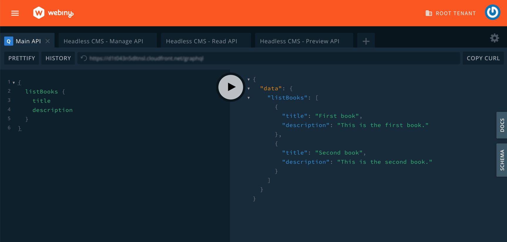

import { Alert } from "@/components/Alert";

<Alert type="success" title="What you'll learn">

- how to use the `GraphQLSchemaPlugin` in order to extend an existing default GraphQL API
- how to use the [`CmsGraphQLSchemaPlugin`](https://github.com/webiny/webiny-js/blob/v5.39.0/packages/api-headless-cms/src/plugins/CmsGraphQLSchemaPlugin.ts) in order to extend an existing Headless CMS GraphQL API

</Alert>

## Introduction

When it comes to HTTP API development, Webiny relies on [GraphQL](https://graphql.org/). In fact, all of the applications that are part of the Webiny Serverless CMS, such as [Page Builder](https://www.webiny.com/serverless-app/page-builder) and [Headless CMS](https://www.webiny.com/serverless-app/headless-cms), use GraphQL to enable developers to programmatically interact with the applications via a client of their choice, like a browser.

Generally, when discussing extending an existing GraphQL API, we refer to one or more of the following:

- Adding new [query or mutation](https://graphql.org/learn/queries/) GraphQL operations
- Adding new GraphQL [types](https://graphql.org/learn/schema/#object-types-and-fields)
- Extending existing GraphQL types with additional [fields](https://graphql.org/learn/queries/#fields)

For example, we might want to add a new Page Builder-related `duplicatePage` mutation responsible for duplicating pages. Or, we might want to add an extra field to the [`PbPage`](https://github.com/webiny/webiny-js/blob/v5.39.6/packages/api-page-builder/src/graphql/graphql/pages.gql.ts#L31) GraphQL type to store additional data for each page.

<ExtensionsGettingStarted
  type={"api"}
  name={"extendGraphqlApi"}
  dependencies={"@webiny/handler-graphql"}
  scaffoldCommandExtraInfo={
    <>
      Since we'll be using the <code>GraphQLSchemaPlugin</code>{" "} utility from the <code>@webiny/handler-graphql</code>{" "}
      package, we've immediately included it in the list of dependencies. Also, note that the scaffolded
      files can be used for all of the examples shown in this guide.
    </>
  }
/>

Once you run the scaffold command mentioned above, all the necessary files will be created. Now, let's extend the default GraphQL API with a new `listBooks` query using the `GraphQLSchemaPlugin` utility.  

Update the `extensions/extendGraphqlApi/src/index.ts` file with the following code:

```ts extensions/extendGraphqlApi/src/index.ts
import { GraphQLSchemaPlugin } from "@webiny/handler-graphql/plugins";
import { Context } from "@webiny/handler";

export const createExtension = () => {
    return [
        new GraphQLSchemaPlugin<Context>({
            // Extend the `Query` type with the `Book` type and `listBooks` query field,
            // which returns a list of all books previously saved in the database.
            typeDefs: /* GraphQL */ `
              type Book {
                title: String
                description: String
              }
              extend type Query {
                # Returns a list of all users
                listBooks: [Book]
              }
            `,
            // In order for the `listBooks` to work, we also need to create a resolver function.
            resolvers: {
              Query: {
                listBooks: async (_, args, context) => {
                  // In a real life application, these would be loaded from the database.
                  const books = [
                    { title: "First book", description: "This is the first book." },
                    { title: "Second book", description: "This is the second book." }
                  ];
          
                  // Finally, return the list of books using the `ListResponse` class instance.
                  return books;
                }
              }
            }
        })
    ];
};
```

Declaring your API using `GraphQLSchemaPlugin` means your API will be registered under the default API. This way, your new query (`listBooks`) will be visible in the [API Playground](/docs/{version}/admin-area/basics/api-playground) under the **Main API** tab.

```graphql
{
  listBooks {
    title
    description
  }
}
```

Executing the query should give us the following result:



In case you wish to extend the Headless CMS API, simply replace `GraphQLSchemaPlugin` with `CMSGraphQLSchemaPlugin` in your plugin. Everything else remains the same. This will make your plugin visible under the **"Headless CMS - Manage API"** tab in the API Playground, and you'll need to use the corresponding Headless CMS - Manage API GraphQL URL. You can find a detailed example of extending the Headless CMS API [here](/docs/{version}/headless-cms/extending/extend-graphql-api).

```diff-tsx extensions/extendGraphqlApi/src/index.ts
- import { GraphQLSchemaPlugin } from "@webiny/handler-graphql";
+ import { CmsGraphQLSchemaPlugin } from "@webiny/api-headless-cms";

```


<Alert type="info">

The [`CmsGraphQLSchemaPlugin`](https://github.com/webiny/webiny-js/blob/v5.39.6/packages/api-headless-cms/src/plugins/CmsGraphQLSchemaPlugin.ts) plugin is part of the [`@webiny/api-headless-cms`](https://github.com/webiny/webiny-js/tree/v5.39.6/packages/api-headless-cms) package, which can also be used to create new standalone GraphQL APIs.

</Alert>


## Additional Related Examples

For more concrete examples, you can visit the following guides, which explain how to extend GraphQL types and operations for different Webiny applications:

- [Page Builder](/docs/{version}/page-builder/extending/extend-graphql-api)
- [Headless CMS](/docs/{version}/headless-cms/extending/extend-graphql-api)