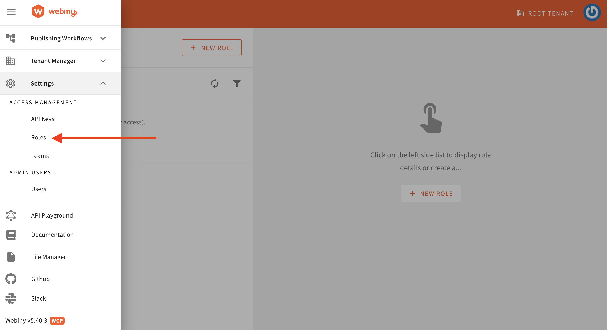
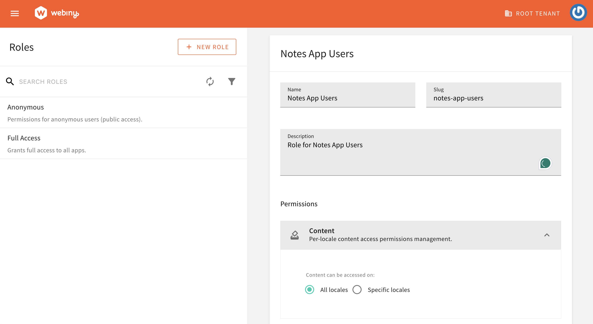
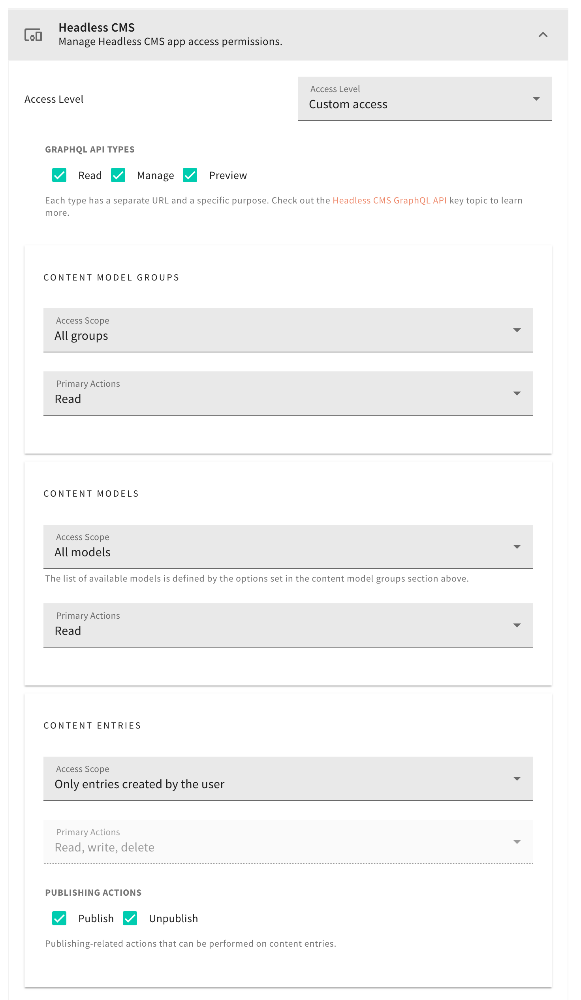
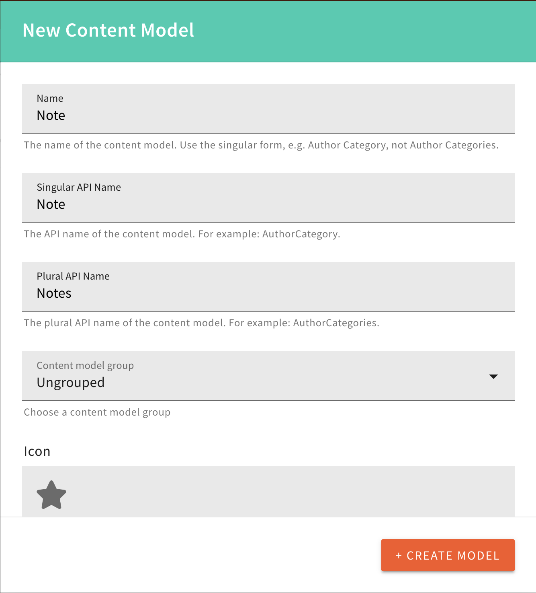
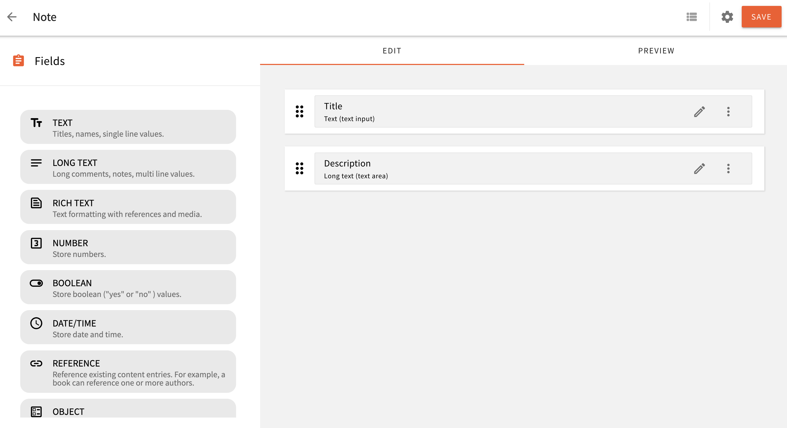

---
id:
title: Webiny Infrastructure Setup
description: Learn how to set up a new User Pool in Webiny, enable authentication for it, and restrict users’ access to only their own content.
---

import { Alert } from "@/components/Alert";

<Alert type="info" title="Can I Use This?">

This feature has been available since Webiny **v5.40.0** and is available in Business & Enterprise tier.

</Alert>

<Alert type="success" title="What you will learn">

- how to set up a new User Pool in Webiny and enable authentication for it
- how to limit users' access to only the content they've created

</Alert>

## Webiny Infrastructure Setup

### Notes App User Pool and User Pool Client

<Alert type="info">

The `extensions/notesApp` code covered in this section can be found in our [GitHub examples repository](https://github.com/webiny/webiny-examples/tree/master/headless-cms/notes-app/5.40.0/webiny).

</Alert>

The first step is to set up an AWS Cognito User Pool and User Pool Client specifically for Notes App users. All users who sign up through our Notes App (React App) will be created in this User Pool.

1. To get started, we first scaffold a new workspace extension in the `/extensions/notesApp` folder, via the following command:

```bash
yarn webiny scaffold workspace \
--name notesApp \
--dependencies @webiny/api-headless-cms
```

This command will create `notesApp` extensions in `<webiny-project-home>/extensions/` location.

2. In the `extensions/notesApp/src` directory, create the `configureNotesAppCognitoUserPool.ts` and `applyNotesAppEnvVariables.ts` files.

```tsx configureNotesAppCognitoUserPool.ts
import * as aws from "@pulumi/aws";
import * as pulumi from "@pulumi/pulumi";
import { CorePulumiApp } from "@webiny/pulumi-aws";

// We mark resources as protected if deploying via CI/CD and into one of the specified environments.
const protectResource = (app: CorePulumiApp) => {
    return "CI" in process.env && ["prod", "staging"].includes(app.params.run["env"]);
};

export type CustomCoreOutput = {
    notesAppUserPoolId: string;
    notesAppUserPoolRegion: string;
    notesAppUserPoolClient: string;
    notesAppUserPoolArn: string;
};

export const configureNotesAppCognitoUserPool = (app: CorePulumiApp) => {

    const userPool = app.addResource(aws.cognito.UserPool, {
        name: "notes-app-users",
        config: {
            schemas: [
                {
                    attributeDataType: "String",
                    name: "email",
                    required: false,
                    developerOnlyAttribute: false,
                    mutable: true,
                    stringAttributeConstraints: {
                        maxLength: "2048",
                        minLength: "0"
                    }
                },
                {
                    attributeDataType: "String",
                    name: "family_name",
                    required: false,
                    developerOnlyAttribute: false,
                    mutable: true,
                    stringAttributeConstraints: {
                        maxLength: "2048",
                        minLength: "0"
                    }
                },
                {
                    attributeDataType: "String",
                    name: "given_name",
                    required: false,
                    developerOnlyAttribute: false,
                    mutable: true,
                    stringAttributeConstraints: {
                        maxLength: "2048",
                        minLength: "0"
                    }
                },
                {
                    attributeDataType: "String",
                    name: "wby_tenant",
                    required: false,
                    developerOnlyAttribute: false,
                    mutable: true,
                    stringAttributeConstraints: {
                        maxLength: "30",
                        minLength: "0"
                    }
                },
                {
                    attributeDataType: "String",
                    name: "wby_notes_app_group",
                    required: false,
                    developerOnlyAttribute: false,
                    mutable: true,
                    stringAttributeConstraints: {
                        maxLength: "50",
                        minLength: "0"
                    }
                }
            ],
            passwordPolicy: {
                minimumLength: 8,
                requireLowercase: false,
                requireNumbers: false,
                requireSymbols: false,
                requireUppercase: false,
                temporaryPasswordValidityDays: 7
            },
            autoVerifiedAttributes: ["email"],
            aliasAttributes: ["preferred_username"],
        },
        opts: { protect: protectResource(app) }
    });

    const userPoolClient = app.addResource(aws.cognito.UserPoolClient, {
        name: "notes-app",
        config: {
            userPoolId: userPool.output.id,
            explicitAuthFlows: [
                "ALLOW_USER_SRP_AUTH",
                "ALLOW_CUSTOM_AUTH",
                "ALLOW_REFRESH_TOKEN_AUTH"
            ],

            supportedIdentityProviders: ["COGNITO"]
        }
    });

    app.addOutputs({
        notesAppUserPoolId: userPool.output.id,
        notesAppUserPoolRegion: String(process.env.AWS_REGION),
        notesAppUserPoolArn: userPool.output.arn,
        notesAppUserPoolClient: userPoolClient.output.id
    });
};
```

``` tsx applyNotesAppEnvVariables.ts

import { ApiPulumiApp } from "@webiny/pulumi-aws";
import { getStackOutput } from "@webiny/cli-plugin-deploy-pulumi/utils";

export const applyNotesAppEnvVariables = (app: ApiPulumiApp) => {
    const core = getStackOutput({
        folder: "apps/core",
        env: app.params.run["env"]
    });

    if (!core) {
        throw new Error("Core application is not deployed.");
    }

    app.setCommonLambdaEnvVariables({
        NOTES_APP_COGNITO_REGION: core["notesAppUserPoolRegion"],
        NOTES_APP_COGNITO_USER_POOL_ID: core["notesAppUserPoolId"]
    });

    // Add permission to GraphQL Lambda policy to interact with the Notes App User Pool
    app.resources.graphql.policy.config.policy(policy => {
        if (typeof policy === "string") {
            return policy;
        }

        return {
            ...policy,
            Statement: [
                ...policy.Statement,
                {
                    Sid: "PermissionForNotesAppCognitoUserPool",
                    Effect: "Allow",
                    Action: "cognito-idp:*",
                    Resource: `${core["notesAppUserPoolArn"]}`
                }
            ]
        };
    });
};

```

3. Now export the `configureNotesAppCognitoUserPool` and `applyNotesAppEnvVariables` modules.
Add the following content in the `extensions/notesApp/src/index.ts` file.

``` tsx index.ts
export * from "./configureNotesAppCognitoUserPool";
export * from "./applyNotesAppEnvVariables";
```

4. In the core app configuration, add the Cognito User Pool for Notes App users by updating the `apps/core/webiny.application.ts` file with the following changes.

``` diff-tsx apps/core/webiny.application.ts
import { createCoreApp } from "@webiny/serverless-cms-aws";
+ import { configureNotesAppCognitoUserPool } from "notes-app"

export default createCoreApp({
-    pulumiResourceNamePrefix: "wby-"
+    pulumiResourceNamePrefix: "wby-",
+    pulumi(app) {
+        configureNotesAppCognitoUserPool(app);
+    }
});

```

7. Add environment variables related to the Notes App's Cognito User Pool to the Webiny API application by updating the `apps/api/webiny.application.ts` file with the following changes.

``` diff-tsx apps/api/webiny.application.ts
import { createApiApp } from "@webiny/serverless-cms-aws";
+ import { applyNotesAppEnvVariables } from "notes-app";

export default createApiApp({
-    pulumiResourceNamePrefix: "wby-",
+    pulumiResourceNamePrefix: "wby-",
+    pulumi(app) {
+        applyNotesAppEnvVariables(app);
+    }
});
```

### Add Cognito Authenticator for Notes App Users

Add the Cognito Authenticator for Notes App users. This authenticator will be responsible for authenticating and authorizing the Notes App users. Add the following Cognito Authenticator to the `apps/api/graphql/src/security.ts` file.

```diff-tsx apps/api/graphql/src/security.ts
    cognitoAuthentication({
        region: String(process.env.COGNITO_REGION),
        userPoolId: String(process.env.COGNITO_USER_POOL_ID),
        identityType: "admin"
    }),
+    cognitoAuthentication({
+        region: String(process.env.NOTES_APP_COGNITO_REGION),
+        userPoolId: String(process.env.NOTES_APP_COGNITO_USER_POOL_ID),
+        identityType: "notes-app-users",
+        getIdentity({ token, identityType}) {
+            return {
+                id: token.sub,
+               type: identityType,
+               displayName: `${token.given_name} ${token.family_name}`,
+               email: token.email,
+               firstName: token.given_name,
+               lastName: token.family_name,
+               group: token["custom:wby_notes_app_group"]
+           }
+       }
+   }),

```

### Add Types for Environment Variables

Since we have used `process.env.NOTES_APP_COGNITO_REGION` and `process.env.NOTES_APP_COGNITO_USER_POOL_ID` in
the `security.ts` file above, let's add these types to the `types/env/index.d.ts` file.
This file is located at `<project-root>/types/env/index.d.ts`.

```diff-tsx types/env/index.d.ts
        COGNITO_USER_POOL_ID?: string;
        COGNITO_REGION?: string;
+       NOTES_APP_COGNITO_REGION?: string;
+       NOTES_APP_COGNITO_USER_POOL_ID?: string;
```

### Deploy the Core and API Applications

The next step is to deploy the Core and API applications. This will create the necessary infrastructure and enable the Cognito authenticator for Notes App users that we created earlier.

Please run the following commands to deploy the Core and API applications in the development environment. If you are deploying to another environment, replace "dev" with the appropriate environment in the command.

```bash
yarn webiny deploy apps/core --env dev
yarn webiny deploy apps/api --env dev
```

<Alert type="info">

After deployment, you will receive the following values as output:
- `notesAppUserPoolId`
- `notesAppUserPoolRegion`
- `notesAppUserPoolArn`
- `notesAppUserPoolClient`

Please save these values, as they will be needed when creating the React App.

If you lost these values, don't worry. You can also retrieve them from the `your-webiny-project-root/.pulumi/apps/core/.pulumi/stacks/core/dev.json` file within your Webiny project.

Since we've deployed the `dev` environment for the demo, we're seeing the `dev.json` file. If you've deployed your project in a different environment, you'll find a file named after your environment, such as `your-env-name.json` stack file .
</Alert>

<Alert type="success">

With the [`webiny watch`](/docs/{version}/core-development-concepts/basics/watch-command) command running, any changes to the application code will be automatically rebuilt and redeployed to the cloud.

</Alert>

### Create Role for Notes App Users

Now, we will create a role for Notes App users and define the permissions for this role. In our scenario, users can read, write, and delete only the content entries they have created.

Navigate to the Roles section under Access Management.



**Step 1:** Enter the Role Name, Slug, and Description. Set the permissions for either All locales or Specific locales based on your use case.

**Please note that the `slug` is important and should match the one we defined in the [Cognito Authenticator for Notes App Users](/docs/{version}/headless-cms/notes-app/webiny-infrastructure-setup#add-cognito-authenticator-for-notes-app-users). For our use case, the `slug` should be `notes-app-users`.**

Additionally, under the Permissions/Content section, select "**All locales**" (as shown in the image below). For this demo, we've chosen "All locales." However, for your app, you can opt to select specific locales if needed.




**Step 3:** Set the custom access level for the Headless CMS. Grant Read access to the content model group and content model. For Content Entries, set the scope to `Only entries created by the user`. Refer to the screenshot below for details.




### Create Note Model to Store User Notes

As the final step on the Webiny side, we'll create a Note Model to store user notes. If you're new to creating models in Webiny, refer to the [Create Content Model](/docs/user-guides/headless-cms/essentials/create-content-model) user guide.

We'll set up a Note content model with the following fields:

| Field       | Field Type |
| :---------- | :--------- |
| Title        | Text       |
| Description | Long text  |

**Step 1**: Create the Note Model.



**Step 2**: Add Title and Description Fields to the Note Model.



Great, we're all set on the Webiny side. Now, let's move on to building the [Notes App in React](/docs/{version}/headless-cms/notes-app/react-notes-app).
