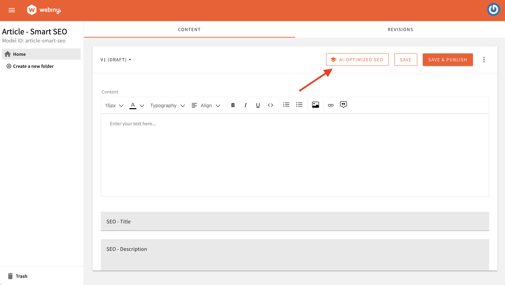

import { Alert } from "@/components/Alert";
import smartSEO from "./assets/smart-seo-open-ai/smart-seo.mp4";

<Alert type="info" title="Can I Use This?">

This feature is available since Webiny **v5.41.0**.

</Alert>

<Alert type="success" title="What you will learn">

- how to integrate OpenAI with Webiny
- how to generate SEO titles, descriptions, and tags for your articles with OpenAI

</Alert>

## Overview

Webiny is an AI model-agnostic platform. You can integrate it with different models and craft tailored AI-experiences. You control which model and what AI-powered capabilities your users and content editors can use.

In this tutorial, we will demonstrate how to integrate OpenAI with Webiny to build a Smart SEO tool for Headless CMS. This tool will automatically generate SEO titles and tags for your articles.

You’ll create the content for your blog or article, and based on this content, OpenAI will provide SEO titles and tags to enhance your article’s search visibility.

<Video src={smartSEO} controls={true} />

## Getting Started

Run the following command to set up this extension in your project.

```bash
yarn webiny extension headless-cms/smart-seo-open-ai
```

The Smart SEO extension code can be found in our [webiny-examples](https://github.com/webiny/webiny-examples/tree/master/headless-cms/smart-seo-open-ai) repository.

## Set OpenAI API Key in Environment Variables

Open the `.env` file in the root of your project and add the OpenAI API key to the `WEBINY_API_OPEN_AI_API_KEY` environment variable as shown below:

```bash
WEBINY_API_OPEN_AI_API_KEY=sk-proj-T2-xxxxxxxxxxxxxxxxxxxxxxxxxxxxxxxxxxx
```

For detailed instructions on creating an OpenAI API key, refer to their [official documentation](https://platform.openai.com/docs/quickstart#create-and-export-an-api-key).

## Deploy API application

In this example, we created an **Article - Smart SEO** Content Model to demonstrate AI-powered capabilities. This content model is generated programmatically via code.
Additionally, we extended the Headless CMS GraphQL API to generate SEO data using the OpenAI API, which creates SEO titles, descriptions, and tags for articles.

Details on this are covered in the sections below. For now, let’s deploy the API application that will create the Article - Smart SEO Content Model and extend Headless CMS GraphQL API to generate SEO data using OpenAI.

```bash
yarn webiny deploy api --env ENVIRONMENT_NAME
```

Alternatively, you can use the watch command, which continuously rebuild and redeploy your code. Learn more about it [here](/docs/core-development-concepts/basics/watch-command).

## Run the Project

After downloading the extension to your project, run the [webiny watch](/docs/core-development-concepts/basics/watch-command) command to see the Smart SEO functionality in action.

```bash
yarn webiny watch admin --env ENVIRONMENT_NAME
```

## All Set!
You’re now ready to generate SEO titles and tags for your articles using OpenAI. Simply navigate to the **Article - Smart SEO** Model, create a new article, and click the “AI-Optimized SEO” button to generate SEO titles and tags effortlessly.

<Video src={smartSEO} controls={true} />

## Code Walkthrough

Let’s walk through the code to understand how the Smart SEO extension operates. We’ve created a new [extension](/docs/core-development-concepts/basics/extensions) called [`smart-seo-open-ai`](https://github.com/webiny/webiny-examples/tree/master/headless-cms/smart-seo-open-ai/5.41.x/extensions/smartSeoOpenAi), and we’ll review each plugin used in this extension one by one.

### Field Tracker, ContentEntry Form Decorator
In this example, we have an **Article - Smart SEO** Model with four fields: **Content**, **SEO - Title**, **SEO - Description**, and **SEO - Meta Tags**. We will track these fields. Once the Content field is populated, we will send it to OpenAI, which will generate SEO-friendly titles and tags for the article. The generated title and tags will then be set in the respective **Title**, **Description** and **Tags** fields of the model.

The concept is straightforward: we aim to track fields of interest, such as text inputs or rich text fields. The challenge lies in not knowing the exact location of these fields. They could be nested within objects, repeatable objects, or dynamic zone templates, making their placement unpredictable. Hardcoding paths to these fields is not a feasible solution. So, we will create the [Field Tracker](https://github.com/webiny/webiny-examples/blob/master/headless-cms/smart-seo-open-ai/5.41.x/extensions/smartSeoOpenAi/admin/src/FieldTracker.tsx).

**Field Tracker** is a React context that tracks content model fields of interest. It enables you to extract data from these fields that can be sent data to OpenAI and update fields with the received response.

Here is the [code for the Field Tracker](https://github.com/webiny/webiny-examples/blob/master/headless-cms/smart-seo-open-ai/5.41.x/extensions/smartSeoOpenAi/admin/src/FieldTracker.tsx), here we [decorated the `ContentEntryForm`](https://github.com/webiny/webiny-examples/blob/master/headless-cms/smart-seo-open-ai/5.41.x/extensions/smartSeoOpenAi/admin/src/DecorateContentEntryForm.tsx) with a FieldTracker component.

We’ve also [decorated the `useBind` hook](https://github.com/webiny/webiny-examples/blob/master/headless-cms/smart-seo-open-ai/5.41.x/extensions/smartSeoOpenAi/admin/src/DecorateContentEntryFormBind.tsx) to integrate field tracking specifically for models. In this example, we are tracking rich-text fields and SEO-specific fields (**seoTitle**, **seoDescription**, **seoMetaTags**) in the **Article - Smart SEO** model. This allows us to trigger dynamic updates and facilitate interactions with external services.

<Alert type="info">

  You can customize [this `ContentEntryFormBind` decorator file](https://github.com/webiny/webiny-examples/blob/master/headless-cms/smart-seo-open-ai/5.41.x/extensions/smartSeoOpenAi/admin/src/DecorateContentEntryFormBind.tsx) to track fields from other models or different field types, tailoring it to your specific use case.

</Alert>

### Extract HTML from RichTextHtml (Lexical Editor)
Webiny leverages the [Lexical text editor](https://lexical.dev/) for Rich Text Fields. However, for generating SEO-related information using OpenAI, we will send the HTML content (not the Lexical format). To achieve this, we need to extract the HTML content from the Rich Text field. For this purpose, we have created a [`extractFromRichText` transformer](https://github.com/webiny/webiny-examples/blob/master/headless-cms/smart-seo-open-ai/5.41.x/extensions/smartSeoOpenAi/admin/src/extractFromRichText.ts) to handle the conversion.

### Extend Headless CMS GraphQL API

In this example, we [extended the Headless CMS GraphQL API](/docs/headless-cms/extending/extend-graphql-api) to generate SEO data using the OpenAI API. The [`generateSeo` plugin](https://github.com/webiny/webiny-examples/blob/master/headless-cms/smart-seo-open-ai/5.41.x/extensions/smartSeoOpenAi/api/src/generateSeo.ts) integrates Webiny with OpenAI. We created a `generateSeo` query for the same.

To prevent exposing our OpenAI API key to the public, we avoid calling the OpenAI API from the client side. Instead, we handle it server-side by creating this `generateSeo` plugin that extends the Headless CMS GraphQL API for secure SEO data generation. This plugin sends content to OpenAI and retrieves SEO-related information.

### Smart SEO

The [`SmartSeo.tsx` plugin](https://github.com/webiny/webiny-examples/blob/master/headless-cms/smart-seo-open-ai/5.41.x/extensions/smartSeoOpenAi/admin/src/SmartSeo.tsx) sends HTML content to the `generateSeo` query (created by the [generateSeo plugin](#extend-headless-cms-graph-ql-api) mentioned earlier) and retrieves SEO-related information. The retrieved data is then used to update the relevant fields in the content model.

If you’ve noticed the AI-Optimized SEO button on the Content Entry form, it has been configured in this plugin using the [ContentEntryEditorConfig](https://github.com/webiny/webiny-examples/blob/3c73e547b992e6d4b1ce67647ae056bbd05b43b3/headless-cms/smart-seo-open-ai/5.41.x/extensions/smartSeoOpenAi/admin/src/SmartSeo.tsx#L118).

<Alert type="info">

  We display the **AI-OPTIMIZED SEO** button on the Content Entry form for the content model with the ID `article`.
  You can easily customize it to include your [content model IDs](https://github.com/webiny/webiny-examples/blob/3c73e547b992e6d4b1ce67647ae056bbd05b43b3/headless-cms/smart-seo-open-ai/5.41.x/extensions/smartSeoOpenAi/admin/src/SmartSeo.tsx#L124) to display this button on the respective content model entry forms.

</Alert>



### Article Content Model

In this example, we created an **Article - Smart SEO** Content Model with the ID **article-smart-seo** to showcase AI capabilities.This content model is generated programmatically, and you can find the corresponding [Content Model code here](https://github.com/webiny/webiny-examples/blob/master/headless-cms/smart-seo-open-ai/5.41.x/extensions/smartSeoOpenAi/api/src/Article.ts).

<Alert type="info">

  Please note that the **article-smart-seo** content ID is referenced in the code. Refer to the sections above for guidance on customizing the code to align with your content model.

  In your real project, you can remove this content model by either [deleting the corresponding `Article.ts` file](https://github.com/webiny/webiny-examples/blob/master/headless-cms/smart-seo-open-ai/5.41.x/extensions/smartSeoOpenAi/api/src/Article.ts) or commenting out the [Article import in the index file](https://github.com/webiny/webiny-examples/blob/3c73e547b992e6d4b1ce67647ae056bbd05b43b3/headless-cms/smart-seo-open-ai/5.41.x/extensions/smartSeoOpenAi/api/src/index.ts#L6).

</Alert>

For your reference, we created an **Article - Smart SEO** content model with the following fields to manage and store articles:

| Field             | Field Type | Field ID |
| :----------       | :--------- | :--------- |
| Content           | Rich Text  | content |
| SEO - Title       | Long text  | seoTitle |
| SEO - Description | Long text  | seoDescription |
| SEO - Meta Tags   | Object (with **Tag Name** and **Tag Value** Text Field)  | seoMetaTags |


