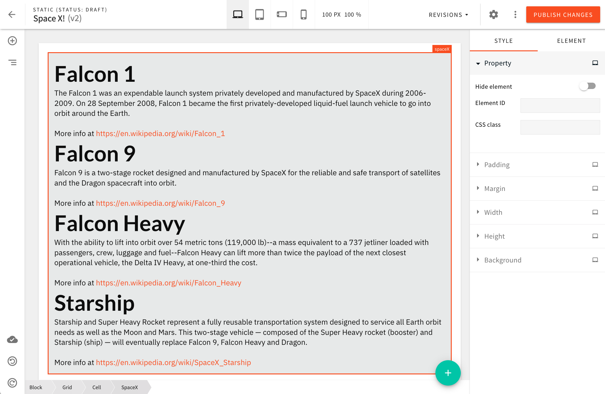
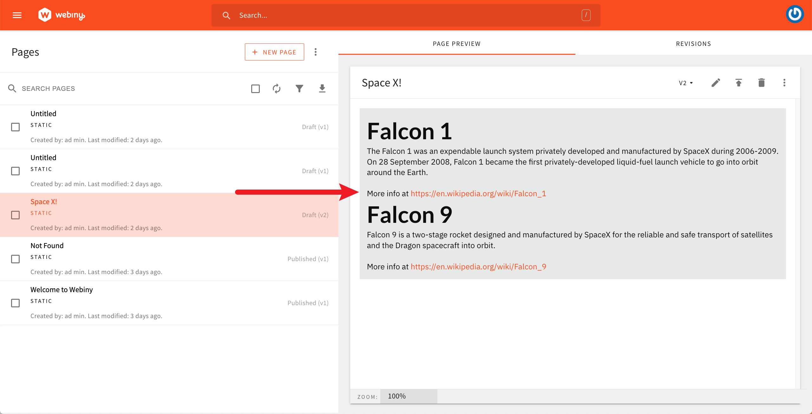

import elementInSidebar from "./assets/create-a-page-element/element-in-sidebar.png";
import elementSettings from "./assets/create-a-page-element/page-element-settings.png";
import elementInEditor from "./assets/create-a-page-element/element-in-editor.mp4";

import { Alert } from "@/components/Alert";

<Alert type="success" title="What you'll learn">

- how to create a custom page Builder element
- how to register plugins in Webiny applications

</Alert>

<Alert type="info">

The full code example used in this article is available in our
[webiny-examples](https://github.com/webiny/webiny-examples/tree/master/page-builder/spacex-page-element) GitHub
repository.

</Alert>

## Introduction

Out of the box, Webiny's Page Builder app provides a plethora of ready-made page elements we can use to create both simple and complex pages for our website. Furthermore, on top of the default set, users can also create their custom page elements, which is what this article demonstrates.

In this short article, we create a relatively simple page element that allows users to show a list of different [SpaceX](https://www.spacex.com/) rocket and dragon spacecrafts. Here's what the final result will look like:



The custom page element will be available from the **Media** page elements category:

<Image
  title="SpaceX Page Element in the Elements Menu (Media category)"
  src={elementInSidebar}
  style={{ width: 450 }}
/>

Also, upon dropping the element onto a page, users will have the ability to adjust the following three settings:

1. type of spacecrafts to be displayed (rockets or dragons)
2. number of spacecrafts to be displayed
3. pagination offset (number of spacecrafts we want to skip when retrieving the data)

<Image
  title="SpaceX Page Element in the Elements Menu (Media category)"
  src={elementSettings}
  style={{ width: 450 }}
/>

Note that the spacecrafts data will be retrieved from a non-official public SpaceX GraphQL HTTP API, located at https://spacex-production.up.railway.app/. Meaning, changing these settings will dictate the variables that will be included in GraphQL queries issued by the page element. More on this in the following sections.

<ExtensionsGettingStarted
  type={"pbElement"}
  name={"spaceXElement"}
  fullExampleLink={"https://github.com/webiny/webiny-examples/tree/master/page-builder/custom-page-elements"}
  fullExampleDownloadLink={"page-builder/custom-page-elements"}
/>

## Overview

### Renderer React Component

To create a custom page element, the first step is to create a [renderer React component](https://github.com/webiny/webiny-js/blob/v5.40.0/packages/app-page-builder-elements/src/types.ts#L129-L131) which, as the name itself suggests, renders it. As we'll be able to see, this is easily achieved via the [`createRenderer`](https://github.com/webiny/webiny-js/blob/v5.40.0/packages/app-page-builder-elements/src/createRenderer.tsx) factory function.

### Registering the Renderer

Via a couple of React components, the next step is registering the renderer React component within our project's **Admin** and **Website** apps.

For the **Admin** app, we first use the `PbEditorPageElementPlugin` React component, which enables us to introduce our custom page element into the Page Builder's page editor and enables users to drop the new element onto a page.

After that, optionally, we use the `PbEditorPageElementAdvancedSettingsPlugin` React component, which lets us define all the related settings that are available to users upon dropping the page element onto a page. Since the page element we're building does contain settings that the user can adjust, we will need this plugin as well.

When it comes to the **Website** app, here we use the `PbRenderElementPlugin` React component. With it, we ensure our renderer React component is used upon serving a published page to an actual website visitor. Note we'll also need to the same on the **Admin** app side because previewing pages is possible there too, outside the page editor.



## Implementation

### Renderer React Component

As previously mentioned, in order to create a custom page element, we start off by creating a new renderer React component. We create the [`extensions/theme/src/pageElements/spaceX/SpaceX.tsx`](https://github.com/webiny/webiny-examples/blob/master/page-builder/spacex-page-element/extensions/theme/src/pageElements/spaceX/SpaceX.tsx) file with the following code:

```tsx extensions/theme/src/pageElements/spaceX/SpaceX.tsx
import React, { useEffect, useState } from "react";
import { request } from "graphql-request";
import { createRenderer, useRenderer } from "@webiny/app-page-builder-elements";

// For simplicity, we're hard-coding the GraphQL HTTP API URL here.
const GQL_API_URL = "https://spacex-production.up.railway.app/";

// These are the necessary GraphQL queries we'll need in order to retrieve data.
const QUERIES = {
  rockets: /* GraphQL */ `
    query listRockets($limit: Int, $offset: Int) {
      data: rockets(limit: $limit, offset: $offset) {
        id
        name
        description
        wikipedia
      }
    }
  `,
  dragons: /* GraphQL */ `
    query listDragons($limit: Int, $offset: Int) {
      data: dragons(limit: $limit, offset: $offset) {
        id
        name
        description
        wikipedia
      }
    }
  `
};

export interface Spacecraft {
  id: string;
  name: string;
  description: string;
  wikipedia: string;
}

// It's often useful to type the data that the page element will carry.
export interface SpaceXElementData {
  variables: {
    limit: string;
    offset: string;
    type: "rockets" | "dragons";
  };
}

// The renderer React component.
export const SpaceX = createRenderer(() => {
  // Let's retrieve the variables that were chosen by
  // the user upon dropping the page element onto the page.
  const { getElement } = useRenderer();
  const element = getElement<SpaceXElementData>();
  const { limit, offset, type } = element.data.variables;

  const [data, setData] = useState<Spacecraft[]>([]);

  // This is where we fetch the data and store it into component's state.
  useEffect(() => {
    request(GQL_API_URL, QUERIES[type], {
      limit: parseInt(limit),
      offset: parseInt(offset)
    }).then(({ data }) => setData(data));
  }, [limit, offset, type]);

  if (!data.length) {
    return <>Nothing to show.</>;
  }

  // If the data has been retrieved, we render it via a simple unordered list.
  return (
    <ul>
      {data.map(item => (
        <li key={item.id}>
          <h1>{item.name}</h1>
          <div>{item.description}</div>
          <br />
          <div>
            More info at&nbsp;
            <a href={item.wikipedia} target={"_blank"} rel={"noreferrer"}>
              {item.wikipedia}
            </a>
          </div>
        </li>
      ))}
    </ul>
  );
});
```

Note that, for simplicity's sake, all the code is placed in a single file. Of course, it is possible to organize it across multiple files, if preferred.

Furthermore, in order to be able to issue remote GraphQL queries, we introduce the [`graphql-request`](https://www.npmjs.com/package/graphql-request) package. The package can be installed via the following command, run from your project root:

```bash
yarn workspace theme add graphql-request@^6.0.0
```

With this code in place, we're ready for the next step, which is registering the renderer React component within our **Admin** and **Website** apps. We'll start with the **Website** app, as the plugin that we'll create here will also be needed within the **Admin** app.

### Website App

As previously mentioned, ensuring our custom renderer React component is actually used upon rendering a published page is done via the [`PbRenderElementPlugin`](https://github.com/webiny/webiny-js/blob/v5.40.0/packages/app-page-builder/src/types.ts#L375-L380) plugin. For this, we'll create a new [`extensions/theme/src/pageElements/spaceX/website.ts`](https://github.com/webiny/webiny-examples/blob/master/page-builder/spacex-page-element/extensions/theme/src/pageElements/spaceX/website.ts) file with the following code:

```tsx extensions/spaceXElement/src/website.tsx
import React from "react";
import { PbRenderElementPlugin } from "@webiny/app-website";
import { SpaceX } from "./SpaceX";

export const Extension = () => <PbRenderElementPlugin elementType={"spaceX"} render={SpaceX} />;

```

### Admin App

As previously mentioned, within the **Admin** app, we need two plugins: [`PbEditorPageElementPlugin`](https://github.com/webiny/webiny-js/blob/v5.40.0/packages/app-page-builder/src/types.ts#L498-L536) and [`PbEditorPageElementAdvancedSettingsPlugin`](https://github.com/webiny/webiny-js/blob/v5.40.0/packages/app-page-builder/src/types.ts#L642-L647).

For simplicity's sake, we'll again place all the code in a single file, this time in [`extensions/theme/src/pageElements/spaceX/admin.tsx`](https://github.com/webiny/webiny-examples/blob/master/page-builder/spacex-page-element/extensions/theme/src/pageElements/spaceX/admin.tsx):

```tsx extensions/spaceXElement/src/admin.tsx
import React from "react";
import {
    PbEditorPageElementAdvancedSettingsPlugin,
    PbEditorPageElementPlugin,
    PbRenderElementPlugin
} from "@webiny/app-page-builder";
import { SpaceX, SpaceXElementData } from "./SpaceX";
import { OnCreateActions } from "@webiny/app-page-builder/types";
import { Element } from "@webiny/app-page-builder-elements/types";
import { AdvancedSettings } from "./admin/AdvancedSettings";

const INITIAL_ELEMENT_DATA: SpaceXElementData = {
    variables: { type: "rockets", limit: "10", offset: "0" }
};

export const Extension = () => (
    <>
        <PbRenderElementPlugin elementType={"spaceX"} render={SpaceX} />
        <PbEditorPageElementPlugin
            elementType={"spaceX"}
            render={({ element }) => <SpaceX element={element as Element} />}
            toolbar={{
                // We use `pb-editor-element-group-media` to put our new
                // page element into the Media group in the left sidebar.
                title: "SpaceX",
                group: "pb-editor-element-group-media",
                preview() {
                    // We can return any JSX / React code here. To keep it
                    // simple, we are simply returning the element's name.
                    return <>Space X Page Element</>;
                }
            }}
            // Defines which types of element settings are available to the user.
            settings={[
                "pb-editor-page-element-settings-delete",
                "pb-editor-page-element-settings-visibility",
                "pb-editor-page-element-style-settings-padding",
                "pb-editor-page-element-style-settings-margin",
                "pb-editor-page-element-style-settings-width",
                "pb-editor-page-element-style-settings-height",
                "pb-editor-page-element-style-settings-background"
            ]}
            // Defines onto which existing elements our element can be dropped.
            // In most cases, using `["cell", "block"]` will suffice.
            target={["cell", "block"]}
            onCreate={OnCreateActions.OPEN_SETTINGS}
            // `create` function creates the initial data for the page element.
            create={options => {
                return {
                    type: "spaceX",
                    elements: [],
                    data: INITIAL_ELEMENT_DATA,
                    ...options
                };
            }}
        />
        <PbEditorPageElementAdvancedSettingsPlugin
            elementType={"spaceX"}
            element={<AdvancedSettings />}
        />
    </>
);

```

Before we register these plugins, note that, in order to construct the settings form, we're using the [`@webiny/form`](https://github.com/webiny/webiny-js/tree/v5.40.0/packages/form), [`@webiny/ui`](https://github.com/webiny/webiny-js/tree/v5.40.0/packages/ui), and [`@webiny/validation`](https://github.com/webiny/webiny-js/tree/v5.40.0/packages/validation) packages. Since the [`@webiny/ui`](https://github.com/webiny/webiny-js/tree/v5.40.0/packages/ui) is not installed within the [`extensions/theme`](https://github.com/webiny/webiny-examples/tree/master/page-builder/spacex-page-element/extensions/theme) package by default, we need to install it. This can be done via the following command, run from your project root:

```bash
yarn workspace theme add @webiny/ui
```

When it comes to plugin registration, in total, there are three plugins we need to register within the **Admin** app. The two shown above, plus the previously created [`PbRenderElementPlugin`](https://github.com/webiny/webiny-js/blob/v5.40.0/packages/app-page-builder/src/types.ts#L375-L380) plugin. The [`PbRenderElementPlugin`](https://github.com/webiny/webiny-js/blob/v5.40.0/packages/app-page-builder/src/types.ts#L375-L380) is required because, as mentioned, pages can also be previewed within the **Admin** app, outside the page editor.


With all the plugins registered, we're now ready to give this a try locally in our browser.

## Testing

With the above steps correctly completed, we should be able to see our custom page element in Page Builder's page editor and be able to drop it onto a page. The page element should also be correctly rendered when previewing the page, and also on the public website, once the page has been published.

<Video src={elementInEditor} controls={true} />

## Conclusion

Creating custom page elements is certainly an interesting option when users need more than what the default set of page elements provides.

On the code level, this could be creating completely custom (renderer) React components, including needed external NPM libraries, or even issuing remote HTTP requests to external HTTP APIs in order to retrieve data from standalone external systems.

On the other hand, custom page elements also add additional flexibility by allowing content creators to tweak elements' settings and, ultimately, allowing them to achieve more with just a single page element.

## Additional Examples

- [Cards Page Element](https://github.com/webiny/webiny-examples/tree/master/page-builder/cards-page-element)
- [Pages as Modal Content](https://github.com/webiny/webiny-examples/tree/master/page-builder/pages-as-modals)
