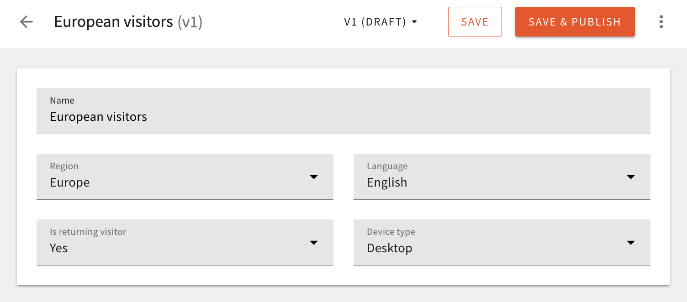

## About

We’re excited to announce the launch of its new A/B Testing & Personalization module for its Headless CMS. This cutting-edge module enables content creators, marketers, and developers to experiment, optimize, and personalize content experiences at scale—all while leveraging the power of serverless infrastructure. 

### Why Personalization Matters

In today’s fast-paced digital landscape, one-size-fits-all content strategies no longer cut it. Users expect content that resonates with them, speaks to their needs, and adapts to their behaviors. With Webiny’s new A/B Testing & Personalization module, businesses can:

- **Deliver Tailored Content** – Dynamically present the right content to the right audience based on demographics, behavior, and engagement data.
- **Optimize User Experience** – Conduct A/B tests and multivariate experiments to understand what content drives higher engagement and conversions.
- **Increase Retention and Loyalty** – Personalized content builds stronger relationships, fostering long-term engagement with users.
- **Leverage Data for Smarter Decisions** – Data-driven content strategies ensure that every published piece is backed by insights, leading to improved ROI.

### A Game-Changer for Content Creators and Marketers

With this new module, Webiny’s Headless CMS users gain powerful capabilities, including:

- **Effortless A/B Testing** – Test different versions of content elements, such as headlines, images, or layouts, to determine what performs best.
- **Advanced Personalization Rules** – Define audience segments and serve personalized content based on attributes like geolocation, past interactions, and device type.
- **Real-Time Insights & Reporting** – Access analytics dashboards to track test results and make data-driven content decisions.
- **Serverless Scalability** – Built on Webiny’s robust serverless architecture, the module ensures high performance, cost-efficiency, and seamless integration with existing workflows.

### Shaping the Future of Headless Content Management

“The launch of our A/B Testing & Personalization module marks a significant step in how businesses can engage with their audiences through our Headless CMS,” - Sven Al Hamad, CEO at Webiny. “By integrating experimentation and personalization natively into the platform, we are empowering content creators with the tools they need to drive meaningful user experiences and maximize engagement.”

This latest innovation underscores Webiny’s commitment to providing the most powerful, flexible, and scalable Headless CMS solution for enterprises and digital teams worldwide.

### Get Started Today

The A/B Testing & Personalization module is now available to a limited set of enterprise customers via a guided implementation from one of our partners. To learn more about how you can transform your content strategy with personalization and experimentation, [get in touch](https://www.webiny.com/forms/product-demo).