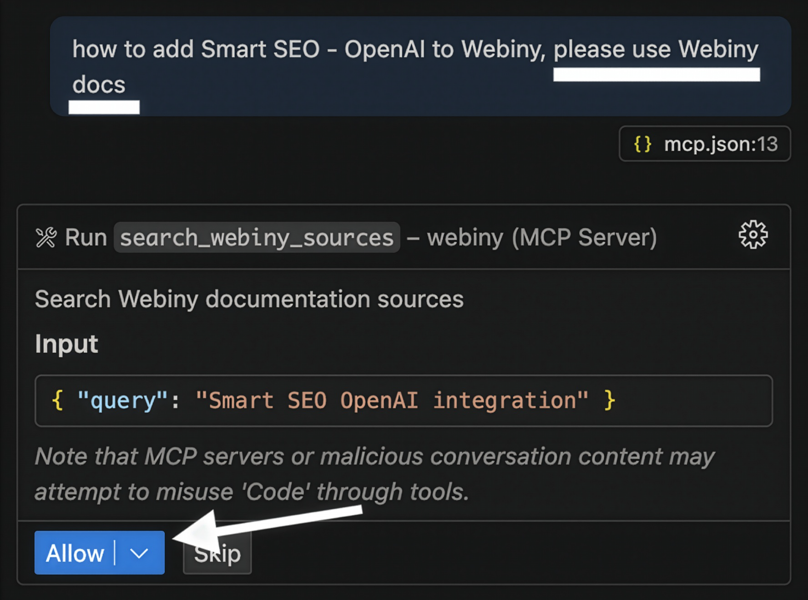

import { Alert } from "@/components/Alert";

<Alert type="success" title="WHAT YOU'LL LEARN">

- how to use AI assistant with Webiny documentation
- how to connect to the Remote Webiny MCP Server for enhanced AI assistance

</Alert>

In this chapter, you'll learn how you can use AI assistants and Remote MCP Server effectively in your Webiny development workflow.

## Webiny MCP Server

The Webiny documentation provides a remote Model Context Protocol (MCP) server that allows you to find information from the Webiny documentation right in your IDEs or AI tools, such as Cursor.
You can ensure your AI tools have current Webiny knowledge through the Webiny MCP server. This provides real-time access to the latest documentation, helping AI tools avoid outdated recommendations and ensuring they understand current best practices.

<Alert type="info" title="What is MCP?">

[Model Context Protocol](https://modelcontextprotocol.io/) (MCP) is a standardized way for AI tools to access external tools and data sources.

</Alert>


### Server Details

- **Name**: Webiny Docs
- **URL**: `https://mcp.docs.webiny.com/mcp`
- **Transport**: Streamable HTTP

You can add it to AI agents that support connecting to MCP servers.

### Cursor

[Click here](https://cursor.com/install-mcp?name=webiny&config=eyJ1cmwiOiJodHRwczovL21jcC5kb2NzLndlYmlueS5jb20vbWNwIn0K) to add the Webiny MCP server to Cursor.

To manually connect to the Webiny MCP server in Cursor, add the following to your `.cursor/mcp.json` file or Cursor settings, as explained in the [Cursor documentation](https://docs.cursor.com/context/model-context-protocol):

```json
{
  "mcpServers": {
    "webiny": {
      "url": "https://mcp.docs.webiny.com/mcp"
    }
  }
}
```

### VS Code

[Click here](https://vscode.dev/redirect/mcp/install?name=webiny&config=%7B%22type%22%3A%22http%22%2C%22url%22%3A%22https%3A%2F%2Fmcp.docs.webiny.com%2Fmcp%22%7D) to add the Webiny MCP server to VS Code.

To manually connect to the Webiny MCP server in VS Code, add the following to your `.vscode/mcp.json` file in your workspace:

```json
{
  "servers": {
    "webiny": {
      "type": "http",
      "url": "https://mcp.docs.webiny.com/mcp"
    }
  }
}
```

Learn more in the [VS Code documentation](https://code.visualstudio.com/docs/copilot/chat/mcp-servers).

<Alert type="info" title="Additional One-Time Setup in VS Code">
  Sometimes, in VS Code, you may need to perform a one-time setup. When you ask a question and include a phrase like “use Webiny Docs”, then VS Code will prompt you to enable the Webiny MCP server for all sessions. Allow it, and the setup will be complete. This step is required only once. Please refer to the image below for reference.
</Alert>



### Claude Desktop

To connect to the Webiny MCP server in Claude Desktop, add the following to your Claude Desktop configuration file:

**macOS**: `~/Library/Application Support/Claude/claude_desktop_config.json`

**Windows**: `%APPDATA%\Claude\claude_desktop_config.json`

```json
{
  "mcpServers": {
    "webiny": {
      "command": "npx",
      "args": [
        "@modelcontextprotocol/server-fetch",
        "https://mcp.docs.webiny.com/mcp"
      ]
    }
  }
}
```

Learn more in the [Claude Desktop documentation](https://docs.anthropic.com/en/docs/build-with-claude/computer-use).

### Manual Setup

Many tools support a common JSON configuration format for MCP servers. If there are not specific instructions for your chosen tool, you may be able to add the Webiny Docs MCP server by including the following configuration in your tool's MCP settings:

**Streamable HTTP:**
```json
{
  "mcpServers": {
    "Webiny docs": {
      "type": "http",
      "url": "https://mcp.docs.webiny.com/mcp"
    }
  }
}
```

**Local Proxy:**
```json
{
  "mcpServers": {
    "Webiny docs": {
      "type": "stdio",
      "command": "npx",
      "args": ["-y", "mcp-remote", "https://mcp.docs.webiny.com/mcp"]
    }
  }
}
```

### Claude Code CLI

[Claude Code](https://docs.anthropic.com/en/docs/claude-code/overview) is an agentic coding tool that runs on the command line. Enabling the Webiny Docs MCP server allows it to access the latest documentation while generating Webiny code.

Install using the terminal command:

```shell
claude mcp add --transport http webiny-docs https://mcp.docs.webiny.com/mcp
```

Learn more about [using MCP servers with Claude Code](https://docs.anthropic.com/en/docs/claude-code/mcp).

### Claude Code GitHub Action

Claude Code also provides a GitHub Action that can be used to run commands in response to GitHub events. Enabling the Webiny Docs MCP server allows it to access the latest documentation while answering questions in comments or generating Webiny code.

You can configure it to use the Webiny Docs MCP server for documentation access by adding the following to the workflow file:

```yaml
# ...rest of your workflow configuration
- uses: anthropics/claude-code-action@beta
  with:
    anthropic_api_key: ${{ secrets.ANTHROPIC_API_KEY }}
    mcp_config: |
      {
        "mcpServers": {
          "webiny-docs": {
            "type": "http",
            "url": "https://mcp.docs.webiny.com/mcp"
          }
        }
      }
    allowed_tools: "mcp__webiny-docs__search_webiny_docs"
```

Learn more about [using MCP servers with the Claude Code GitHub Action](https://github.com/anthropics/claude-code-action?tab=readme-ov-file#using-custom-mcp-configuration).

### Warp

[Warp](https://warp.dev) is an agent development environment built for coding with multiple AI agents. Adding the Webiny Docs MCP server allows Warp to access the latest Webiny documentation when answering questions or performing coding tasks.

1. Open your Warp settings and go to AI > MCP Servers > Manage MCP Servers.
2. Click "Add".
3. Enter the following configuration. You can optionally configure the Webiny MCP server to activate on startup using the `start_on_launch` flag:
   ```json
   {
     "mcpServers": {
       "Webiny docs": {
         "command": "npx",
         "args": ["-y", "mcp-remote", "https://mcp.docs.webiny.com/mcp"],
         "env": {},
         "working_directory": null,
         "start_on_launch": true
       }
     }
   }
   ```
4. Click "Save".

Learn more about [using MCP servers with Warp](https://docs.warp.dev/knowledge-and-collaboration/mcp).

### Claude.ai

[Claude.ai](https://claude.ai) is a general-purpose AI assistant. Adding the Webiny Docs MCP server allows it to access the latest documentation when answering Webiny questions or generating Webiny code.

1. Navigate to the [Claude.ai connector settings](https://claude.ai/settings/connectors).
2. Click "Add custom connector". You may need to scroll down to find this option.
3. Enter the server URL: `https://mcp.docs.webiny.com/mcp`.
4. Set the name to "Webiny docs".

Learn more about [using MCP servers with Claude.ai](https://support.anthropic.com/en/articles/10168395-setting-up-integrations-on-claude-ai#h_cda40ecb32).

### Windsurf

[Windsurf](https://windsurf.com/) is an AI-powered agentic coding tool, available as editor plugins or a standalone editor. It can use the Webiny Docs MCP server to access documentation while performing coding tasks.

Windsurf doesn't support streaming HTTP, so it requires a local proxy configuration:

1. Open `~/.codeium/windsurf/mcp_config.json` in your editor.
2. Add the following configuration to your Windsurf MCP settings:
   ```json
   {
     "mcpServers": {
       "Webiny docs": {
         "command": "npx",
         "args": ["-y", "mcp-remote", "https://mcp.docs.webiny.com/mcp"]
       }
     }
   }
   ```
3. Save the configuration and restart Windsurf.

Learn more about [using MCP servers with Windsurf](https://docs.windsurf.com/windsurf/cascade/mcp#mcp-config-json).

### Gemini CLI

Gemini CLI is a command-line AI coding tool that can use the Webiny Docs MCP server to access documentation while generating Webiny code.

You can configure MCP servers at the global level in the `~/.gemini/settings.json` file, or in a `.gemini/settings.json` file in a project root.

```json
{
  "mcpServers": {
    "Webiny docs": {
      "httpUrl": "https://mcp.docs.webiny.com/mcp"
    }
  }
}
```

Learn more about [using MCP servers with Gemini CLI](https://github.com/google-gemini/gemini-cli/blob/main/docs/tools/mcp-server.md).

### Zed

[Zed](https://zed.dev) supports MCP servers when using its AI capabilities. It can use the Webiny Docs MCP server to access documentation while performing coding tasks.

Zed doesn't support streaming HTTP, so it requires a local proxy configuration:

1. Open `~/.config/zed/settings.json` in your editor.
2. Add the following configuration to your Zed MCP settings:
   ```json
   {
     "context_servers": {
       "Webiny docs": {
         "command": "npx",
         "args": ["-y", "mcp-remote", "https://mcp.docs.webiny.com/mcp"]
       }
     }
   }
   ```
3. Save the configuration.

Learn more about [using MCP servers with Zed](https://zed.dev/docs/ai/mcp).

### ChatGPT

<Alert type="warning" title="Limited availability">

MCP server integration is only available for ChatGPT Pro, Team, and Enterprise users. The setup process is more complex than other tools.

</Alert>

Refer to the [OpenAI MCP documentation](https://platform.openai.com/docs/mcp#test-and-connect-your-mcp-server) for specific setup instructions.

## Usage

Once configured, you can ask your AI tool questions about Webiny, and it will retrieve information directly from the latest docs. Coding agents will be able to consult the latest documentation when performing coding tasks, and chatbots will be able to accurately answer questions about Webiny features, APIs, and best practices.


## Troubleshooting

If you encounter issues:

- Verify that your tool supports streamable HTTP transport.
- Check that the server URL is correct: `https://mcp.docs.webiny.com/mcp`.
- Ensure your tool has proper internet access.
- Consult your specific tool's MCP integration documentation.

If you are still having problems, please reach out to our [community support channels](https://www.webiny.com/slack) for assistance.


## AI Assistant in Documentation

The Webiny documentation is equipped with an AI Assistant that can answer your questions and help you build customizations with Webiny. To open the AI Assistant, Click the "Ask AI" button in the bottom right corner of the documentation.

You can then ask the AI Assistant any questions about Webiny and the AI Assistant will provide you with relevant documentation links, code snippets, and explanations to help you with your development.

## FAQ

### Can I use the MCP server with any AI assistant?

The MCP server works with any AI assistant or tool that supports the Model Context Protocol. This includes popular tools like Cursor, VSCode with Copilot, Claude Desktop, and many others.

### Is the Webiny MCP server free to use?

Yes, the Webiny MCP server is free to use and provides access to all public Webiny documentation.

### How often is the MCP server updated?

The MCP server is automatically updated whenever the Webiny documentation is updated, ensuring you always have access to the latest information.
