import { Alert } from "@/components/Alert";

<Alert type="success" title="What you’ll learn">

- How to backup DynamoDB Tables
- How to take ElasticSearch Snapshots
- How to restore DynamoDB tables
- How to restore ElasticSearch indexes

</Alert>

<Alert type="info" title="OpenSearch Service and ElasticSearch">

AWS uses OpenSearch as a service to manage ElasticSearch domains. In this article I have used the terms interchangeably.

</Alert>

## Introduction

It's not always feasible to destroy your Webiny instance once you've started to create entries. If you need to delete entries in the Headless CMS and effectively restore your instance to a previous state, you can follow along here.

<Alert type="warning" title="Read This Before you add your Data!">

You must follow along with this tutorial **before** you begin creating entries, since it depends on creating backups that you can use to restore your Webiny instance.

</Alert>

## Prerequisites

You need to have a deployed Webiny instance and have logged in to your AWS account. You also need your root user access key ID and secret.

## Step 1: Back up DynamoDB tables

Once you've logged in to the AWS account where you deployed your Webiny instance, navigate to DynamoDB in the menu.

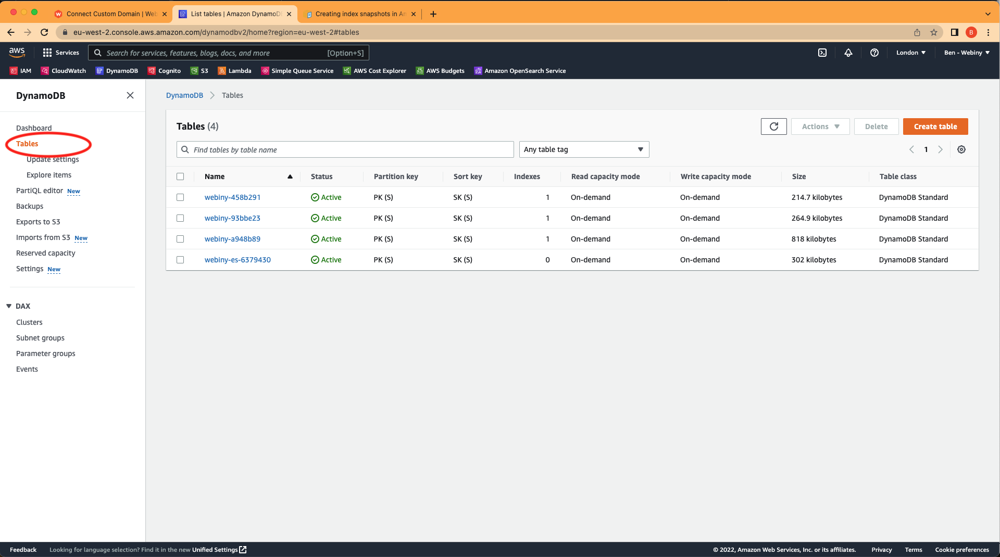

If you're not sure which DynamoDB table is associated with which Webiny instance, you can navigate to **.pulumi/apps/core/.pulumi/stacks/{env}.json** to find the table `id`.

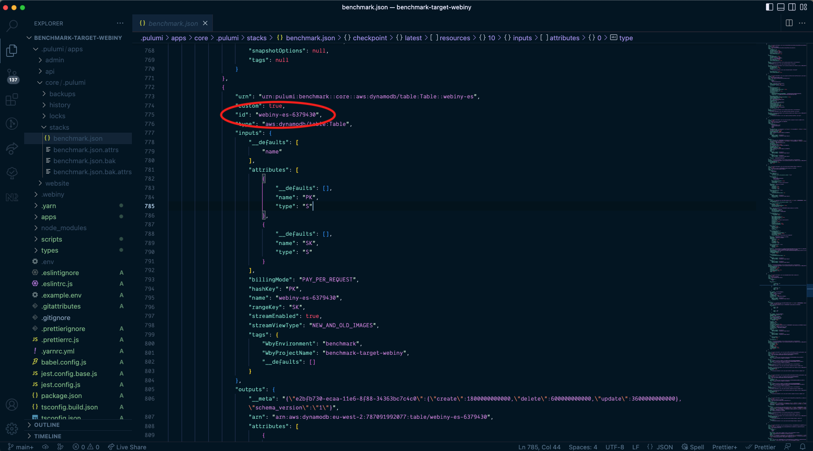

Go into the table and click on "Create on-demand backup".

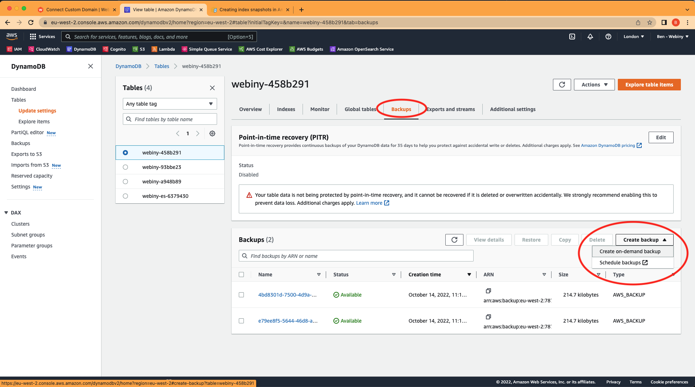

If you only have a DynamoDB instance, you can skip the next step and go straight to "restoring DynamoDB tables from backup".

## Step 2: Create OpenSearch Snapshots

To follow the steps below you will need to get the domain endpoint of the OpenSearch. You can find this by navigating to the OpenSearch Service dashboard for the region you deployed webiny to, opening up the domains menu item, clicking on the name of your domain, and copying the domain endpoint as shown in the screenshot below:

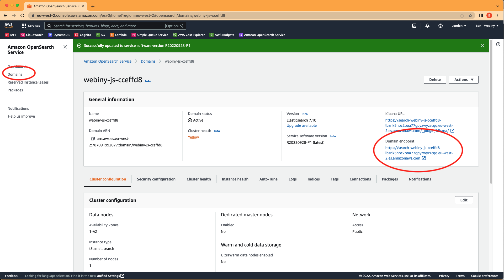

The full details of how to create snapshots are [in this AWS Docs page](https://docs.aws.amazon.com/opensearch-service/latest/developerguide/managedomains-snapshots.html), but we'll outline the steps you need specifically for a Webiny instance.

1. [Create an S3 bucket to store your snapshots](https://docs.aws.amazon.com/AmazonS3/latest/userguide/creating-bucket.html)
2. [Create an IAM role to delegate permissions to OpenSearch Service](https://docs.aws.amazon.com/IAM/latest/UserGuide/id_roles_create_for-user.html) (see also the table heading ["IAM role" on this page](https://docs.aws.amazon.com/opensearch-service/latest/developerguide/managedomains-snapshots.html) for the details of the policy you will need to create)
3. Edit the trust relationship so that OpenSearch Service has the ability to assume the role ([see the section in the table titled "Edit the trust relationship" on this page](https://docs.aws.amazon.com/opensearch-service/latest/developerguide/managedomains-snapshots.html) for the details of the trust policy)
4. Pass the role you created to the OpenSearch Service by attaching a policy to the role ([see the table heading "Permissions" on this page](https://docs.aws.amazon.com/opensearch-service/latest/developerguide/managedomains-snapshots.html) for the details of the policy you will need to add)

Please follow the links above for more details about how to achieve each step. Once you have completed these you should have a new role that looks like this:

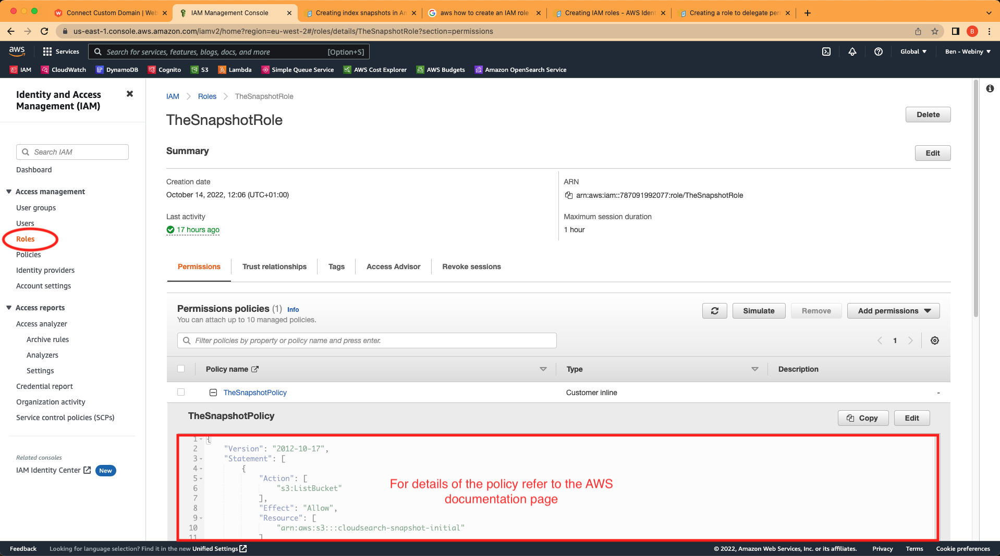

Under the **Trust relationships** tab it should have the following:

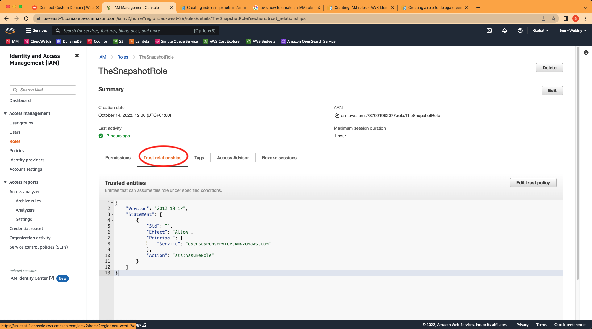

Now we need to [Register the S3 bucket as a repository for your snapshots](https://docs.aws.amazon.com/opensearch-service/latest/developerguide/managedomains-snapshots.html#managedomains-snapshot-register). To perform this request we can't use the AWS dashboard. Instead, you need to use Postman or another HTTP / API client so that we can send a signed request.

Create a new `PUT` request as shown in the screenshot following the format described in the step on the docs page linked above. You will need to add your AWS `AccessKey` and `SecretKey` to the **Authorization** tab and, if it isn't present already, add the additional header `Content-Type: application/json` and the request body should contain the JSON as shown on the documentation page and in the screenshot.

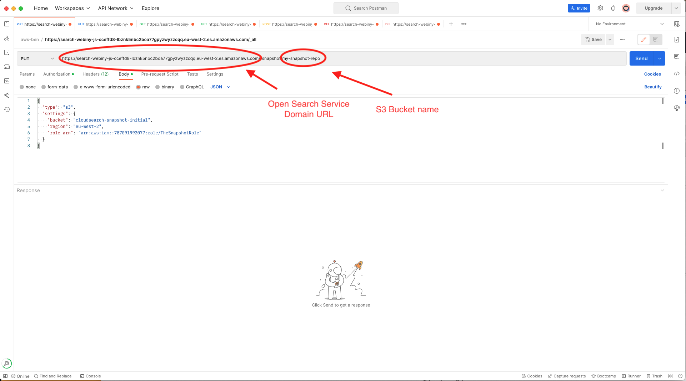

Now we can take a snapshot. Duplicate the request you made in the step above, and modify it to a `PUT` request with the format [shown in the AWS docs page](https://docs.aws.amazon.com/opensearch-service/latest/developerguide/managedomains-snapshots.html#managedomains-snapshot-take):

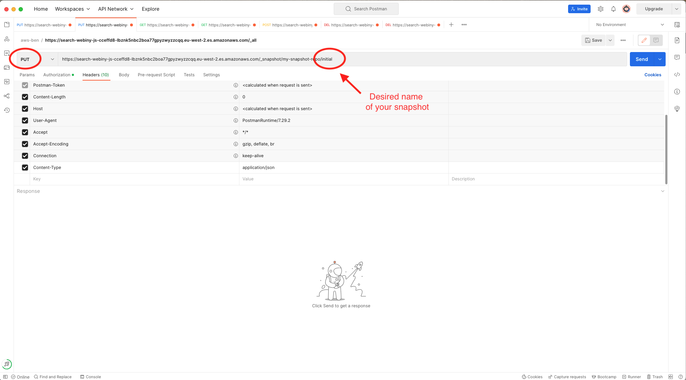

Notice this time there is no content in the request `body`.

After a while you should be able to navigate to OpenSearch Service in your AWS account and see that your S3 bucket has been populated with the indices and other data:

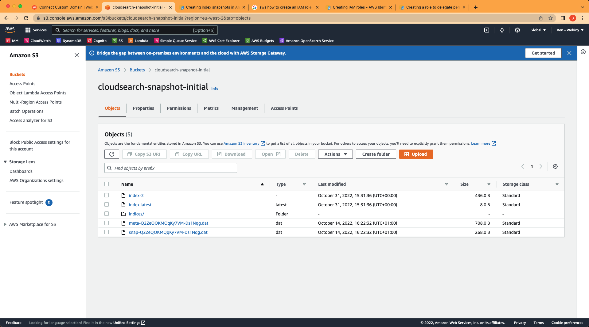

Congratulations, you have successfully created a snapshot of your OpenSearch Service indexes.

## Step 3: Restoring DynamoDB Tables from a backup

Navigate to the DynamoDB section of you AWS dashboard and click on the "Backups" menu item. Choose a backup you want to restore, and choose "Restore" from the action buttons.

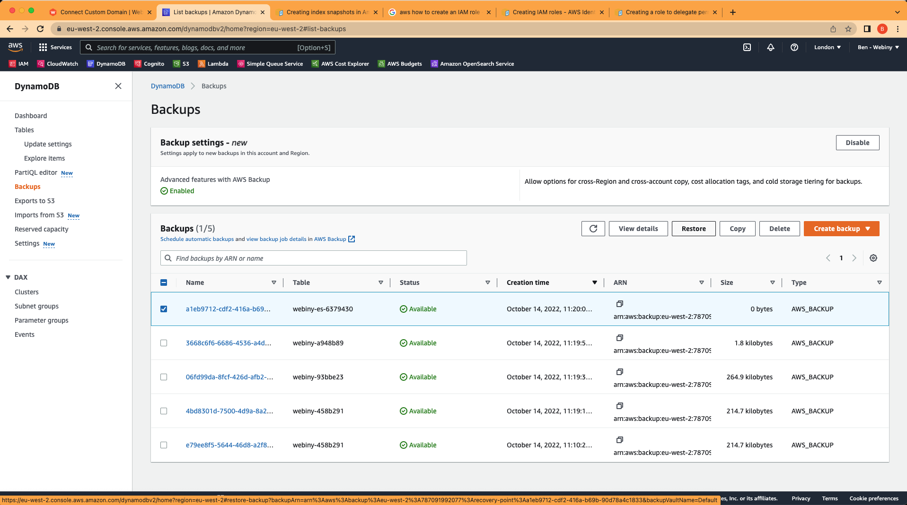

You will see on the next page that the restore settings by default add a suffix of `-restored` to the database. Delete this suffix so that so that it will be the same name as the live table and therefore overwrite it.

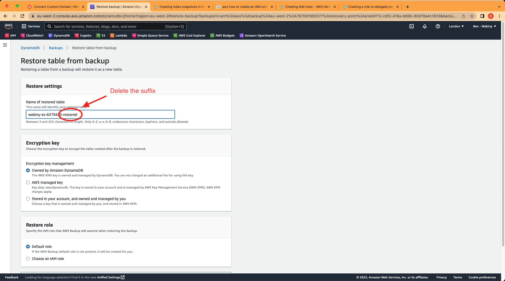

Click on "restore" and you will soon see the table has been restored from the backup.

## Step 4: Restore OpenSearch indices from a Snapshot

First, we need to delete existing indexes otherwise there will be errors when trying to restore from the snapshot. To do this you can make a `DELETE` request to your indexes:

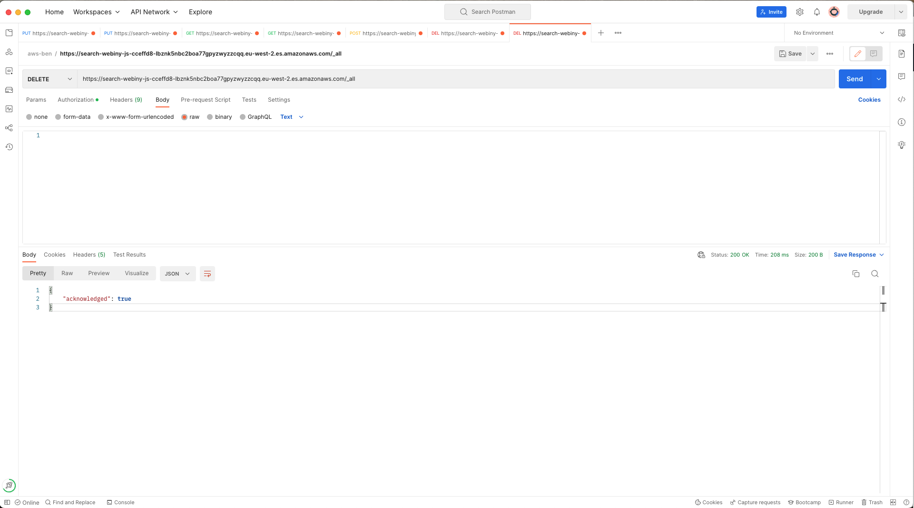

If you don't remember what your snapshot is called, or you want to verify it has completed, make a `GET` request to the `_all` endpoint of your snapshot repository (eg. the S3 bucket you stored your snapshot in):

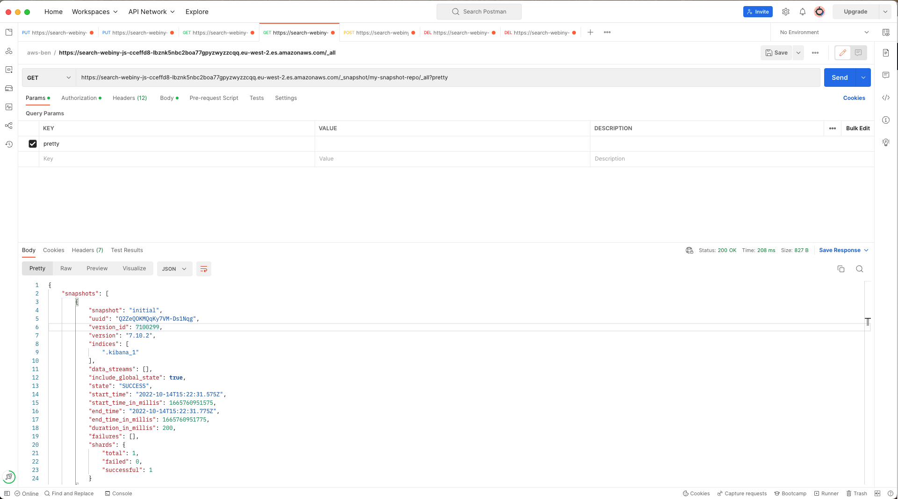

If it's there, we can restore our ElasticSearch indexes by making a `POST` request to the `_restore` endpoint by appending with the name of that snapshot to the request:

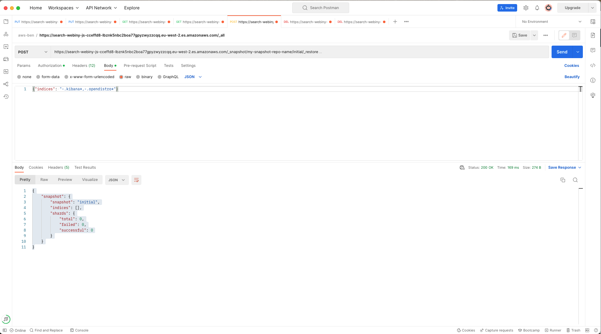

Notice that in the request body I have specified that I don't wish dashboards and access-control indexes to be restored.

These steps are covered [in more detail on the AWS documentation page](https://docs.aws.amazon.com/opensearch-service/latest/developerguide/managedomains-snapshots.html#managedomains-snapshot-restore).

Once the snapshot has been restored, you should be able to refresh your Webiny admin panel and see the application is in the state it was when you took the initial snapshots and backups.
