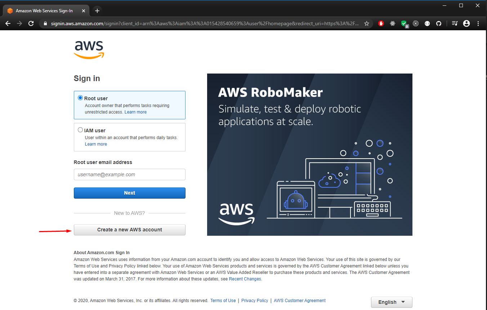
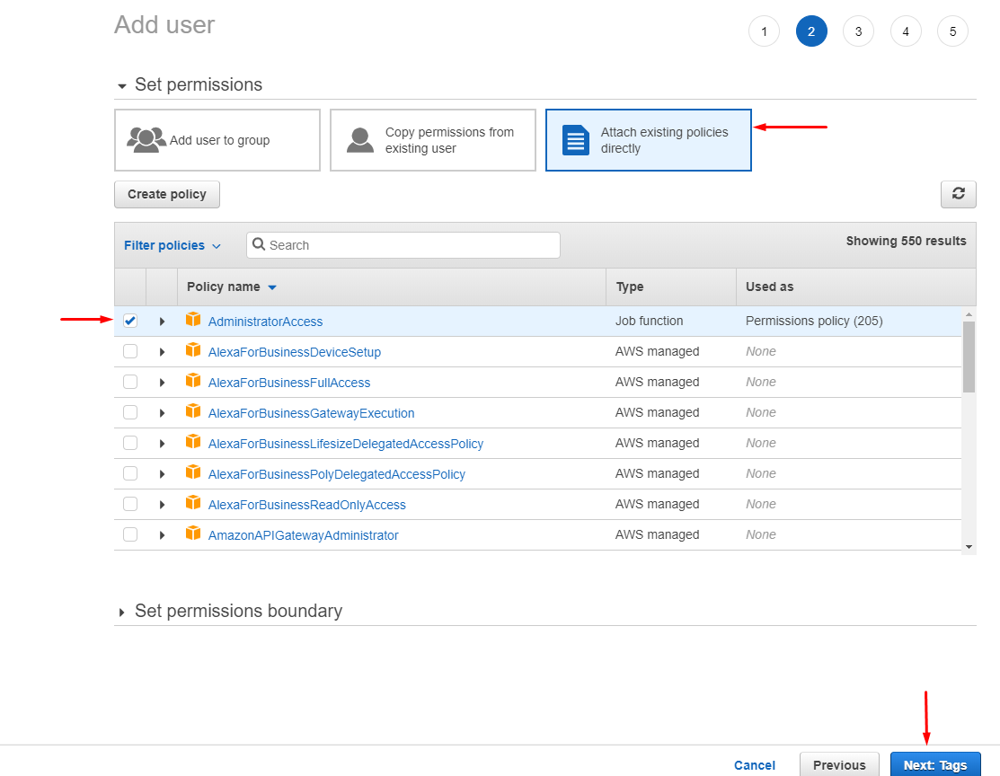

:::tip What you’ll learn
- how to configure your AWS credentials for programmatic access
:::

import YouTube from "../../../mdxComponents/youtube";

This article guides you through configuring your AWS credentials for programmatic access. At the end of the tutorial, you will have your API keys and region configured to successfully deploy Webiny to your AWS cloud.

If you prefer the video version, check out our YouTube video below:

<YouTube id="qmtDRmplMG4" />

---

## Step 1: Create Your AWS Account

:::info Already have an account?
In that case skip to [step 2](#step-2-create-a-user-for-programmatic-access) to create your programmatic user.
:::

To create your AWS account and set up your IAM credentials we should first navigate to the [AWS Console page](https://aws.amazon.com/console/):


Next click on `Create a new AWS account`:



Now input your credentials and create your account:


---

## Step 2: Create a User for Programmatic Access

Once you're registered, login and head to the AWS Management Console and select **IAM** under **Security, Identity & Compliance**:


Click on **IAM** and select **Users** under **Access Management**:


Click on **Add user** to create the account with the IAM credentials:


Here you enter a 5-step process, and the first step is to create a `User name` for the credentials.
:::caution Programmatic access
Make sure to select the **Programmatic access** checkbox before moving to the next step.
:::


In the next step you define the access level for the new user. Select **Attach existing Policies** from the three options that are available. Then select the **AdministratorAccess** role by marking the checkbox next to it. When ready, click the `Next:Tags` button:

:::info
Because Webiny creates different resources on your AWS account, it has to have administration-level access to many of the resources. If you feel this is a blocker for your project, get in touch via our [community slack](https://www.webiny.com/slack) and we'll help you out.
:::



In case you don't want to add any tags to your new user, you can just skip this step and click the `Next:Review` button.


After all the steps are complete, you'll see a `Review` page. It should look something similar to this. If everything is correct, click the `Create user` button.


Lastly, you will receive a success message with your **Access key ID** and **Secret access key**. You need to copy these strings and keep them safe as you need them for the next step.

:::caution Save the credentials
Once you navigate off this screen, you will not be able to see the credentials any more. If you lose them, you will need to delete the user and create a new one.
:::


## Step 3: Configure the Programmatic Access

Now that you have the **Access key ID** and **Secret access key** it's time to store them on your development machine.

---

### Unix setup

If you're on UNIX, create a folder named `.aws` inside your user folder, that's `~/.aws`. Inside that folder place a file called `credentials`. So the full path is `~/.aws/credentials`.

### Windows setup

On Windows machines, navigate to your user folder. That's `C:\Users\USERNAME\` (replace `USERNAME` with your actual username). Inside create a new folder named `.aws`, and inside the `.aws` folder create a file named `credentials`. The full path should be like this: `C:\Users\USERNAME\.aws\credentials`.

---

Now that we have our `credentials` file, edit the file and populate it like so:

```plain
[default]
aws_access_key_id = PASTE_ACCESS_KEY_ID_HERE
aws_secret_access_key = PASTE_SECRET_ACCESS_KEY_HERE
```

The word `default` inside the square brackets is your profile name. If you don't explicitly configure a profile name, the `default` profile is used by AWS CLI and SDK.

<!-- ## Step 4: Configure the default region

The last thing to configure is your default region. It's important to configure the region that is closest to your geographical location for optimal network latency. You can find which region is the most suitable for you using, for example, https://www.cloudping.info/.

To see the region codes, visit https://docs.aws.amazon.com/general/latest/gr/rande.html#regional-endpoints.

If you don't want to bother with regions, use `us-east-1`.

---

### Unix setup

Inside your `.aws` folder, the one we created in the previous step, create a file called `config`. So the full path is `~/.aws/config`.

### Windows setup

Inside your `.aws` folder, the one we created in the previous step, create a file called `config`. The full path should be like this: `C:\Users\USERNAME\.aws\config`.

---

Now that we have our `config` file, edit the file and populate it like so:

```plain
[default]
region = YOUR_AWS_REGION
```

This means that for your `default` profile, that particular region is used. -->

And that's it! You now have your AWS credentials, your default region, and you're ready to deploy Webiny.
