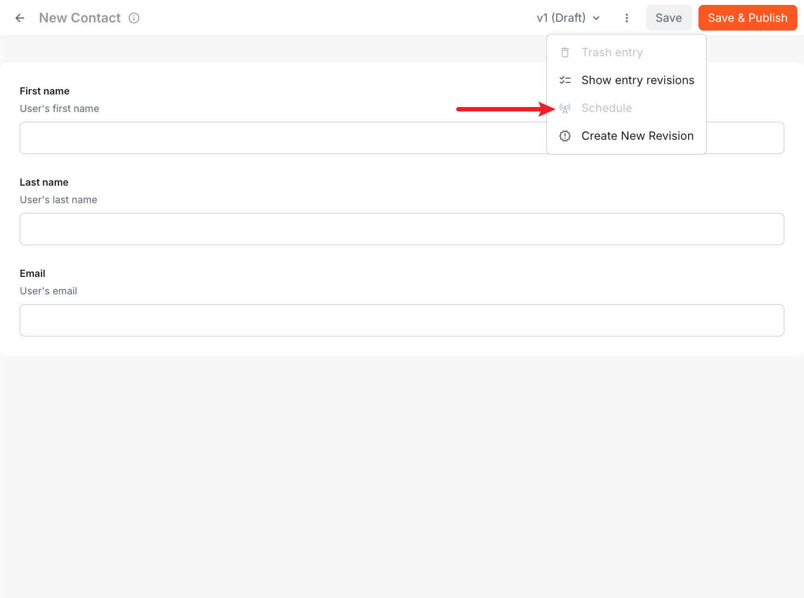
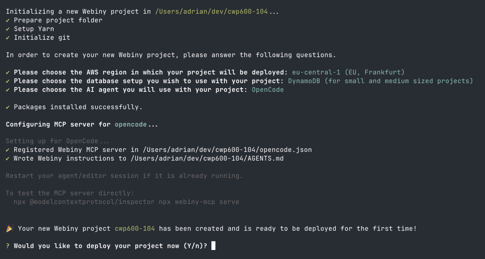

import { GithubRelease } from "@/components/GithubRelease";
import { Alert } from "@/components/Alert";

<GithubRelease version={"6.2.0"} />

## Page Builder

### Language Selector and Indicator for Page Creation ([#5092](https://github.com/webiny/webiny-js/pull/5092))

Page creation now includes language support when the Languages module is configured:

- A language dropdown appears in the "Create Page" dialog when multiple languages exist
- When only one language is configured, it is auto-assigned without showing a dropdown
- A language code tag is displayed in the page editor title bar and pages list table
- The selected language is automatically prepended to the page path

### Page Translation Support ([#5083](https://github.com/webiny/webiny-js/pull/5083), [#5081](https://github.com/webiny/webiny-js/pull/5081))

You can now translate pages into different languages directly from the Pages list. Open a page's options menu, click "Translate", select a target language and folder, and a translated copy of the page is created with the appropriate language assignment and path prefixing. The new page maintains a link to its source page for reference.

### Schedule Publish/Unpublish from Page Editor ([#5059](https://github.com/webiny/webiny-js/pull/5059))

The scheduling feature is now available directly in the page editor, allowing you to schedule publish and unpublish actions without leaving the editing context.

## Headless CMS

### Fixed Schedule Menu Item Crashing on New Unsaved Entries ([#5069](https://github.com/webiny/webiny-js/pull/5069))

When creating a new content entry that had not yet been saved, the Schedule action in the editor menu would malfunction. The Schedule option now appears as disabled until the entry is saved.



## Webiny SDK

### New `sdk.languages` Module ([#5085](https://github.com/webiny/webiny-js/pull/5085), [#5081](https://github.com/webiny/webiny-js/pull/5081))

The SDK now includes a `languages` module with a `listLanguages` method for retrieving configured languages:

```typescript
import { createWebiny } from "webiny/sdk";

const sdk = createWebiny({
  apiUrl: "https://your-api.webiny.io/graphql",
  token: "your-api-token"
});

const languages = await sdk.languages.listLanguages();
```

<Alert type="info">

You can try `sdk.languages` methods interactively via the [SDK Playground](/core-concepts/webiny-sdk#sdk-playground) built into your Webiny project.

</Alert>

### Token Parameter Now Supports Async Token Providers ([#5060](https://github.com/webiny/webiny-js/pull/5060))

The SDK's `token` parameter previously only accepted a plain string. It now also accepts an async function that returns a token string, allowing the token to be refreshed on every request:

```typescript
import { createWebiny } from "webiny/sdk";

const sdk = createWebiny({
  apiUrl: "https://your-api.webiny.io/graphql",
  token: async () => {
    // Fetch a fresh token on each request
    return await getIdToken();
  }
});
```

This enables the SDK to be used in contexts where tokens expire, such as inside the admin app.

## Admin

### Named Dialogs Infrastructure ([#5083](https://github.com/webiny/webiny-js/pull/5083))

A new dialog registration system is available via `AdminConfig.Dialog`. Dialogs registered this way mount only when opened and unmount on close, eliminating render cost for dialogs attached to table rows. Use `useOpenDialog()` to trigger a dialog and `useDialog(zodSchema?)` inside the dialog component to consume it.

### Reusable FolderPicker Component ([#5083](https://github.com/webiny/webiny-js/pull/5083))

A new `FolderPicker` component is available in `@webiny/app-aco` for selecting folders in forms. It renders a tree picker UI driven by the ACO folder structure.

## Development

### Consolidated API Exports to Root ([#5080](https://github.com/webiny/webiny-js/pull/5080))

Import commonly used abstractions like `Logger`, `BuildParams`, `EventPublisher`, `KeyValueStore`, and `DomainEvent` directly from `webiny/api`:

```typescript
import { Logger, BuildParams, EventPublisher } from "webiny/api";
```

The old sub-path imports (`webiny/api/logger`, `webiny/api/build-params`) are now deprecated and will be removed in a future release.

### Introduced the `Api.Route` Extension ([#5066](https://github.com/webiny/webiny-js/pull/5066))

A new `Api.Route` extension allows you to register custom HTTP routes on the API Gateway and GraphQL Lambda directly from `webiny.config.tsx`. Route handlers are plain classes with full dependency injection support:

```typescript
import { Logger, Route } from "webiny/api";

class MyApiRouteImpl implements Route.Interface {
  constructor(private logger: Logger.Interface) {}

  async execute(request: Route.Request, reply: Route.Reply) {
    this.logger.info("Handling GET /my-api-route");
    return reply.send({ message: request.method });
  }
}

export default Route.createImplementation({
  implementation: MyApiRouteImpl,
  dependencies: [Logger]
});
```

### Endpoint-Agnostic GraphQL Client ([#5073](https://github.com/webiny/webiny-js/pull/5073))

The low-level `GraphQLClient` now requires an explicit `endpoint` field on each request, making it endpoint-agnostic. Two new abstractions are available: `MainGraphQLClient` (pointing to the main GraphQL API) and `CmsGraphQLClient` (pointing to `/cms/manage`). All existing consumers have been migrated to `MainGraphQLClient`.

### Injectable Permissions with Domain/Features Layer Separation ([#5076](https://github.com/webiny/webiny-js/pull/5076))

Permission handling has been refactored into a three-layer structure: `domain/permissionsSchema.ts` → `features/permissions/abstractions.ts` → `features/permissions/feature.ts`. Use `createPermissionsAbstraction` and `createPermissionsFeature` to define permissions with dependency injection support. This pattern is now enforced across all admin and API packages.

### Fixed Extension `src` Props Accepting Directory Paths ([#5055](https://github.com/webiny/webiny-js/pull/5055))

Providing a folder path instead of a file path in an extension's `src` prop would silently pass validation and then fail with a confusing error. Extension `src` props now immediately reject directory paths with a clear message: `Expected a file but got a directory: <path>. Please provide a path to a specific file.`

### Webiny Version Displayed During Deploy ([#5058](https://github.com/webiny/webiny-js/pull/5058))

Running `yarn webiny deploy` now prints the Webiny version at the start of the deployment process, making it easier to identify which version is being deployed.

## Infrastructure

### Custom Domain Support for the API CloudFront Distribution ([#5068](https://github.com/webiny/webiny-js/pull/5068))

You can now configure custom domains and an ACM SSL certificate for the API directly in `webiny.config.tsx` using the new `Infra.Api.CustomDomains` extension, consistent with how custom domains are already configured for the Admin app:

```tsx
<Infra.Api.CustomDomains
  domainName="api.example.com"
  certificateArn="arn:aws:acm:us-east-1:123456789:certificate/abc123"
/>
```

## Development

### MCP Server Auto-Configuration in Project Setup ([#5074](https://github.com/webiny/webiny-js/pull/5074))

The `create-webiny-project` wizard now includes a step that asks which AI agent you use (Claude Code, Cursor, Cline, Copilot, Windsurf, OpenCode, Kiro). For supported agents, the Webiny MCP server is automatically configured in your project directory right after packages are installed — no separate manual step required.

If your agent is not on the list, manual setup instructions are printed at the end of the process after the project has been deployed, so the setup flow is never interrupted.



### Updated `Logger` and `BuildParams` Exports ([#5064](https://github.com/webiny/webiny-js/pull/5064))

`Logger` and `BuildParams` can now be imported directly from `webiny/api`:

```typescript
import { Logger, BuildParams } from "webiny/api";
```

The previous imports from `webiny/api/logger` and `webiny/api/build-params` still work but are deprecated and will be removed in a future release.

## Headless CMS

### Internal Plugin Architecture Refactored to Abstractions ([#5063](https://github.com/webiny/webiny-js/pull/5063), [#5075](https://github.com/webiny/webiny-js/pull/5075), [#5079](https://github.com/webiny/webiny-js/pull/5079), [#5082](https://github.com/webiny/webiny-js/pull/5082))

Several internal Headless CMS plugins have been converted to the newer abstraction-based architecture introduced in Webiny 6. This change improves code organisation and maintainability but does not affect the public API.

The following plugins have been replaced with their abstraction equivalents:

| Old Plugin                                | New Abstraction                     |
| ----------------------------------------- | ----------------------------------- |
| `CmsModelFieldToGraphQLPlugin`            | `CmsModelFieldToGraphQL`            |
| `CmsModelFieldValidatorPlugin`            | `CmsModelFieldValidator`            |
| `CmsModelFieldPatternValidatorPlugin`     | `CmsModelFieldPatternValidator`     |
| `CmsGraphQLSchemaSorterPlugin`            | `CmsGraphQLSchemaSorter`            |
| `StorageTransformPlugin`                  | `StorageTransform`                  |
| `CmsEntryElasticsearchBodyModifierPlugin` | `CmsEntryElasticsearchBodyModifier` |

<Alert type="info">

If you have custom code that extends these internal plugins directly, you may need to update your implementation to use the new abstraction classes. The public Headless CMS SDK APIs remain unchanged.

</Alert>

## Infrastructure

### Support for External OpenSearch Clusters with Authentication ([#5090](https://github.com/webiny/webiny-js/pull/5090))

You can now connect Webiny to an externally managed OpenSearch cluster that requires username/password authentication. The `Infra.OpenSearch` extension accepts three new optional properties: `endpoint`, `username`, and `password`.

```typescript
<Infra.OpenSearch
  enabled={true}
  domainName={process.env.OPENSEARCH_DOMAIN_NAME}
  endpoint={process.env.OPENSEARCH_ENDPOINT}
  username={process.env.OPENSEARCH_USERNAME}
  password={process.env.OPENSEARCH_PASSWORD}
/>
```

When `endpoint` is provided, Webiny connects directly to that URL instead of provisioning a new OpenSearch domain. The `username` and `password` fields are only applied when the endpoint requires basic authentication.

<Alert type="info">

The `endpoint` property is also useful in multi-environment setups where several Webiny environments share a single OpenSearch instance. See [Using a Shared OpenSearch Domain](/infrastructure/extensions/opensearch#using-a-shared-open-search-domain) for details.

</Alert>
