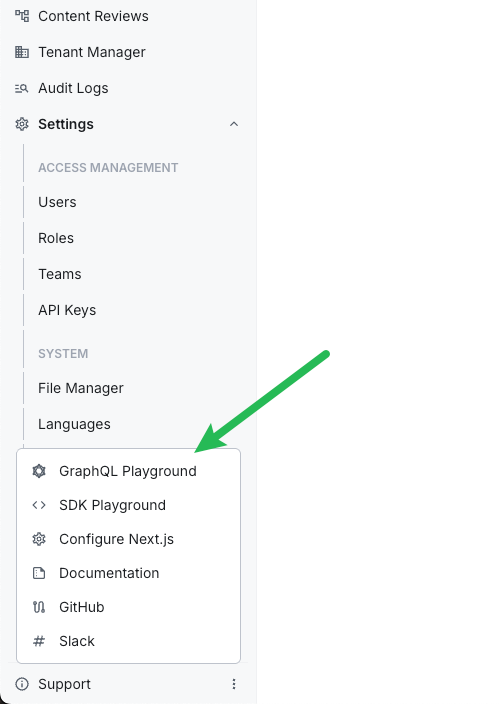

import { GithubRelease } from "@/components/GithubRelease";
import { Alert } from "@/components/Alert";

<GithubRelease version={"6.3.0"} />

## AI PowerUps

### AI-Powered Page Content Generation ([#5125](https://github.com/webiny/webiny-js/pull/5125), [#5117](https://github.com/webiny/webiny-js/pull/5117), [#5113](https://github.com/webiny/webiny-js/pull/5113), [#5111](https://github.com/webiny/webiny-js/pull/5111))

Webiny now includes AI-powered content generation capabilities through the new AI PowerUps feature. You can configure AI providers (OpenAI, Anthropic) and define personas in the Admin settings, then use AI to generate page content directly within the Page Builder.

The feature includes:

- **Provider configuration** — set up connections to OpenAI or Anthropic with your API keys
- **Personas** — define reusable AI personas with custom instructions for different content styles
- **Content generation** — generate page sections and content using natural language prompts
- **Tool pipeline** — AI-generated content is automatically processed through tools that convert text to Lexical editor format and resolve images

### AI Image Enrichment for File Manager ([#5104](https://github.com/webiny/webiny-js/pull/5104), [#5123](https://github.com/webiny/webiny-js/pull/5123))

Images uploaded to the File Manager are now automatically enriched with AI-generated metadata:

- **Tags** — AI analyzes the image and assigns relevant tags for improved searchability
- **Description** — a human-readable description is generated and stored with the file

Both fields can be viewed and edited manually in the file details panel. This runs as a background task after upload, so it doesn't block the upload process.

## Admin

### API Playground Renamed to GraphQL Playground ([#5103](https://github.com/webiny/webiny-js/pull/5103))

The "API Playground" label in the admin interface has been renamed to "GraphQL Playground" for clarity.



### Extended Form Model Capabilities ([#5125](https://github.com/webiny/webiny-js/pull/5125))

The Admin form system now supports additional field types and layout options:

- **Object fields** — group related fields into nested structures
- **Vertical tabs renderer** — organize form sections into vertical tab layouts
- **Textarea renderer** — multiline text input
- **Passthrough renderer** — render custom components within forms

## Development

### Typescript Upgraded to 6.0.2 ([#5043](https://github.com/webiny/webiny-js/pull/5043))

Webiny now uses Typescript 6.0.2 with module resolution set to `bundler`. This brings improved type inference and better alignment with modern bundler toolchains.

### Install Version Flag for Upgrade Command ([#5115](https://github.com/webiny/webiny-js/pull/5115))

The `webiny upgrade` command now accepts an `--install-version` flag, letting you specify an exact package version to install during the upgrade process. This is useful when you want to test an unstable release before the stable version ships.

```
webiny upgrade --install-version=6.3.0-unstable.abc
```

### Old Pulumi Plugin Versions Now Cleaned Up ([#5101](https://github.com/webiny/webiny-js/pull/5101))

Previously, downloading new Pulumi plugins would leave old versions behind, causing the `.webiny/pulumi-cli` folder to grow over time. Old plugin versions are now automatically removed when newer versions are installed.

### Feature API Types Corrected ([#5108](https://github.com/webiny/webiny-js/pull/5108))

The second parameter in the Feature API's `register` method now correctly populates when defined via generics.

## Webiny SDK

### Tasks SDK Methods ([#5125](https://github.com/webiny/webiny-js/pull/5125))

New SDK methods are available for working with background tasks:

```typescript
// Trigger a new task
const result = await sdk.tasks.triggerTask({
  definition: "aiImageTagging",
  input: { fileId: "abc123" }
});

// List running tasks
const tasks = await sdk.tasks.listTasks({ status: "running" });

// List available task definitions
const definitions = await sdk.tasks.listDefinitions();

// Abort a running task
await sdk.tasks.abortTask({ taskId: "task-123" });

// Get task logs
const logs = await sdk.tasks.listLogs({ taskId: "task-123" });
```

## Development

### Export `useEnv` Hook from `@webiny/project-aws` ([#5139](https://github.com/webiny/webiny-js/pull/5139))

The `useEnv` hook, which provides access to the current deployment environment context within infrastructure code, was not exported from the `@webiny/project-aws` package. It can now be imported directly:

```typescript
import { useEnv } from "webiny/project-aws";

const env = useEnv();
```

### Export `useBuildParams` from Main Admin Entry Point ([#5136](https://github.com/webiny/webiny-js/pull/5136))

The `useBuildParams` hook was previously only importable from a sub-path (`webiny/admin/build-params`) and was missing from the main admin package exports. It is now available from the standard `webiny/admin` import path, consistent with all other admin hooks:

```typescript
import { useBuildParams } from "webiny/admin";
```

The sub-path export is now deprecated.

### Upgrade Command Always Logs Full Output ([#5126](https://github.com/webiny/webiny-js/pull/5126))

The `webiny upgrade` command now always outputs full logging information during execution, making it easier to diagnose upgrade issues.

## Webiny SDK

### Added Tasks SDK Module ([#5106](https://github.com/webiny/webiny-js/pull/5106))

External applications can now interact with Webiny Background Tasks through the SDK. The new `sdk.tasks` module lets you list task definitions and runs, retrieve execution logs, trigger new tasks, and abort running tasks:

```typescript
// List all registered task definitions
const definitions = await sdk.tasks.listDefinitions();

// List task runs with optional filtering
const tasks = await sdk.tasks.listTasks({
  where: { definitionId: "myTaskDefinition" }
});

// Trigger a new task execution
const result = await sdk.tasks.triggerTask({
  definition: "myTaskDefinition",
  input: { someParam: "value" }
});

// Abort a running task
await sdk.tasks.abortTask({ id: "task-run-id" });
```

The SDK playground includes full TypeScript declarations for the new module, providing autocomplete and type checking.

## Infrastructure

### Added Production Environment Helpers and Encryption Guardrail ([#5129](https://github.com/webiny/webiny-js/pull/5129), [#5131](https://github.com/webiny/webiny-js/pull/5131))

New project templates now include encryption preconfigured for production environments, and deploying to production without encryption configured will fail with a clear error message. Two new components make it easier to scope infrastructure config to production environments:

```tsx
<Infra.ProductionEnvironments environments={["prod", "prod-eu", "prod-us"]} />

<Infra.Env.IsProd>
  <Infra.Encryption passphrase={process.env.WEBINY_ENCRYPTION_PASSPHRASE} />
</Infra.Env.IsProd>

<Infra.Env.IsNotProd>
  {/* Development-only configuration */}
</Infra.Env.IsNotProd>
```

Previously, users with multiple production environments had to repeat the full list of environment names at every `Infra.Env.Is` usage site.

### Added Encryption Service ([#5109](https://github.com/webiny/webiny-js/pull/5109), [#5112](https://github.com/webiny/webiny-js/pull/5112))

A built-in encryption service is now available in the Webiny API layer. Developers can inject `Encryption` into any API feature to encrypt and decrypt strings using AES-256-GCM:

```tsx
// webiny.config.tsx
<Infra.Encryption passphrase={process.env.WEBINY_ENCRYPTION_PASSPHRASE} />
```

```typescript
import { Encryption } from "webiny/api";

class MyUseCase {
  constructor(private encryption: Encryption.Interface) {}
  
  run() {
    const cipher = this.encryption.encrypt("sensitive-value");
    const plain = this.encryption.decrypt(cipher);
  }
}
```

The encryption passphrase is optional — when not configured, `encrypt` and `decrypt` pass values through unchanged, allowing teams to adopt encryption gradually.

### Fixed OpenSearch Domain Being Recreated on Re-deploy ([#5137](https://github.com/webiny/webiny-js/pull/5137))

When a Pulumi resource name prefix was configured (or when upgrading from an older version of Webiny), the OpenSearch domain physical name could change between deploys, causing Pulumi to destroy and recreate the entire cluster. The domain name is now persisted in the stack output and reused on every subsequent deploy to keep it stable.

### Fixed Duplicate Pulumi Resource URN Error When Registering Multiple API Routes ([#5135](https://github.com/webiny/webiny-js/pull/5135))

Deploying two or more `Api.Route` extensions at the same time caused a "Duplicate resource URN" error during `pulumi up`, preventing the deployment from completing. Multiple API routes can now be registered and deployed without conflict.

## Headless CMS

## Admin

### Added Dev Tools Sidebar Section ([#5130](https://github.com/webiny/webiny-js/pull/5130))

The GraphQL Playground and SDK Playground links have been moved from the Support dropdown menu into a new Dev Tools section in the sidebar. Access to each tool can now be managed through the Security permissions panel. The Support dropdown has been removed; the Upgrade link is now a standalone footer item, and Configure Next.js has moved into the Website Builder section.

### Added Auto-Scrolling to Dialogs ([#5134](https://github.com/webiny/webiny-js/pull/5134))

All dialogs now automatically add a vertical scroll bar when content exceeds available height. To disable auto-scrolling, pass `scrollable={false}` to the dialog component.

### Tenant Manager Use Cases and Features Now Exported from Public API ([#5140](https://github.com/webiny/webiny-js/pull/5140))

The tenant manager's use case classes, feature plugins, and TypeScript interfaces are now exported from both `webiny/tenant-manager` and the main `webiny/webiny` package. This enables developers to extend or override tenant management behavior — including getting the current tenant, fetching by ID, creating, updating, enabling, disabling, and installing tenants.

## Development

### Advanced Form Model for Declarative Admin UI Forms ([#5138](https://github.com/webiny/webiny-js/pull/5138))

A new `FormModel` API is now available for building admin UI forms declaratively. This system powers internal Webiny forms and is available for extension developers building custom admin interfaces.

Key capabilities include:

- **Layout primitives** — tabs, rows, separators, and nested object nodes with per-template inner layouts
- **Field types** — text, number, boolean, datetime, object (with list mode, dynamic zones, and templates)
- **Validation** — required fields, Zod schema integration, async validation, conditional required rules, and form-level validation
- **Field renderers** — inputs, textareas, tags, switches, dropdowns, radio buttons, checkboxes, date/time pickers, object accordions, and dynamic zones
- **Focus management** — `form.focusField(path)` walks the layout tree, activates ancestor tabs, and focuses the target field
- **Computed fields** — `computed()` and `computedUntilDirty()` for reactive derivation from other field values
- **Condition rules** — hide or disable fields based on other field values
- **List operations** — `addItem`/`removeItem` on field view models so renderers don't manage array slicing directly
- **Type coercion** — `parseValue` handles string-to-number, truthy-to-boolean conversions at the field builder level

### Self-Cleaning Background Tasks ([#5121](https://github.com/webiny/webiny-js/pull/5121))

Background tasks can now be configured to automatically delete themselves after completion. When enabled, the task runner removes the task record, all logs, child tasks, and their logs from the database once the task finishes successfully.

Enable self-cleaning in your task definition:

```typescript
import { createTask } from "webiny/tasks";

const myTask = createTask({
  id: "myTask",
  title: "My Task",
  selfClean: true,
  run: async ({ context }) => {
    // Task logic here
  }
});
```

### Mailer Configuration via `webiny.config.ts` ([#5114](https://github.com/webiny/webiny-js/pull/5114))

The Mailer package now supports configuration through `webiny.config.ts` instead of requiring plugin-based setup. Additionally, the `replyTo`, `from`, `to`, and `bcc` fields now accept the `Name <email@example.com>` format.

```typescript
// webiny.config.ts
export default {
  mailer: {
    from: "Support Team <support@example.com>",
    replyTo: "No Reply <noreply@example.com>"
  }
};
```

## Webiny SDK

### Improved Input Validation and Error Reporting ([#5120](https://github.com/webiny/webiny-js/pull/5120))

The CMS and File Manager SDK methods now validate inputs before making network requests and return descriptive errors for common mistakes:

- **Type validation** — Passing wrong types (e.g. `limit: "sd"`, `search: false`, `fields: []`) returns a `ValidationError` immediately
- **Field validation** — Misspelled fields (`values.typo`), object-type fields used as leaves (`values.category`), or unknown filter keys (`tags_2in`) return descriptive errors instead of silently returning empty results
- **Renamed error class** — `GraphQLError` has been renamed to `ApiError` since the transport layer is an implementation detail
- **Typed `meta` object** — `CmsEntryData` now includes a typed `meta` object with `status`, `modelId`, `version`, `locked`, `title`, `description`, `image`, and `data` fields

These improvements apply to all CMS methods (`listEntries`, `getEntry`, `createEntry`, `updateEntryRevision`, `publishEntryRevision`, `unpublishEntryRevision`, `deleteEntryRevision`), File Manager methods (`listFiles`, `getFile`, `updateFile`), Tasks, and Tenant Manager methods.

## Headless CMS

### AI PowerUps Settings with Provider Presets ([#5133](https://github.com/webiny/webiny-js/pull/5133))

AI PowerUps now includes a pluggable settings architecture for managing AI providers. The first settings group, **Providers**, lets you configure preset AI providers with id, name, description, model, and API key. API keys are encrypted at rest and masked when displayed.

The underlying architecture uses `AiPowerUpsSettingsGroupHandler` and `AiPowerUpsSettingsGroupGraphQLMapper` for group-specific handling, with a top-level `AiPowerUpsSettingsGraphQLMapper` that dispatches to the appropriate group mapper.

## Admin

### Reference Field Responsive Layout ([#5144](https://github.com/webiny/webiny-js/pull/5144))

Reference field entry cards now adapt to the available container width. In narrow panels, cards stack metadata and action buttons vertically; in wider views they use the original single-row layout. The "Create" and "Select" buttons below the list also wrap cleanly at narrow widths.

### Sidebar Footer Hidden When Empty ([#5144](https://github.com/webiny/webiny-js/pull/5144))

The sidebar footer section (including its separator) is now hidden when there are no footer menu items registered, instead of rendering an empty section.

### Sidebar Section Expand Arrow Now Clickable ([#5144](https://github.com/webiny/webiny-js/pull/5144))

Clicking the expand/collapse arrow icon on a collapsible sidebar section now correctly toggles the section open or closed.

## Headless CMS

### Model Field Compression ([#5145](https://github.com/webiny/webiny-js/pull/5145))

Large CMS models with many fields can exceed DynamoDB item size limits or cause performance issues during model reads. You can now enable field compression to reduce the storage footprint of model definitions.

To enable compression, add the following to your `webiny.config.ts`:

```typescript
<Api.Cms.ModelFieldCompression enabled={true} />
```

When enabled, model field definitions are compressed before storage and decompressed on read, allowing models with significantly more fields than previously supported.

## Page Builder

### Page Settings Rebuilt with FormModel Architecture ([#5148](https://github.com/webiny/webiny-js/pull/5148))

The Page Settings panel has been completely rewritten using the new `FormModel` architecture, replacing the previous `react-properties`-based implementation. This brings a cleaner presenter-driven design where each settings group (General, SEO, Social, Schema) is a self-contained class that defines its fields, layout, and data mapping.

**New extension points** allow you to customise Page Settings without modifying core code:

- `PageSettingsGroup` — add entirely new settings tabs
- `PageSettingsGroupModifier` — inject fields into existing groups

The layout builder now supports positional helpers (`before`/`after`) for precise field placement within groups.

<Alert type="info">

See the `extensions/customPageSettings` example in the repository for a working demonstration of both extension patterns.

</Alert>

## Admin

### New Field Renderers for FormModel

Several new field renderers are now available for use with the `FormModel` architecture:

- `CodeEditorRenderer` — syntax-highlighted code input
- `FilePickerRenderer` — file selection from File Manager
- `FileUrlPickerRenderer` — URL-based file input
- `HorizontalTabsRenderer` — tabbed field layouts

The `DateTimeRenderer` has also been updated to support timezone-aware and date-only modes.

## File Manager

### Fixed AI Image Enrichment Failing Due to Missing API Key ([#5147](https://github.com/webiny/webiny-js/pull/5147))

The AI-powered image tagging feature was broken because the enrichment task read an `apiKey` field that is never stored — only the encrypted form (`apiKeyEncrypted`) is persisted. Every enrichment call failed silently or with an incorrect key.

The task now correctly decrypts the key at runtime using the Encryption abstraction. Additionally, response parsing now uses structured output via the AI SDK's `Output.object` with a Zod schema, eliminating the fragile JSON parsing that broke whenever the model returned markdown-fenced responses.

## Admin

### New `DatePicker` Component with Multiple Variants ([#5149](https://github.com/webiny/webiny-js/pull/5149))

A new `DatePicker` component has been added to `@webiny/admin-ui`, supporting 11 different picker types through a discriminated union on the `type` prop:

- `date` — single date selection
- `time` — time-only selection
- `datetime-local` — date and time without timezone
- `datetime-tz` — date and time with timezone selection
- `week` — week picker
- `month` — single month selection
- `year` — single year selection
- `date-range` — select a start and end date
- `multiple-dates` — select multiple individual dates
- `multiple-months` — select multiple months
- `multiple-years` — select multiple years

The component is built on `react-day-picker` and integrates with existing form primitives for labels, descriptions, notes, and error messages.

```typescript
import { DatePicker } from "webiny/admin-ui";

// Single date picker
<DatePicker
  type="date"
  label="Event Date"
  value={date}
  onChange={setDate}
/>

// Date range picker
<DatePicker
  type="date-range"
  label="Booking Period"
  value={{ from: startDate, to: endDate }}
  onChange={setDateRange}
/>

// Date with timezone
<DatePicker
  type="datetime-tz"
  label="Meeting Time"
  value={dateTime}
  onChange={setDateTime}
/>
```
