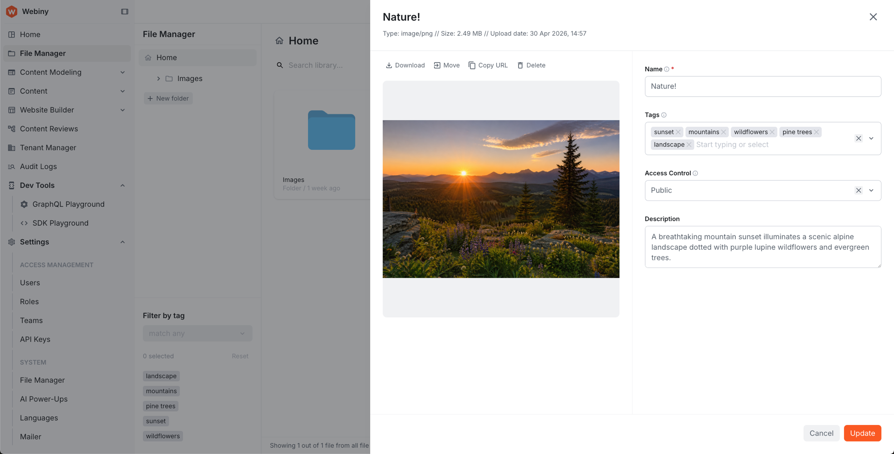
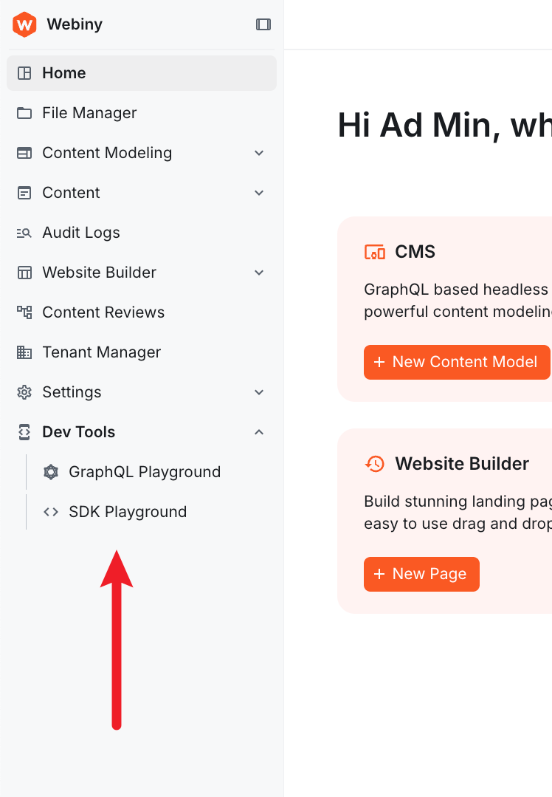

import { GithubRelease } from "@/components/GithubRelease";
import { Alert } from "@/components/Alert";

<GithubRelease version={"6.3.0"} />

## AI PowerUps

### AI-Powered Page Content Generation ([#5125](https://github.com/webiny/webiny-js/pull/5125), [#5117](https://github.com/webiny/webiny-js/pull/5117), [#5113](https://github.com/webiny/webiny-js/pull/5113), [#5111](https://github.com/webiny/webiny-js/pull/5111))

Webiny now includes AI-powered content generation capabilities through the new AI PowerUps feature. You can configure AI providers (OpenAI, Anthropic) and define personas in the Admin settings, then use AI to generate page content directly within the Page Builder.

The feature includes:

- **Provider configuration** — set up connections to OpenAI or Anthropic with your API keys
- **Personas** — define reusable AI personas with custom instructions for different content styles
- **Content generation** — generate page sections and content using natural language prompts
- **Tool pipeline** — AI-generated content is automatically processed through tools that convert text to Lexical editor format and resolve images

### AI Image Enrichment for File Manager ([#5123](https://github.com/webiny/webiny-js/pull/5123))

Images uploaded to the File Manager are now automatically enriched with AI-generated metadata:

- **Tags** — AI analyzes the image and assigns relevant tags for improved searchability
- **Description** — a human-readable description is generated and stored with the file

Both fields can be viewed and edited manually in the file details panel. This runs as a background task after upload, so it doesn't block the upload process.



## Admin

### API Playground Renamed to GraphQL Playground ([#5103](https://github.com/webiny/webiny-js/pull/5103))

The "API Playground" label in the admin interface has been renamed to "GraphQL Playground" for clarity.


### Added Dev Tools Sidebar Section ([#5130](https://github.com/webiny/webiny-js/pull/5130))

The GraphQL Playground and SDK Playground links have been moved from the Support dropdown menu into a new Dev Tools section in the sidebar. Access to each tool can now be managed through the Security permissions panel. The Support dropdown has been removed; the Upgrade link is now a standalone footer item, and Configure Next.js has moved into the Website Builder section.



### New Field Renderers for FormModel

Several new field renderers are now available for use with the `FormModel` architecture:

- `CodeEditorRenderer` — syntax-highlighted code input
- `FilePickerRenderer` — file selection from File Manager
- `FileUrlPickerRenderer` — URL-based file input
- `HorizontalTabsRenderer` — tabbed field layouts

The `DateTimeRenderer` has also been updated to support timezone-aware and date-only modes.

### New `DatePicker` Component ([#5149](https://github.com/webiny/webiny-js/pull/5149))

A new `DatePicker` component is now available, supporting multiple picker types via a discriminated union on the `type` prop: `date`, `time`, `datetime-local`, `datetime-tz`, `week`, `month`, `year`, `date-range`, `multiple-dates`, `multiple-months`, and `multiple-years`.

```typescript
import { DatePicker } from "webiny/admin-ui";

<DatePicker type="date" label="Event Date" value={date} onChange={setDate} />

<DatePicker type="date-range" label="Booking Period" value={{ from: startDate, to: endDate }} onChange={setDateRange} />
```

## Development

### Typescript Upgraded to 6.0.2 ([#5043](https://github.com/webiny/webiny-js/pull/5043))

Webiny now uses Typescript 6.0.2 with module resolution set to `bundler`. This brings improved type inference and better alignment with modern bundler toolchains.

### Install Version Flag for Upgrade Command ([#5115](https://github.com/webiny/webiny-js/pull/5115))

The `webiny upgrade` command now accepts an `--install-version` flag, letting you specify an exact package version to install during the upgrade process. This is useful when you want to test an unstable release before the stable version ships.

```
webiny upgrade --install-version=6.3.0-unstable.abc
```

### Tenant Manager Use Cases and Features Now Exported from Public API ([#5140](https://github.com/webiny/webiny-js/pull/5140))

The tenant manager's use case classes, feature plugins, and TypeScript interfaces are now exported from `webiny/api`. This enables developers to extend or override tenant management behavior — including getting the current tenant, fetching by ID, creating, updating, enabling, disabling, and installing tenants.

### Feature API Types Corrected ([#5108](https://github.com/webiny/webiny-js/pull/5108))

The second parameter in the Feature API's `register` method now correctly populates when defined via generics.

### Export `useBuildParams` from Main Admin Entry Point ([#5136](https://github.com/webiny/webiny-js/pull/5136))

The `useBuildParams` hook was previously only importable from a sub-path (`webiny/admin/build-params`) and was missing from the main admin package exports. It is now available from the standard `webiny/admin` import path, consistent with all other admin hooks:

```typescript
import { useBuildParams } from "webiny/admin";
```

The sub-path export is now deprecated.

### Upgrade Command Always Logs Full Output ([#5126](https://github.com/webiny/webiny-js/pull/5126))

The `webiny upgrade` command now always outputs full logging information during execution, making it easier to diagnose upgrade issues.

### Advanced Form Model for Declarative Admin UI Forms ([#5138](https://github.com/webiny/webiny-js/pull/5138))

A new `FormModel` API is now available for building admin UI forms declaratively. This system powers internal Webiny forms and is available for extension developers building custom admin interfaces.

Key capabilities include:

- **Layout primitives** — tabs, rows, separators, and nested object nodes with per-template inner layouts
- **Field types** — text, number, boolean, datetime, object (with list mode, dynamic zones, and templates)
- **Validation** — required fields, Zod schema integration, async validation, conditional required rules, and form-level validation
- **Field renderers** — inputs, textareas, tags, switches, dropdowns, radio buttons, checkboxes, date/time pickers, object accordions, and dynamic zones
- **Focus management** — `form.focusField(path)` walks the layout tree, activates ancestor tabs, and focuses the target field
- **Computed fields** — `computed()` and `computedUntilDirty()` for reactive derivation from other field values
- **Condition rules** — hide or disable fields based on other field values
- **List operations** — `addItem`/`removeItem` on field view models so renderers don't manage array slicing directly
- **Type coercion** — `parseValue` handles string-to-number, truthy-to-boolean conversions at the field builder level

### Self-Cleaning Background Tasks ([#5121](https://github.com/webiny/webiny-js/pull/5121))

Background tasks can now be configured to automatically delete themselves after completion. When enabled, the task runner removes the task record, all logs, child tasks, and their logs from the database once the task finishes successfully.

Enable self-cleaning in your task definition:

```typescript
import { createTask } from "webiny/tasks";

const myTask = createTask({
  id: "myTask",
  title: "My Task",
  selfClean: true,
  run: async ({ context }) => {
    // Task logic here
  }
});
```

### Mailer Configuration via `webiny.config.ts` ([#5114](https://github.com/webiny/webiny-js/pull/5114))

The Mailer package now supports configuration through `webiny.config.ts` instead of requiring plugin-based setup. Additionally, the `replyTo`, `from`, `to`, and `bcc` fields now accept the `Name <email@example.com>` format.

```typescript
// webiny.config.ts
export default {
  mailer: {
    from: "Support Team <support@example.com>",
    replyTo: "No Reply <noreply@example.com>"
  }
};
```

## Webiny SDK

### Added Tasks SDK Module ([#5106](https://github.com/webiny/webiny-js/pull/5106))

External applications can now interact with Webiny Background Tasks through the SDK. The new `sdk.tasks` module lets you list task definitions and runs, retrieve execution logs, trigger new tasks, and abort running tasks:

```typescript
// List all registered task definitions
const definitions = await sdk.tasks.listDefinitions();

// List task runs with optional filtering
const tasks = await sdk.tasks.listTasks({
  where: { definitionId: "myTaskDefinition" }
});

// Trigger a new task execution
const result = await sdk.tasks.triggerTask({
  definition: "myTaskDefinition",
  input: { someParam: "value" }
});

// Abort a running task
await sdk.tasks.abortTask({ id: "task-run-id" });
```

The SDK playground includes full TypeScript declarations for the new module, providing autocomplete and type checking.

### Improved Input Validation and Error Reporting ([#5120](https://github.com/webiny/webiny-js/pull/5120))

All SDK methods now validate inputs before making network requests and return descriptive errors for common mistakes:

- **Type validation** — Passing wrong types (e.g. `limit: "sd"`, `search: false`, `fields: []`) returns a `ValidationError` immediately
- **Field validation** — Misspelled fields (`values.typo`), object-type fields used as leaves (`values.category`), or unknown filter keys (`tags_2in`) return descriptive errors instead of silently returning empty results
- **Renamed error class** — `GraphQLError` has been renamed to `ApiError` since the transport layer is an implementation detail
- **Typed `meta` object** — `CmsEntryData` now includes a typed `meta` object with `status`, `modelId`, `version`, `locked`, `title`, `description`, `image`, and `data` fields

## Deployments

### Old Pulumi Plugin Versions Now Cleaned Up ([#5101](https://github.com/webiny/webiny-js/pull/5101))

Previously, downloading new Pulumi plugins would leave old versions behind, causing the `.webiny/pulumi-cli` folder to grow over time. Old plugin versions are now automatically removed when newer versions are installed.

### `Infra.Env.useEnv` Hook for Infrastructure Extensions ([#5139](https://github.com/webiny/webiny-js/pull/5139))

The `Infra.Env.useEnv` hook is now available via `webiny/extensions`. It returns the deployment environment name passed via the `--env` CLI flag (e.g. `webiny deploy --env prod`), so extension authors no longer need to rely on `process.env.STAGE` or similar environment variables:

```tsx
import { Infra } from "webiny/extensions";

const MyResourceNamePrefix = () => {
  const env = Infra.Env.useEnv();

  return <Infra.PulumiResourceNamePrefix prefix={`wby6-${env.name}-`} />;
};

export default MyResourceNamePrefix;
```

For more details, see [Reading the Current Environment](/infrastructure/extensions/env-specific-config#reading-the-current-environment).

### Added Encryption Service ([#5109](https://github.com/webiny/webiny-js/pull/5109), [#5112](https://github.com/webiny/webiny-js/pull/5112))

A built-in encryption service is now available in the Webiny API layer. Inject `Encryption` into any API feature to encrypt and decrypt strings using AES-256-GCM:

```typescript
import { Encryption, Route } from "webiny/api";

class MyApiRouteImpl implements Route.Interface {
  constructor(private encryption: Encryption.Interface) {}

  async execute(request: Route.Request, reply: Route.Reply) {
    const cipher = this.encryption.encrypt("sensitive-value");
    const plain = this.encryption.decrypt(cipher);

    return reply.send({ cipher, plain });
  }
}

export default Route.createImplementation({
  implementation: MyApiRouteImpl,
  dependencies: [Encryption]
});
```

Configure the passphrase in `webiny.config.tsx`:

```tsx
<Infra.Env.IsProd>
  <Infra.Encryption passphrase={process.env.WEBINY_ENCRYPTION_PASSPHRASE || ""} />
</Infra.Env.IsProd>
```

New projects already include this configuration. If you're upgrading, add it to your `webiny.config.tsx` — your existing deployments won't break, but deploying to a [production environment](/infrastructure/extensions/production-environments) without encryption configured will be blocked until it's set up. For full details, see the [Encryption](/infrastructure/extensions/encryption) article.

### OpenSearch Domains Now Properly Prefixed ([#5137](https://github.com/webiny/webiny-js/pull/5137))

OpenSearch domain names are now correctly prefixed with the configured Pulumi resource name prefix. Previously, the prefix was not applied to the domain name, causing a mismatch between the resource name and the actual AWS domain.

If you already have a deployed OpenSearch cluster, nothing will change — your domain will continue to operate without the prefix. If you want the prefix applied, you can redeploy; be aware this will recreate the domain and cause data loss. We intentionally did not apply the prefix automatically to existing clusters for this reason.

### CorePulumi, ApiPulumi, and AdminPulumi Extensions Now Have Proper TypeScript Typing ([#5150](https://github.com/webiny/webiny-js/pull/5150))

When implementing a custom Pulumi handler, the `execute` method's `app` parameter previously had to be typed as `any`. It can now be typed using `CorePulumi.Params` (or `ApiPulumi.Params` / `AdminPulumi.Params`), giving full access to app resources, outputs, and environment with proper type checking.

```typescript
import { Ui } from "webiny/infra";
import { CorePulumi } from "webiny/infra/core";

class MyCorePulumiHandlerImpl implements CorePulumi.Interface {
    constructor(private ui: Ui.Interface) {}

    execute(app: CorePulumi.Params) {
        this.ui.info("Executing MyCorePulumiHandler with environment:", app.env);
    }
}

export default CorePulumi.createImplementation({
    implementation: MyCorePulumiHandlerImpl,
    dependencies: [Ui]
});
```

This also fixes a longstanding bug in `createAdminPulumiApp` that was incorrectly casting to `CorePulumiApp` instead of `AdminPulumiApp`.

### Fixed Duplicate Pulumi Resource URN Error When Registering Multiple API Routes ([#5135](https://github.com/webiny/webiny-js/pull/5135))

Deploying two or more `Api.Route` extensions at the same time caused a "Duplicate resource URN" error during `pulumi up`, preventing the deployment from completing. Multiple API routes can now be registered and deployed without conflict.

## New Documentation

This release adds the following new developer documentation:

**API**
- [Add Custom API Routes](/webiny-api/api-routes) — register custom HTTP endpoints on the Webiny API using the `Api.Route` extension
- [Build-Time Parameters](/webiny-api/build-params) — access build-time configuration in your API extensions
- [Encryption](/webiny-api/encryption) — inject and use the `Encryption` service to encrypt/decrypt values in API extensions

**Admin**
- [Build-Time Parameters](/admin/build-params) — access build-time configuration in Admin extensions

**Deployments and Infrastructure**
- [DynamoDB-Only Dev Environments](/infrastructure/dynamodb-only) — run Webiny locally without OpenSearch
- [Shared OpenSearch Cluster](/infrastructure/opensearch) — configure a shared OpenSearch cluster across environments
- [Encryption](/infrastructure/extensions/encryption) — configure the encryption passphrase in `webiny.config.tsx`

**Reference**
- [Api Extensions](/reference/extensions/api), [Admin Extensions](/reference/extensions/admin), [Infra Extensions](/reference/extensions/infra), [Cli Extensions](/reference/extensions/cli), [Project Extensions](/reference/extensions/project) — full reference for all `webiny/extensions` components
- [Tasks SDK](/reference/sdk/tasks) — full reference for the `sdk.tasks` module

## Headless CMS

### Model Field Compression ([#5145](https://github.com/webiny/webiny-js/pull/5145))

Large CMS models with many fields can exceed DynamoDB item size limits or cause performance issues during model reads. You can now enable field compression to reduce the storage footprint of model definitions.

To enable compression, add the following to your `webiny.config.ts`:

```typescript
<Api.Cms.ModelFieldCompression enabled={true} />
```

When enabled, model field definitions are compressed before storage and decompressed on read, allowing models with significantly more fields than previously supported.

## Page Builder

### Page Settings Rebuilt with FormModel Architecture ([#5148](https://github.com/webiny/webiny-js/pull/5148))

The Page Settings panel has been completely rewritten using the new `FormModel` architecture, replacing the previous `react-properties`-based implementation. This brings a cleaner presenter-driven design where each settings group (General, SEO, Social, Schema) is a self-contained class that defines its fields, layout, and data mapping.

New extension points allow you to customise Page Settings without modifying core code:

- `PageSettingsGroup` — add entirely new settings tabs
- `PageSettingsGroupModifier` — inject fields into existing groups

The layout builder now supports positional helpers (`before`/`after`) for precise field placement within groups.

