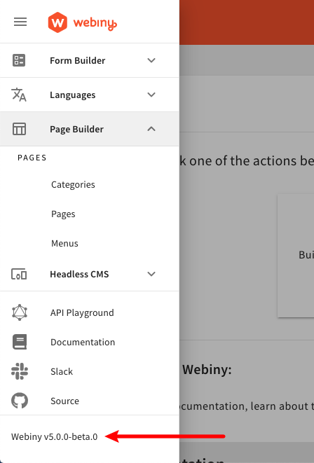

import { Alert } from "@/components/Alert";

<Alert type="success" title="What you’ll learn">

- what does it mean to upgrade Webiny
- how to upgrade Webiny to a specific version

</Alert>

## 🔥 Precaution Measures

### Pre-production Environments First

Whenever you're doing an upgrade, we recommended that you first deploy your changes into one of your pre-production environments, like `dev` or `staging`. Once you've confirmed everything works as expected, then you can start planning moving into the production.

<Alert type="info">

Learn how to deploy your project into multiple environments with the [`deploy`](/docs/{version}/core-development-concepts/basics/project-deployment) command.

</Alert>

### Production Data Backups

When deploying to production environments, in order to prevent data loss, make sure to **backup data stored in your [ElasticSearch](https://docs.aws.amazon.com/elasticsearch-service/latest/developerguide/es-managedomains-snapshots.html) and [DynamoDB](https://docs.aws.amazon.com/amazondynamodb/latest/developerguide/Backups.html) databases**!

If you have any additional questions or concerns, please don't hesitate to send us a message via our [community Slack channel](https://www.webiny.com/slack).

## How to Upgrade

When planning an upgrade, always check if there's a dedicated guide for your specific Webiny version. All the guides are located in the menu on the left, for example: [5.9.0 → 5.10.0](/docs/release-notes/5.10.0/upgrade-guide). If you see the guide that matches your versions, follow it. It may contain additional steps to upgrade your Webiny project, as sometimes there are changes in project file organization, project configs, etc.

If there's no dedicated article, upgrades are as easy as upgrading all the `@webiny/*` packages to the desired version.

Since every Webiny project is using [yarn](https://yarnpkg.com/) as the package manager, to upgrade all `@webiny/*` packages, you can use the [`yarn up`](https://yarnpkg.com/cli/up) command, like so:

```
// Make sure you replace the version number in the command.
yarn up "@webiny/*@5.0.0"
```

<Alert type="info">

The `yarn up` command updates all your `package.json` files in all workspaces across the project. Learn more about it in the [official documentation](https://yarnpkg.com/cli/up#details).

</Alert>

Once that's done, you can deploy your project.

## FAQ

### While upgrading, can I skip versions, for example from 5.30.0 to 5.35.0?

You should **never skip versions (major or minor)** as each upgrade can contain additional manual steps that need to be taken. The steps will always be listed in upgrade guides.  
Please note that it's possible to skip only **patch versions**. For example, if you are currently on version `5.30.0` and wish to upgrade to version `5.32.0`. You can upgrade from `5.30.0` to `5.31.0` and then from `5.31.0` to `5.32.0` by skiping the patch versions within the `5.31.0` series, such as `5.31.1`, `5.31.2`, and `5.31.3`.

### Once upgraded, do we need to re-deploy the Webiny project in order to see the changes?

Yes, once you've completed the upgrade steps, in order to actually see the new features and fixes online, you need to re-deploy you project. Which project applications you need to re-deploy? It depends on the released fixes and features, but the easiest approach would be just to deploy the entire project, using the [`yarn webiny deploy`](/docs/{version}/core-development-concepts/basics/project-deployment#the-deploy-command) command.

Additionally, before you re-deploy the changes into the production environment, it's recommended that you re-deploy the changes into one of your test or preview environments first.

### Is it possible to upgrade Webiny from v4 to v5?

Differences between these two versions are so vast that it's simply impossible to do the upgrade. If you're interested in migrating your existing project to v5, unfortunately, you will have to recreate your existing content in a new v5 project, either manually, or by writing your own custom migration scripts.

### How can we check what's the version of Webiny we're currently at?

In your terminal of choice and in your project root, run the following command:

```
yarn webiny --version
```

Additionally, the version is also shown in the deployed Admin Area React application, at the bottom of the main menu:



### Where can I find details on the Webiny beta releases?

You can find details about beta versions on the [create-webiny-project - npm](https://www.npmjs.com/package/create-webiny-project?activeTab=versions) page.  
If you are interested in setting up a Webiny project with a beta release, run the following command:

```
npx create-webiny-project@beta my-project --tag=5.40.0-beta.5
```

Additionally, set the environment variable `WEBINY_VERSION=5.40.0`. Feel free to update the tag version to your intended beta version.

Please note, we do not recommend using beta versions for production projects. However, if you want to try out features available early in a beta release, you can set up a beta version.
