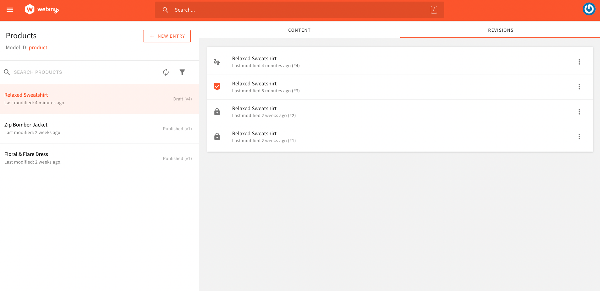

import { Alert } from "@/components/Alert";
import createContentEntry from "./assets/create-content-entry/create-content-entry.mp4";

<Alert type="success" title="WHAT YOU'LL LEARN">

- how to create a content Entry

</Alert>

In the previous tutorial, we learned how to create a [content model](/docs/{version}/user-guides/headless-cms/essentials/create-content-model), and
in this tutorial, we will explore how to create a [content entry](/docs/{version}/user-guides/headless-cms/essentials/glossary#content-entry).
As an example, we will create a **Product** content entry with the following attributes:

| Field       | Value                                          |
| :---------- | :--------------------------------------------- |
| Name        | Relaxed Sweatshirt                             |
| Description | Top sweatshirt fabric made from a cotton blend |
| Price       | 10                                             |

## Prerequisites

To create a content entry, the prerequisite is to have a content model.
If you don't have any content model yet, please follow this [tutorial](/docs/{version}/user-guides/headless-cms/essentials/create-content-model) to create a content model.

<Video src={createContentEntry} controls={true} />

## Create Content Entry

1. From the **Side Menu**, Click **Headless CMS** > **Products**.
2. Click **+ NEW ENTRY**.

   ✔️ The New Content Entry screen opens.

3. In the **Name** textbox, type **Relaxed Sweatshirt**.
4. In the **Description** textbox, type **Top sweatshirt fabric made from a cotton blend**.
5. In the **Price** textbox, type **10**.
6. Click **SAVE & PUBLISH**.
7. Congratulations! You have created your first content entry.

## Additional Information

### Content Revision

Every time you save any content entry, a new revision is created. You can see all the content revisions in the **REVISONS** tab.

