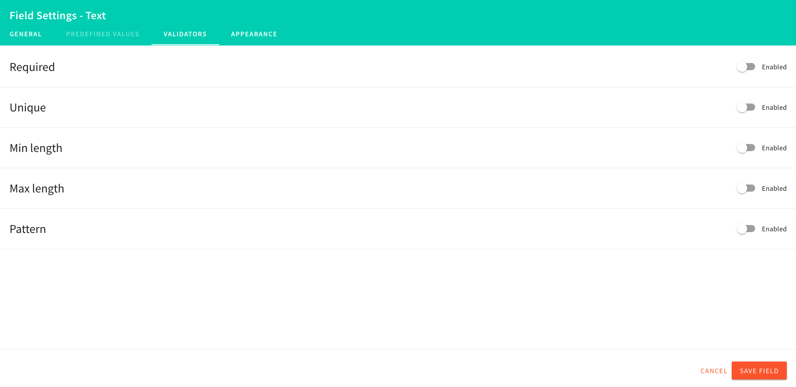

import { Alert } from "@/components/Alert";
import createContent from "./assets/create-content-model/create-content-model.mp4";

<Alert type="success" title="WHAT YOU'LL LEARN">

- how to create a content model
- how to define content model's fields

</Alert>

In this tutorial, we will learn how to create a [content model](/docs/{version}/user-guides/headless-cms/essentials/glossary#content-model).
As an example, we will create a Product content model with the following fields:

| Field       | Field Type |
| :---------- | :--------- |
| Name        | Text       |
| Description | Long text  |
| Price       | Number     |

Content model creation is a two-step process: in step 1, we will create the model, and in step 2,
we will define model [fields](/docs/{version}/user-guides/headless-cms/essentials/glossary#field-field-type).

<Video src={createContent} controls={true} />

## Step 1: Create Content Model

1. From the **Side Menu**, Click **Headless CMS** > **Models**.
2. Click **+ NEW MODEL**.

   ✔️ The New Content Model screen opens.

3. In the **Name** textbox, type **Product**.
4. In the **Content model group** drop-down, if you have already created a group, select that group; else select **Ungrouped**.
5. In the **Description** textbox, type **Demo Product Content Model**.
6. Click **+ CREATE MODEL**.

   ✔️ Screen to configure the content model's fields opens.

## Step 2: Define fields

1. Drag and drop the **TEXT** field in the **EDIT** tab.

   ✔️ **Field Settings - Text** screen opens.

2. In the **Label** textbox, type **Name** and click **SAVE FIELD**.

3. Drag and drop the **LONG TEXT** field in the **EDIT** tab.

   ✔️ **Field Settings - Long Text** screen opens.

4. In the **Label** textbox, type **Description** and click **SAVE FIELD**.

5. Drag and drop the **Number** field in the **EDIT** tab.

   ✔️ **Field Settings - Number** screen opens.

6. In the **Label** textbox, type **Price** and click **SAVE FIELD**.

7. Click **SAVE**.

8. Congratulations! You have created your first content model.

## Additional Information

### Field Validation

You can add various validations to a field from the **VALIDATORS** tab on the **Field Settings** screen.
Depending on the field type, you can add different types of validations to your field.

