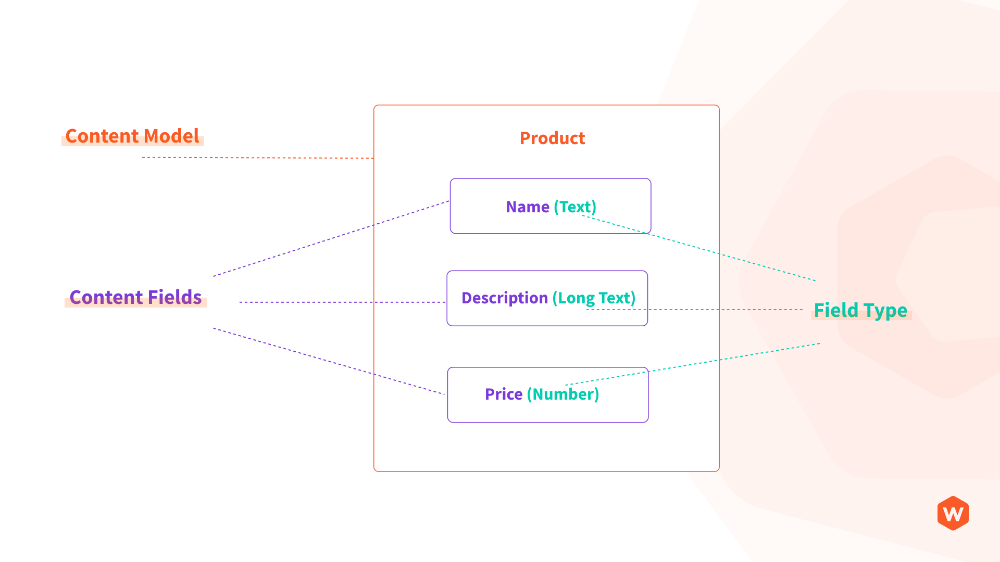
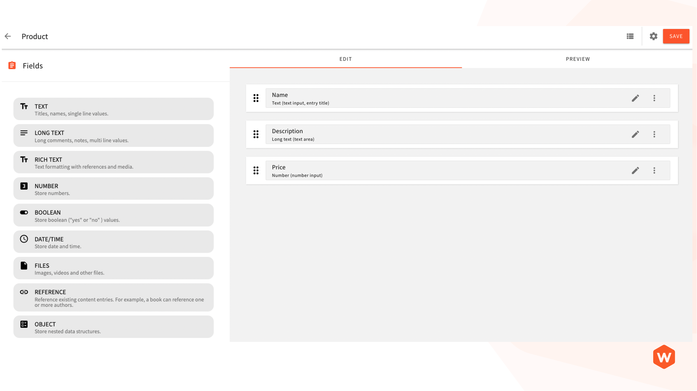
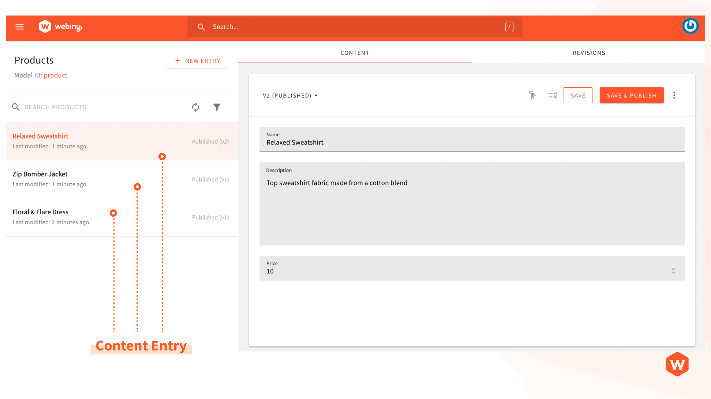

import { Alert } from "@/components/Alert";

<Alert type="success" title="WHAT YOU'LL LEARN">

- Headless CMS terminologies, and their meanings.

</Alert>

## Content Model

The first step to storing information in a Headless CMS is to create your content model.
If you're new to the Headless CMS world, this term may be unfamiliar to you, but it's simple to understand.

Let’s understand the content model with an example.
Let’s say you want to store all the products in your shop in a CMS. As a first step, you will need to define all the
product attributes and their types. For example, a product may have the following attributes ([fields](#field-field-type)):

- Name (Text Type)
- Description (Long Text)
- Price (Number)

The collection of these attributes (fields) will be referred to as the "content model."  
As per the example above, the Product content model will have three fields: name, description,
and price, with field types of text, long text, and number, respectively.  
Below is the actual screenshot of the Webiny user interface for a content model.

## Field / Field Type

As mentioned in the content model section, every content model is a collection of fields, and each field has a type.
The field type defines the kind of content you want to store. Webiny supports the following field types:

| Field Type  | Description                                                                                |
| :---------- | :----------------------------------------------------------------------------------------- |
| `Text`      | Titles, names, single line values.                                                         |
| `Long text` | Long comments, notes, multi line values.                                                   |
| `Rich text` | Text formatting with references and media.                                                 |
| `Number`    | Store numbers.                                                                             |
| `Boolean`   | Store boolean ("yes" or "no" ) values.                                                     |
| `Date/Time` | Store date and time.                                                                       |
| `Files`     | Images, videos and other files.                                                            |
| `Reference` | Reference existing content entries. For example, a book can reference one or more authors. |
| `Object`    | Store nested data structures.                                                              |

## Content Entry

Each record that you store in the content model is a content entry. For example, a new product record
created with the following information is a content entry.

| Field       | Value                                          |
| :---------- | :--------------------------------------------- |
| Name        | Relaxed Sweatshirt                             |
| Description | Top sweatshirt fabric made from a cotton blend |
| Price       | 10                                             |

This one record is a content entry, and each content model will contain multiple content entries.

