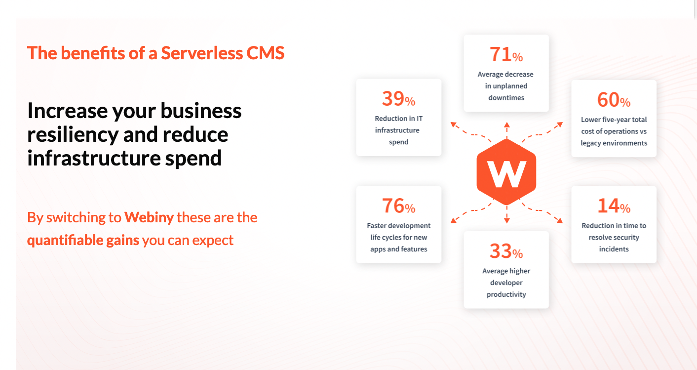
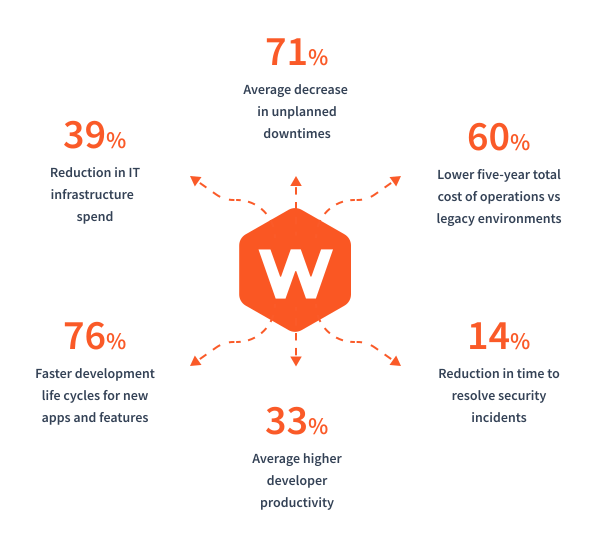

import { Alert } from "@/components/Alert";
import createPage from "./assets/create-page/create-page.mp4";

<Alert type="success" title="WHAT YOU'LL LEARN">

- how to create a page using Page Builder

</Alert>

Webiny's Page Builder incorporates a drag-and-drop visual editor that allows you to easily create and edit web pages without requiring any coding skills.

In this tutorial, we will learn how to create a page using the Page Builder. As an example, we will create a page with the section shown in the image below:

We will do this in 6 steps:

- Step 1: Add a new page
- Step 2: Add and edit a new block
- Step 3: Add a heading
- Step 4: Add an image
- Step 5: Review settings
- Step 6: Preview and publish

<Video src={createPage} controls={true} />

## Step 1: Add a New Page

1. From the **Side Menu**, click **Page Builder** > **PAGES** > **Pages**.

   ✔️ The **Pages** screen opens.

2. Click **+ NEW PAGE**.

   ✔️ The screen to select a template for the page opens.

3. Click **USE A BLANK PAGE TEMPLATE**.

   ✔️ Page editor screen opens.

4. To rename the page, click the page's title **Untitled**.

   ✔️ A textbox appears.

5. In the textbox, update the text from **Untitled** to **The benefits of a Serverless CMS**.

6. Click anywhere outside the textbox.

   ✔️ The message "Page title updated successfully!" displays.

   **Note**: This page title does not need to be same as the title that you want to be listed in search engine rankings. The purpose of this title is for internal content organization.

## Step 2: Add and Edit a New Block

1. Click the **ADD BLOCK** button ( ➕ ) at the bottom-right corner of the page editor.

   ✔️ The **All blocks** screen opens.

2. Hover on the **EMPTY BLOCK**.

3. Click **+ CLICK TO ADD**.

   ✔️ The page editor screen opens with the newly added block.

   **Note**: Blocks are the building blocks of a page. A page may be built with multiple blocks. A block can contain elements like heading, paragraph, grid, etc. A grid is made of one or more cells. And, the elements like heading and paragraph can also be placed inside cells.

4. Hover on and click the **grid** inside the empty block.

   ✔️ Properties of the **grid** display in **STYLE** tab.

5. In the **STYLE** tab of the grid element, click **Width**.

   ✔️ The **Width** accordion opens.

   a. In the **Width value** textbox, update the text from **1100** to **100**.

   b. In the **Width unit** dropdown, click **%**.

   **Note**: This will make the grid occupy 100% width of its parent element - the block.

6. In the **STYLE** tab of the grid element, click **Grid Size**.

   ✔️ The **Grid Size** accordion opens.

   a. In the layout options, click the **two-column-layout**.

   b. Update the value of **Cell 1** from **6** to **5**.

   c. Update the value of **Cell 2** from **6** to **7**.

   **Note**: The cells are in order from the left to the right i.e. Cell 1, Cell 2, Cell 3, and so on.

7. Hover on and click the **block** element.

   ✔️ Properties of the **block** display in **STYLE** tab.

8. In the **STYLE** tab of the block element, click **Background**.

   ✔️ The **Background** accordion opens.

   a. Click the **Image** selector.

   ✔️ The media manager screen opens.

   b. Click **UPLOAD**.

   ✔️ The file explorer screen opens.

   c. From the file explorer, upload the following image:

   

   d. Click the uploaded image in the media manager.

   ✔️ The page editor screen opens with the image added to the page as the block's background.

   e. In the **Scaling** dropdown, click **Cover**.

   f. In the **Position** dropdown, click **Top**.

9. In the **STYLE** tab of the block element, click **Height**.

   ✔️ The **Height** accordion opens.

   a. In the **Height value** textbox, update the text to **100**.

   b. In the **Height unit** dropdown, click **vh**.

## Step 3: Add a Heading

1. Click the **ADD ELEMENT** icon ( ➕ ) at the top-left corner of the page editor.

   ✔️ The elements menu opens.

2. Click **Basic**.

   ✔️ The **Basic** elements accordion opens.

3. Hover on the **HEADING** element.

4. Drag and drop the **HEADING** element inside **Cell 1**.

5. Double click the **Heading** element to edit it.

6. Update the text from **Heading** to **The benefits of a Serverless CMS**.

7. Select the whole text by pressing **Ctrl + A** (or with the mouse).

8. In the text formatting menu that appears above the selected text:

   a. Click the **Bold** icon ( **B** ).

   b. In the **Heading Type** dropdown, click **Heading 1**.

   c. In the **Font Size** dropdown, click **30 px**.

   d. In the **Font Color** dropdowwn, click the **Orange** color.

9. In the **STYLE** tab of the heading element, click **Margin**.

   ✔️ The **Margin** accordion opens.

   a. Click the **LINK ALL SIDES** icon ( 🔗 ) to make it inactive.

   b. Update the **margin-bottom** value from **0px** to **60px**.

10. Now, following the Steps 1 to 9, add the following two texts in order below the **The benefits of a Serverless CMS** text inside **Cell 1** with the mentioned properties:

    | Text                                                                                    | Formatting                | Color  | Heading Type | Font Size | Margin        |
    | :-------------------------------------------------------------------------------------- | :------------------------ | :----- | :----------- | :-------- | :------------ |
    | **Increase your business**  **resiliency and reduce**  **infrastructure spend** | Bold                      | Black  | Heading 2    | 36 px     | Bottom - 40px |
    | By switching to **Webiny** these are the   **quantifiable gains** you can expect:   | Normal + Bold (specified) | Orange | Heading 3    | 24 px     | Bottom - 60px |

## Step 4: Add an Image

1. From the **Basic** elements menu, drag and drop the **IMAGE** element inside **Cell 2**.

   ✔️ The media manager screen opens.

2. Click **UPLOAD**.

   ✔️ The file explorer screen opens.

3. From the file explorer, upload the following image:

   

4. Click the uploaded image in the media manager.

   ✔️ The page editor screen opens with the image added to the page.

5. In the **STYLE** tab of the image element, click **Image**.

   ✔️ The **Image** accordion opens.

   a. In the **Width value** textbox, type **80**

   b. In the **Width unit** dropdown, click **%**.

6. In the **STYLE** tab of the image element, click **Horizontal align**.

   ✔️ The **Horizontal align** accordion opens.

   a. Click the **ALIGN RIGHT** icon ( _Align right icon required_ ).

## Step 5: Review settings

1. Click the **SETTINGS** icon ( ⚙️ ).

   ✔️ The **General settings** tab inside the **Page Settings** screen opens.

2. In the **Path** textbox, type **/the-benefits-of-a-serverless-cms**.

3. In the **Snippet** textbox, type **Increase your business resiliency and reduce infrastructure spend**.

4. Click **SAVE SETTINGS**.

   ✔️ The page editor screen opens with the message "Settings saved!".

## Step 6: Preview and publish

1. Click the **kebab menu** icon ( ⁝ ) on the top right of the page.

   ✔️ Menu opens with the options **Preview** and **Set as homepage**.

2. Click **Preview**.

   ✔️ The page opens in new browser window.

3. To publish the page, click **PUBLISH**.

   ✔️ The **Pages** screen opens with the message "Your page was published successfully!".

4. In the **PAGE PREVIEW** tab of the **The benefits of a Serverless CMS** page, click the **kebab menu** icon ( ⁝ ).

   ✔️ Menu opens with the options **View** and **Set as homepage**.

5. Click **View**.

   ✔️ The **The benefits of a Serverless CMS** page opens in a new tab.
