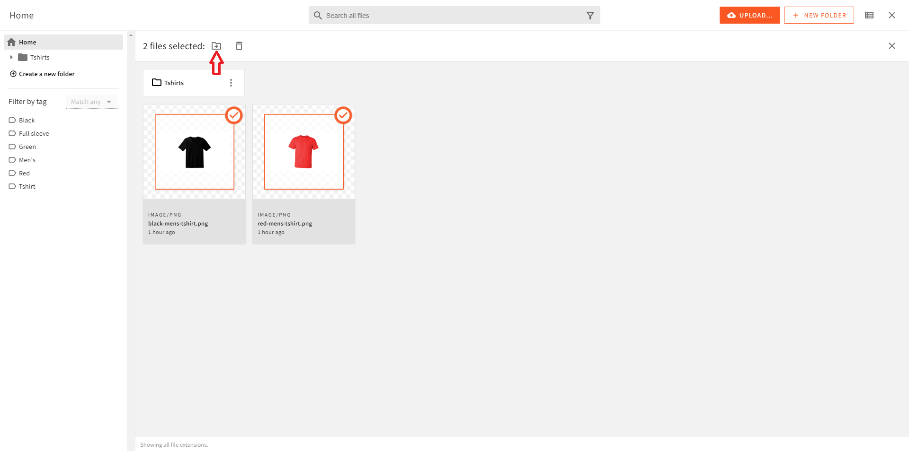

import { Alert } from "@/components/Alert";
import blukActionsVideo from "./assets/bulk-actions/bulk-actions.mp4";

<Alert type="success" title="WHAT YOU'LL LEARN">

- how to move multiple files from one folder to another folder

</Alert>

Webiny enables users to execute bulk actions, such as moving and deleting multiple files in bulk. In this tutorial, we will learn how to move multiple files from folder to another folder in the File Manager.

## Prerequisites

To follow this tutorial, you need the **Men's Red Tshirt** and **Men's Black Tshirt** images uploaded in the file manager. If you don’t have these images in your file manager, please follow the [File Upload](/docs/{version}/user-guides/file-manager/essentials/upload-file) and [Tagging Files](/docs/{version}/user-guides/file-manager/essentials/tagging-files) tutorials to upload them.

<Video src={blukActionsVideo} controls={true}/>

1. From the **Side Menu**, click **File Manager**.

    ✔️ The **File Manager Home** screen opens.

2. In the root folder, create a folder titled **Tshirts**.

    **Note**: If you are not familiar with how to create a folder, please follow the [Organizing Files](/docs/{version}/user-guides/file-manager/essentials/organizing-files) tutorial.

3. In the root folder, over the **Men's Red Tshirt** image we uploaded in the [File Upload](/docs/{version}/user-guides/file-manager/essentials/upload-file) tutorial, click the **SELECT** icon (☑️).

    ✔️ A file action bar appears below the search bar.

4. Similarly, select the **Men's Black Tshirt** image we uploaded in the [Tagging Files](/docs/{version}/user-guides/file-manager/essentials/tagging-files) tutorial.

5. In the file action bar, click the **MOVE *N* FILES** icon (📁).

    ✔️ The **Select folder** screen appears.

6. In the menu, click **Tshirts**.

7. Click **MOVE**.

    ✔️ The **Move files** dialog box appears with the message "Finished moving files! See full report below".
