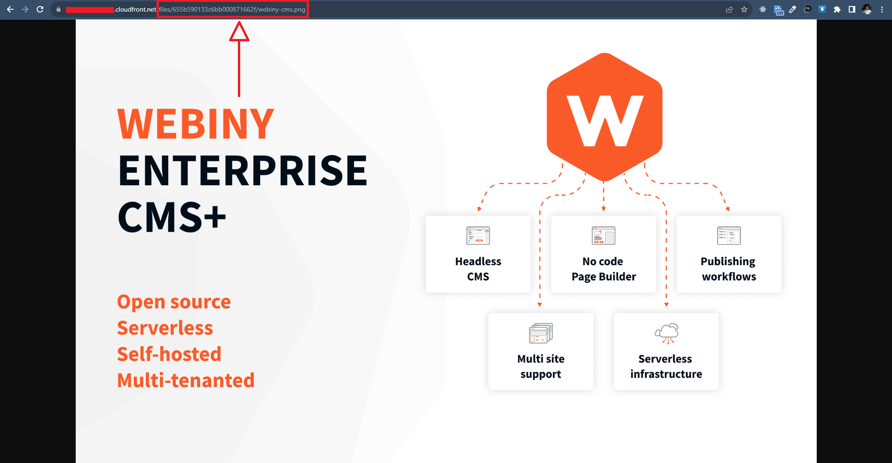

import { Alert } from "@/components/Alert";
import fileAliasesVideo from "./assets/file-aliases/file-aliases.mp4";

<Alert type="success" title="WHAT YOU'LL LEARN">

- how to add a path aliases to a file

</Alert>

Webiny simplifies file access in the File Manager by allowing users to create path aliases. Each file can have one or more aliases, which proves useful, especially during file migrations from other systems, ensuring the preservation of URLs in existing content. In this tutorial, we will learn how to add a path alias to a file. We will do this in 2 steps:

- Step 1: Add a path alias to a file
- Step 2: Preview the file using the alias

## Prerequisites

To follow this tutorial, you need the **Men's Red Tshirt** image uploaded in the file manager. If you don’t have the **Men's Red Tshirt** image in your file manager, please follow the [File Upload](/docs/{version}/user-guides/file-manager/essentials/upload-file) tutorial to upload it.

<Video src={fileAliasesVideo} controls={true}/>

## Step 1: Add a path alias to a file

1. From the **Side Menu**, click **File Manager**.

    ✔️ The **File Manager Home** screen opens.

2. Hover over the **Men's Red Tshirt** image we uploaded in the [File Upload](/docs/{version}/user-guides/file-manager/essentials/upload-file) tutorial.

3. Click the **SETTINGS** icon (⚙️).

    ✔️ The **File details** screen opens.

4. In front of **FILE ALIASES**, click **+ ADD ALIAS**.

    ✔️ The **Alias** textbox appears.

5. In the **Alias** textbox, type **/apparels/mens/tshirts/red/red-mens-tshirt.png**.

6. Click **SAVE FILE**.

**Note**: You can add multiple aliases to a file.

## Step 2: Preview the file using the alias

1. Open the **File details** screen for the **Webiny CMS** image.

2. Click the **COPY URL** icon.

3. Visit the URL in a new tab in browser.

4. After the base URL, replace the *path of the file* with the alias **/custom/path/files/images/webiny-cms.png**. For example, in the address bar, change the text from  
**https://*your base URL*/files/655b590133c6bb000871662f/webiny-cms.png** 
to  
**https://*your base URL*/apparels/mens/tshirts/red/red-mens-tshirt.png**.

