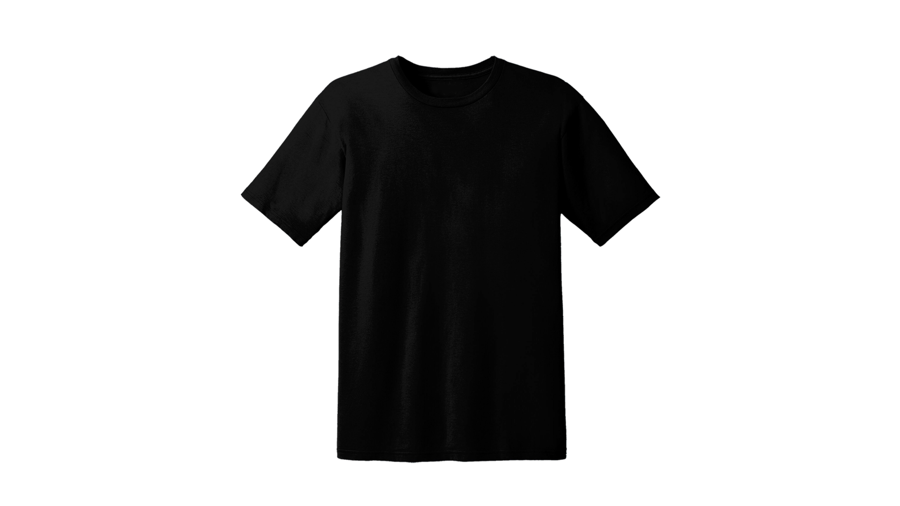

import { Alert } from "@/components/Alert";
import taggingFilesVideo from "./assets/tagging-files/tagging-files.mp4";

<Alert type="success" title="WHAT YOU'LL LEARN">

- how to tag a file
- how to filter files via assigned tag(s)

</Alert>

Webiny allows users to tag files, facilitating convenient access. Users can efficiently search and filter files based on assigned tags. In this tutorial, we will learn how to tag a file, and filter it via its assigned tag in the File Manager. We will do this in 2 steps:

- Step 1: Tag a file
- Step 2: Filter files by tags

## Prerequisites

To follow this tutorial, you need the **Men's Red Tshirt** image uploaded in the file manager. If you don’t have the **Men's Red Tshirt** image in your file manager, please follow the [File Upload](/docs/{version}/user-guides/file-manager/essentials/upload-file) tutorial to upload it.

<Video src={taggingFilesVideo} controls={true}/>

## Step 1: Tag a file

1. From the **Side Menu**, click **File Manager**.

    ✔️ The **File Manager Home** screen opens.

2. Hover over the **Men's Red Tshirt** image we uploaded in the [File Upload](/docs/{version}/user-guides/file-manager/essentials/upload-file) tutorial.

3. Click the **SETTINGS** icon (⚙️).

    ✔️ The **File details** screen opens.

4. In the **Tags** textbox, type **Tshirt**.

5. In the drop-down below, click **Tshirt**.

6. Similarly, add the following tags to the image: **Red** and **Men's** .

7. Click **SAVE FILE**.

8. Now upload the following image.

    

    If you are not familiar with how to upload a file, please follow the [File Upload](/docs/{version}/user-guides/file-manager/essentials/upload-file) tutorial.

9. Following the Steps 2 to 7 add the following tags to the **Men's Black Tshirt** image: **Tshirt**, **Black**, and **Men's**.

## Step 2: Filter files by tags

1. On the **File Manager Home** screen, in the navigation panel on the left, under **Filter by tag**, click the **Tshirt** tag.

    ✔️ All the files with the tag **Tshirt** appear on the screen.

    **Note**: You can deactivate an active tag filter by clicking on it again.

2. Click the **Red** tag.

    ✔️ All the files having either **Tshirt** or **Red** tag appear on the screen.

3. In the **Conditional filter** drop down, click **Match all**.

    ✔️ Only the files having both **Tshirt** and **Red** tag appear on the screen.

    **Note**: When applying multiple tag filters, the **Conditional filter** drop-down becomes active. The default selection is **Match any**, meaning all files with at least one of the active tags will appear on the screen. If the **Match all** option is selected, only files with all the active tags will be displayed on the screen.

## Additional information

1. You can also apply a tag filter by searching the tag name in the search bar.

2. You can apply filters by utilizing the search bar, clicking on tags, and using the conditional filtering drop-down in combination.