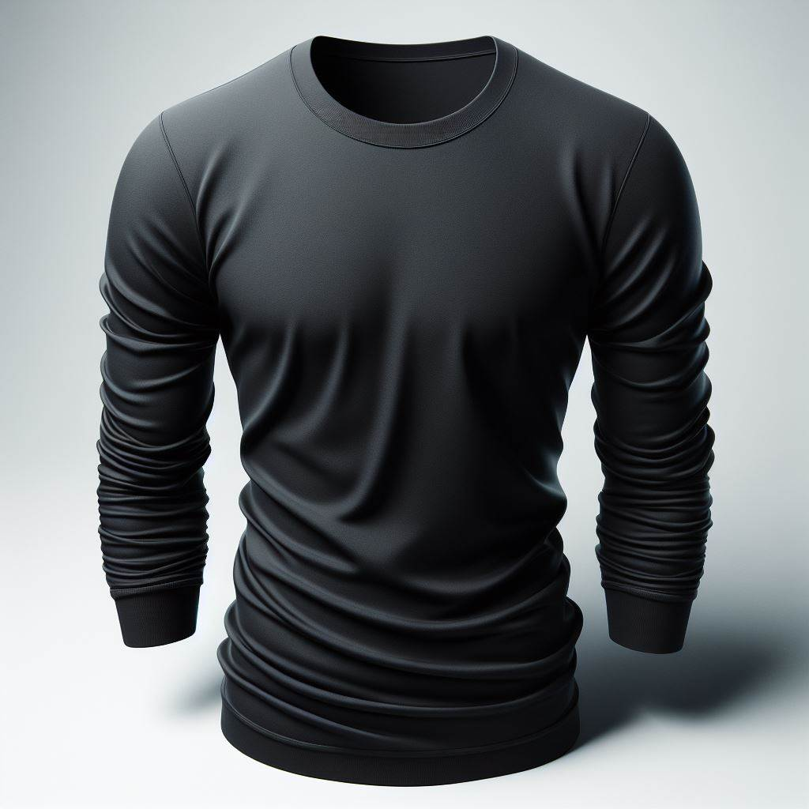
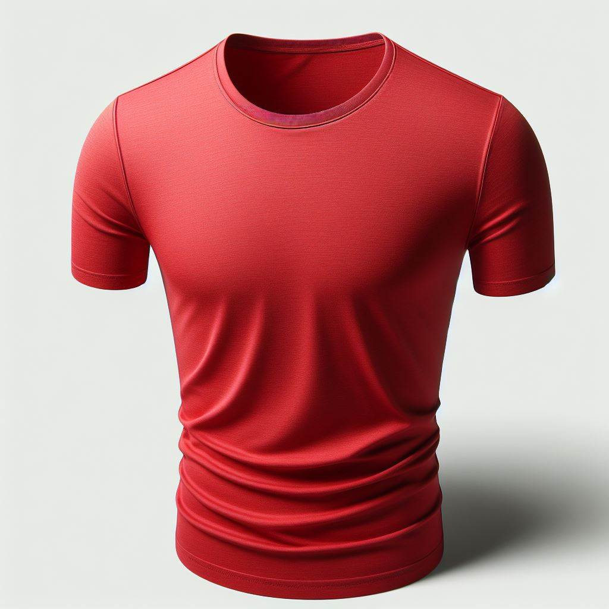

import { Alert } from "@/components/Alert";

<Alert type="success" title="WHAT YOU'LL LEARN">

- how to use advanced search filter in Headless CMS

</Alert>

Webiny's Advanced Search Filter Builder enables users to effortlessly create complex search queries without depending on developer assistance. Users can create custom search queries based on model-defined fields that are one of the following types: boolean, datetime, number, or text. It supports grouping conditions and defining relationships between individual conditions or groups, thereby enhancing search accuracy and efficiency. In this tutorial, we will learn how to use advanced search filter.

[Watch unedited video here](https://drive.google.com/file/d/11wkQjF4-t0dDucfNW2Q00qZmlphEGCzz/view?usp=drive_link)

## Step 1: 

1. Make the following content entries in the **Product** content model:

   | Folder     | Product Title     | Product Description |
   | :-------  | :---------| :------  |
   | Home > Apparels | **Men's Black Half-sleeve T-shirt** | **Product: T-shirt; For: Men, Color: Black, Size: S, Type: Half-sleeve** |
   | Home > Apparels | **Men's Red Half-sleeve T-shirt**   | **Product: T-shirt; For: Men, Color: Red, Size: M, Type: Half-sleeve**   |
   | Home > Apparels | **Men's Black Full-sleeve T-shirt** | **Product: T-shirt; For: Men, Color: Black, Size: L, Type: Full-sleeve** |
   | Home > Apparels | **Men's Red Full-sleeve T-shirt**   | **Product: T-shirt; For: Men, Color: Red, Size: XL, Type: Full-sleeve**  |

   |Half Sleeve|Full Sleeve|
   |:--        |:--        |
   |||
   |||

   If you are not familiar with how to create a content entry, please follow the [Create Content Entry](/docs/{version}/user-guides/headless-cms/essentials/create-content-entry) tutorial.

## Step 2:

1. From the **Side Menu**, click **Headless CMS** > **UNGROUPED** > **Product**.

    ✔️ The **Product** content entries' screen opens.

2. Click the **FILTER** icon (🍸) in front of the **SEARCH** box.

3. Click **ADVANCED SEARCH FILTER**.

   ✔️ The **Advanced search filter** screen opens.

4. Click **CREATE NEW**.

   ✔️ The **Advanced search filter** builder screen opens.

5. Under **Filter group #1**, in the **Field** dropdown, select **Product Title**.

6. In the **Condition** dropdown, click **contains**.

7. In the **Value** textbox, type **Red**.

8. Click **APPLY FILTER**.

   ✔️ The entries **Men's Red Full-sleeve T-shirt** and **Men's Red Half-sleeve T-shirt** display in search results.

   **Note**: You can save a filter for later use by clicking **SAVE FILTER**.

## Step 3: 

1. Follow Steps 1 to 7 of the previous step again. 

   **Note**: The **Match all conditions** toggle button is **ON** by default. It means it will return the entries that meet all the given conditions. If it is set to **OFF**, it will return the entries that meet either of the given conditions.

2. Click **ADD NEW CONDITION** icon (➕).

3. In the **Field** dropdown, select **Product Description**.

4. In the **Condition** dropdown, click **contains**.

5. In the **Value** textbox, type **Full**.

6. Click **APPLY FILTER**.

   ✔️ The entry **Men's Red Full-sleeve T-shirt** displays in search results.

**Note**: You can add multiple conditions inside a Filter Group. You can also add multiple Filter Groups in a Search Query.

