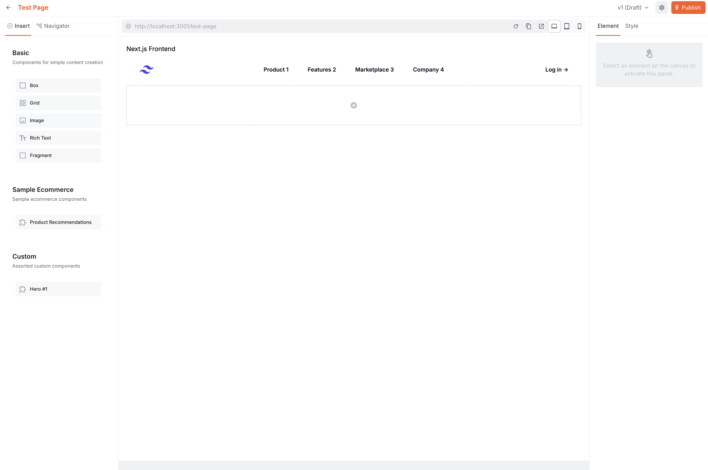
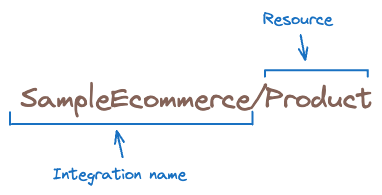
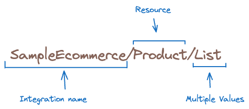

import { Alert } from "@/components/Alert";


<Alert type="success" title="WHAT YOU'LL LEARN">

- how to link your Website Builder with our Next.js starter kit

</Alert>

Webiny's Website Builder incorporates a drag-and-drop visual editor allows you to use custom front end of your choice. We recommend Next.js. To get our users up and running as quickly as possible we put together a sample Next.js project.

In this tutorial, we will learn how to link your Webiny project to the [Next.js starter kit](https://github.com/webiny/website-builder-nextjs) 

We will do this in a few simple steps:

- Step 1: Fork the Next.js starter kit repository
- Step 2: Switch to the appropriate branch
- Step 3: Create and populate your .env file
- Step 4: Establish connection
- Step 5: Validate connection
- Optional information and actions

## What's Included in the Starter Kit

- TypeScript
- Tailwind CSS
- Sample ecommerce API
- Sample components
- Sample component groups
This project uses [Next.js App Router](https://nextjs.org/docs/app)!


## Step 1: Clone the repository

Use your tools of choice and clone the [Next.js Startet kit repository](https://github.com/webiny/website-builder-nextjs.git)

   ✔️ The project structure should be already visible in your editor.

## Step 2: Switch to the appropriate branch

<Alert type="warning" title="Version Match">
Pick the right branch for your Webiny project! If your Webiny project runs on the latest version, check out the latest branch from this  Next.js repo, for example for "Webiny v6.0.0" use the "v6.0.0" branch. If this is not available use the closest matching version and update `@webiny/website-builder-nextjs` in `package.json` in the Next.js project.
</Alert>


## Step 3: Create and populate your .env file

1. Create a new file in your project root called `.env`


2. Add the correct variables from your Webiny project. 

A user can find them in the Webiny Admin app, click on the **Support** link in the bottom left corner, and then select **Configure Next.js**. This is a configuration specifically generated for Webiny Next.js starter kit. Simply copy the values in your `.env` file in the Next.js starter kit and SAVE.

   ✔️ The following environment variables are saved in the `.env` file:
```diff-tsx .env
NEXT_PUBLIC_WEBSITE_BUILDER_API_KEY: {YOUR_API_KEY}
NEXT_PUBLIC_WEBSITE_BUILDER_API_HOST: {YOUR_API_HOST}
NEXT_PUBLIC_WEBSITE_BUILDER_API_TENANT: {YOUR_API_TENANT}
# Optional, check "Cross-Origin Configuration" section below.
NEXT_PUBLIC_WEBSITE_BUILDER_ADMIN_HOST: {YOUR_ADMIN_HOST} 
```

3. Ensure that in the `package.json` the `"@webiny/website-builder-nextjs":` has the right Webiny version against it, e.g. "6.0.0"


## Step 4: Establish the connection

In the Next.js project root, run:

```tsx
yarn && yarn dev
```
   ✔️ This will build your dependencies.
   
   ✔️ It establishes the connection between your Next.js app and the Webiny project thanks to your env variables.
   
   ✔️ It starts the Next.js in development mode on `localhost:3000`. It enables hot reloading, detailed error overlays, and source maps for fast iteration on your project.

## Step 5: Validate connection

In the Website builder, try creating a new page. If the default components and header load properly, then the connection is established properly.



Note: If there are any issues, ensure that there are no warnings in the Next.js project after the start of the dev mode. For example, if you are running something else on `http://localhost:3000` the app will automatically use a different port. If this is the case you need to align your Website Builder settings to the same port.


## Optional information and actions for developers and advanced users

### Webiny Admin app host URL
If you're using your Next.js project in an editor that is hosted on a domain different from your Next.js domain, you'll have to whitelist the editor's domain. You can do that via the `NEXT_PUBLIC_WEBSITE_BUILDER_ADMIN_HOST` env var (see "Cross-Origin Configuration" section below).

A simple way to retrieve your Admin app host URL is to log in to your Webiny Admin app, and copy the URL from your browser's address bar (for example: https://dxhy1vkapexg1.cloudfront.net) or using the **Support** link described above.

### Content SDK

Webiny Content SDK is located in `src/contentSdk` folder. The `initializeContentSdk.ts` file contains the SDK initialization, and editor component group registration. Customize your component groups here.

###  Custom components

Custom components are passed directly to the `DocumentRenderer` (see the example in `./src/app/[[...slug]]/page.tsx`).
To create custom components, see examples in `./src/editorComponents/index.tsx`. We also have amore detailed article here covering Custom Components.

### Cross-Origin Configuration

If you're using your Next.js project in an editor that is hosted on a domain different from your Next.js domain, you'll have to whitelist the editor's domain.

Open `next.config.ts`, and add your domain to the `Content-Security-Policy` header. For example:

```
{
    key: "Content-Security-Policy",
    value: "frame-ancestors http://localhost:3001 https://d3fak6u4cx01ke.cloudfront.net"
}
```

### Sample Routes

- `src/app/[[...slug]]` - this directory contains an example of simple static page generation, using pages from the Webiny Website Builder

- `src/app/product/[slug]` - this directory contains an example of Product Details Page (PDP) generation, using a combination of a remote ecommerce API, and optional editorial content.

## Website Builder SDK

When you initially clone this repo, `@webiny/website-builder-nextjs` package in the `package.json` will be set to `*`. We recommend you set the version to whatever is the latest version at the time of cloning. Also, keep in mind that it's preferable to keep this version in sync with your actual Webiny Admin app version, so the Editor SDK and the Contend SDK are on the same version.


<Alert type="info" title="Tip for developers">
Inspect the sample code for more inline comments!
</Alert>

## Ecommerce Integrations and Component Inputs

<Alert type="info" title="Ecommerce Only">
This section is closely connected to, and depends on, ecommerce integrations in your Webiny Admin app. If you don't have any ecommerce integrations, you can skip this part.
</Alert>

Webiny Website Builder provides a way to integrate with your ecommerce platform of choice. Once an integration is enabled in Webiny Admin app, you get access to specialized component input renderers, which allow you to browse and select your ecommerce resources (products, categories, etc.) to assign them to your components in the editor.

To use a specific renderer in your component inputs definition, you need to follow a naming convention.
Here's an example, which creates a "text" input, which contains a list of string values, and uses a renderer called `SampleEcommerce/Product/List`.

### Single Resource Picker

```
createTextInput({
    name: "productId",
    renderer: "SampleEcommerce/Product",
    label: "Product"
})
```


### Multiple Resources Picker

```
createTextInput({
    name: "productIds",
    list: true,
    renderer: "SampleEcommerce/Product/List",
    label: "Products"
})
```




