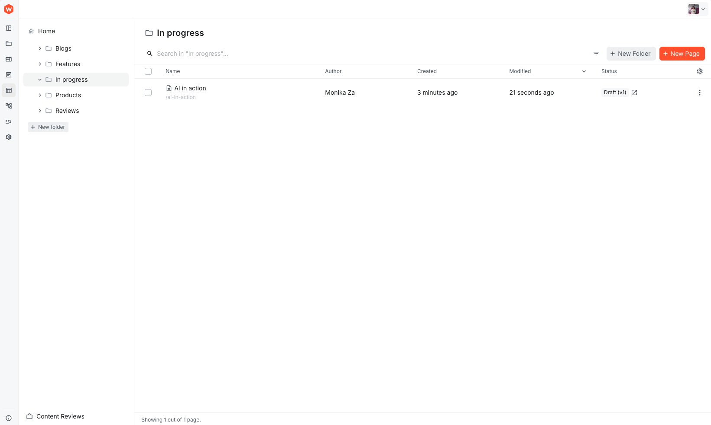

import { Alert } from "@/components/Alert";
import step1Video from "./assets/create-page/step1-add-new-page.mp4";
import step2Video from "./assets/create-page/step2-add-edit-box.mp4";
import step3Video from "./assets/create-page/step3-add-edit-rich-text.mp4";
import step4Video from "./assets/create-page/step4-add-edit-grid.mp4";
import step5Video from "./assets/create-page/step5-add-adjust-image.mp4";
import step6Video from "./assets/create-page/step6-custom-element.mp4";
import step7Video1 from "./assets/create-page/step7-use-navigator.mp4";
import step7Video2 from "./assets/create-page/step7-quick-select.mp4";
import step8Video from "./assets/create-page/step8-review-settings.mp4";
import step9Video from "./assets/create-page/step9-preview-breakpoints.mp4";
import step10Video from "./assets/create-page/step10-preview.mp4";
import step11Video from "./assets/create-page/step11-publish.mp4";
import step12Video from "./assets/create-page/step12-folders.mp4";

<Alert type="success" title="WHAT YOU'LL LEARN">

- how to create a page using Website Builder

</Alert>

Webiny's Website Builder incorporates a drag-and-drop visual editor that allows you to easily create and edit web pages without requiring any coding skills.

In this tutorial, we will learn how to create a Page using the Website Builder. As an example, we will create a page with the section shown in the image below:

We will do this in 12 steps:

- Step 1: Add a new Page
- Step 2: Add and edit a Box
- Step 3: Add and edit Rich Text
- Step 4: Add and edit a Grid
- Step 5: Add and adjust an Image
- Step 6: Add a complex custom Element
- Step 7: Use the Navigator
- Step 8: Review Settings
- Step 9: Preview the Breakpoints and adjust
- Step 10: Preview
- Step 11: Publish
- Step 12: Organize content in Folders

## Step 1: Add a New Page

<Video src={step1Video} controls={true} />

1. From the **Side Menu**, click **Website Builder** > **Pages**.

   ✔️ The **Pages** screen opens.

2. Click **+ NEW PAGE**.

   ✔️ The pop-up to select a Page type opens, e.g., Static Page.

3. Add the **Title** of the Page.

   ✔️ The **Path** is automatically generated.

4. Click **CREATE**.

   ✔️ The new Page edit screen appears.

## Step 2: Add and Edit a Box

<Video src={step2Video} controls={true} />

1. Drag and drop a **Box** Element into the ➕ container and click on it to select it.

   ✔️ The right-side **Element** and **Style** menus now control the selected Box element.

2. Explore the **Style** tab; you can change Layout, Margin & Padding, Background, and control the Visibility of the component.

3. Change the **Background** of the Box.

   ✔️ The Box changes color in the Page area in the center of the screen.

   **Note**: Boxes could be used as building blocks of a Page. A Page may be built with multiple Boxes to group Elements together easily share Style, move around together, or delete in one go. A Box can contain Elements like Grids, Images, Rich Text, etc.

## Step 3: Add and Edit Rich Text

<Video src={step3Video} controls={true} />

1. Drag and drop a **Rich Text** Element to the Box.

   ✔️ Placeholder text appears on the Page.

2. Select the text and, using the **Element** tab on the right, add and edit the text as needed. You can also open it in a larger pop-up for precise editing.

   ✔️ Formatting reflects in the Page preview area.

## Step 4: Add and Edit a Grid

<Video src={step4Video} controls={true} />

1. Add a **Grid** to the Box element and select it. Note: avoid addingthe Grid to the **Main Content** area area to keep the same Background and Style, it should be in the Box.

   ✔️ The Grid shows with sample content in the main Page area.

2. In the **Element** tab layout options, click the **four-column-layout, single-row**.

   ✔️ The Grid updates content in the main Page area.

3. Drag and drop **Rich Text** Elements into Column 3 and 4.

   ✔️ Sample text populates in these Cells.

4. Populate and edit the text to explore the Rich Text editor.

   **Note**: Grids are also powerful Page building blocks made of one or more Cells. Elements like Images and Rich Text can be placed inside their Cells.

## Step 5: Add and Adjust an Image

<Video src={step5Video} controls={true} />

1. Drag and drop an **Image** Element.

   ✔️ Placeholder Image element appears on the Page.

2. Select the Image from the **Element** tab by clicking **SELECT FROM LIBRARY**.

   ✔️ File Manager screen pops up.

   a. Find and click the desired Image.

      ✔️ Selected asset adds to the Page.

   b. OR click **UPLOAD**.

      ✔️ File explorer opens to select the Image you want to use. Here is the image used in this example:

      

3. In the **Style** tab of the Image element, click **Layout** and adjust Width to 80%, for example. Then adjust Alignment to centered. Use Margin & Padding as needed.

## Step 6: Add a Complex Custom Element

<Video src={step6Video} controls={true} />

1. Drag and drop a **Hero #1** element onto the Page.

   ✔️ Complex element with child components appears.

2. Child elements are not editable in this example, but custom components can specify inputs like button labels, etc so this is completely customizable.

3. Adjust the **Style** for this element and the changes apply to the  element as a whole and not to its individual parts.

## Step 7: Use the Navigator

<Video src={step7Video1} controls={true} />

1. From the **Navigator** tab on the left of the Page, click to access structure and components.

   ✔️ Navigator opens.

2. Click parent Elements to explore children, e.g., Box > Grid > Column (first) > Rich Text.

   ✔️ Element highlights on the Page for editing so that users acan find it quickly and start editing it.

   **Note**: Navigator excels for complex Pages with lots of components. Use it for precise selection of composites like Grids. Another way to make a precise selection is to use the bread crumb at the bottom of the screen. It allows you to go up the hierarchy in a single click.

   <Video src={step7Video2} controls={true} />

## Step 8: Review Settings

<Video src={step8Video} controls={true} />

1. Click the **SETTINGS** icon (⚙️).

   ✔️ **General Settings** tab in **Page Settings** opens.

2. In **SEO** and **Social** tabs, add info from the content on the Page itself or any test content.

3. Click **SAVE SETTINGS** before closing.Unlike the changes on the Page, which are automatically saved, here the user needs to actually save them to ensure no accidental changes are made.

   ✔️ Page Settings are updated.

## Step 9: Preview Breakpoints and Adjust

<Video src={step9Video} controls={true} />

1. At the top of the Page , you have some quick actions, click on the tablet or mobile icon icons to see how the content will look.

   ✔️ Center preview updates to different sizes.

2. When you click on the Mobile, you will notice the content in the Grid is not showing properly. The Grid has a built-in functionality that you can use to quickly fix this. Select Grid, **Element** tab, set **Stack at breakpoint** to **Mobile**.

   **Note**: Selecting **Tablet** stacks fpr tablets and all smaller size screens like Mobile automatically.

## Step 10: Preview

<Video src={step10Video} controls={true} />

1. Click **PREVIEW** in a new tab.

   ✔️ Page opens in new tab as on Next.js site so that you can check how it will look once published.

 

## Step 11: Publish

<Video src={step11Video} controls={true} />

1. Click **PUBLISH**.

   ✔️ The pop-up will ask you to confirm that you really want to publish this Page.

2. Click **YES, PUBLISH THE PAGE!**.

   ✔️ Page goes live on website.

## Step 12: Organize Content in Folders

<Video src={step12Video} controls={true} />

1. On Pages list, click **+ NEW FOLDER**.

   ✔️ The pop-up will ask you to confirm the Title of the Page and the Slug will automatically be populated.

2. Use top Search to find the relevant records and multi-select the Pages, then use the top menu **Bulk Actions** > **Move** to target Folder, e.g., **Features**.

   ✔️ A confirmation report in the end of the successful action. If there are any issues with the Move this report will inform you.

   **Note**: If you want to build a hierarchy of Folders (nested in other Folders) then you could change the default **Home** location  (the root folder) to whatever folder that already exists in your Website Builder. Organizing your content in Folders can help end users find content quickly and efficiently, but keep in mind the **Search** functionality at the top can also help when looking for the right content.

