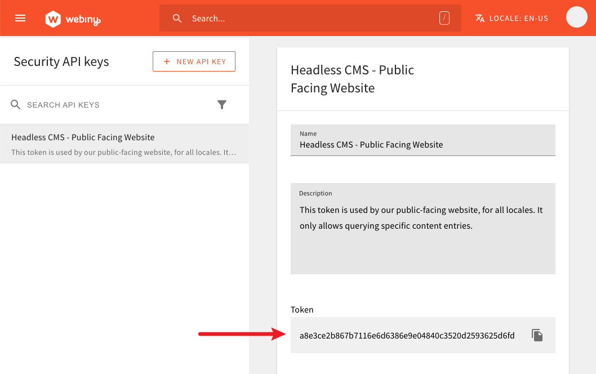
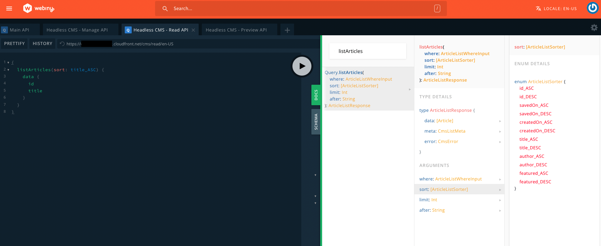

import { Alert } from "@/components/Alert";

<Alert type="success" title="What you'll learn">

- how to use the Headless CMS GraphQL API
- how to create an API key for programmatic use

</Alert>

## Overview

The Headless CMS Webiny application comes with a fully-fledged GraphQL API, which you use in order to perform GraphQL queries and mutations on Headless CMS content models, groups, and entries.

<Alert type="info">

To learn more about the Headless CMS GraphQL API, different API types, support for multiple locales, and more, make sure to check out the [Headless CMS GraphQL API](./graphql-api) key topic.

</Alert>

## API Playground

The easiest way to explore Headless CMS GraphQL API and try different things is via the API Playground, which is part of the Webiny Administration Area. To access it, simply open the main menu on the left side of the screen, and click on the API Playground:


The API Playground enables you to easily access all three Headless CMS GraphQL API types (**read**, **manage**, **preview**). It also enables you to access content in different locales, which you can pick via the locale selector, located in the top right corner of the screen.


<Alert type="info">

Note that the locale selector is not visible for systems that have only one active locale.

</Alert>

## Programmatic Access

Except for the API Playground, the Headless CMS GraphQL API can also be accessed programmatically, via a GraphQL client or a library of your choice.

### Choosing the GraphQL Client

Some of the more common GraphQL clients out there are:

- [Apollo GraphQL](https://www.apollographql.com/docs/react/)
- [URQL](https://formidable.com/open-source/urql/)
- [graphql-request](https://www.npmjs.com/package/graphql-request)

Each of these clients is good in its own way, so choose the one that best suits your needs.

### Headless CMS GraphQL API URL

Once you have your GraphQL client installed, we first need to retrieve the correct Headless CMS GraphQL API URL, which can be done either via the API Playground or via the [Webiny CLI](../../core-development-concepts/basics/webiny-cli), by running the following command in your terminal of choice:

```bash
# Returns information for the "dev" environment.
yarn webiny info --env dev
```

<Alert type="info">

Note that the URL is different for different combinations of Headless CMS GraphQL API types and locales. To learn more about how the Headless CMS GraphQL URL is structured and where to find it, please check out the [Headless CMS GraphQL API](./graphql-api#the-graphql-api-url-structure) key topic.

</Alert>

### Creating the API key

Finally, because the GraphQL API sits behind a security layer that forbids unauthorized access, we also need to create an API key.

An API key is a random non-human-readable string, which essentially contains a list of allowed operations that its user (a real user or an application) can perform. Once created, we include it as the `Authorization` header on every HTTP request we issue (with our GraphQL client of choice), for example:

```
Authorization: Bearer {random-non-human-readable-api-token}
```

<Alert type="info">

Make sure to include the required `Bearer` keyword, placed before our actual API token.

</Alert>

<Alert type="warning">

Failing to correctly include the API key via the `Authorization` HTTP request header will prevent you from performing any sensitive GraphQL query or mutation.

Check your GraphQL client's documentation in order to ensure that the API token is correctly included in every HTTP request.

</Alert>

API Tokens are created via the Security Webiny application, by opening the **API Keys** section:


Once selected, we're redirected to the API Keys section, where we can create new or update existing API keys. But most importantly, we get fine-grained control over which operations our API keys can, or cannot, perform. For example, the following selection allows API key users to access the **read** Headless CMS GraphQL API, but they can only perform queries with the **Pizza** content entries:


Once the API token has been created, you should see it in the user interface, for example:



From there, you can easily grab it by clicking on the **Copy** button, located on the right side of the API token, and paste it in an appropriate place, somewhere where your GraphQL client can access it.

## Pagination and Sorting

### Pagination

You can paginate the resulting entries using the `after` argument in a query. For instance, here is an example that demonstrates how to paginate a result set:

```graphql
{
  listArticles(after: previousCursorValue) {
    data {
      id
      title
    }
    meta {
      hasMoreItems
      totalCount
      cursor
    }
  }
}
```

When running the first query, there is no `cursor` value available, so you can send an `undefined`, `null`, or `empty string` value, for example: `listArticles(after: null)`. However, for the subsequent queries, you can use the `cursor` value returned from the current query.

### Sorting

To get the sorted result set, you can use of the `sort` argument in a query.
Here's an example to sort articles by their title in ascending order.

```graphql
{
  listArticles(sort: title_ASC) {
    data {
      id
      title
    }
  }
}
```

You can also visit the Docs section in the API Playground to explore the available sorting enums for a model.



## FAQ

### When using the API Playground, is my access limited in any way?

You can only access content models, groups, and entries to which you have access, which is based on the security group your user account belongs to.

### Am I allowed to use an API key in a public-facing application?

As long as the API key contains correct set of permissions, meaning no sensitive operations can be performed with it, you are free to do that.

### What is the "Bearer" keyword?

From this [Stack Exchange question](https://security.stackexchange.com/a/120244):

> The `Authorization: {type} {credentials}` pattern was introduced by the W3C in HTTP 1.0, and has been reused in many places since. Many web servers support multiple methods of authorization. In those cases sending just the token isn't sufficient.
