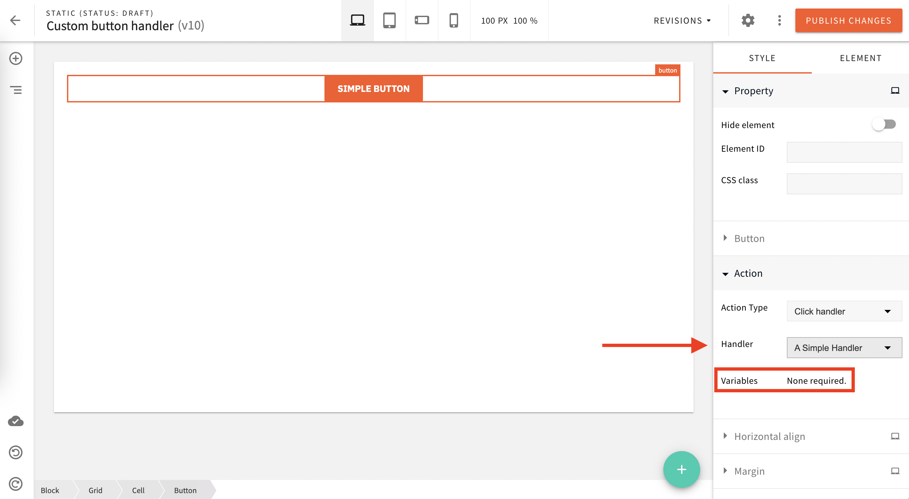

import { Alert } from "@/components/Alert";

<!-- Include this when needed (e.g. when explaining a feature that was introduced in a specific Webiny version) -->

<Alert type="info" title="Can I Use This?">

This feature is available since Webiny **v5.19.0**.

</Alert>

<!-- Always include this section on top of the page. -->

<Alert type="success" title="What You’ll Learn">

- how to add a custom callback to the button element.

</Alert>

## Overview

By default, the **Button** element comes with 2 working action types out of the box:

- **Link**: useful to create a link to different web URLs;
- **Scroll to element**: in case you want to scroll to a specific element within the page.

A third option is available, **Click handler**: this needs a bit of work to function.

In this tutorial, you will learn how to add a custom button click handler, available to be used within the Page Builder.

## Organization of Files

Although you can place and organize the plugins in any way you prefer for your project, we recommend adopting the following organization.

When creating a new plugin, it’s recommended to have all the needed files in a single shared folder. This is because the plugin will need to be imported both within the Admin Area (`apps/admin`) and Website (`apps/website) applications.

With that in mind, for this tutorial, you will create the new `pb-button-click-handlers` folder in the `apps/extensions folder.

<Alert type="info">

By default, the `extensions` folder does not exist in the `apps` directory, so you’ll need to create it.

</Alert>

### Scaffold Folder and File for Plugin

- create a folder named `pb-button-click-handlers` inside `apps/extensions`
- create a `package.json` file inside `apps/extensions/pb-button-click-handlers` with the following contents:

```json apps/extensions/pb-button-click-handlers/package.json
{
  "name": "@extensions/pb-button-click-handlers"
}
```

- add `"apps/extensions/*"` to workspaces packages inside `package.json` in the project root, in case you haven't done it before already:

```diff-js {project-root}/package.json
(...)
"workspaces": {
  "packages": [
    "apps/admin/code",
    "apps/website/code"
    // (...)
+    "apps/extensions/*"
  ]
// (...)
}
```

- create `render.ts` file inside `apps/extensions/pb-button-click-handlers`: this is where all your custom handler plugins will be defined

```ts apps/extensions/pb-button-click-handlers/editor.ts
// This is where we are going to register all our handlers
export const buttonClickHandlers = [
  ...
];
```

- import the click handler plugin into the following files:
- **Page Builder editor** plugins: `apps/admin/src/plugins/pageBuilder/editorPlugins.ts`
- **Page Builder render** plugins: `apps/admin/src/plugins/pageBuilder/renderPlugins.ts`
- **Website Page Builder** plugins: `apps/website/src/plugins/pageBuilder.ts

  `
- link workspaces by running `yarn install` command from the project root. After completion, there will be a [symbolic link](https://en.wikipedia.org/wiki/Symbolic_link) of `pb-button-click-handlers` package in `node_modules`.

## Register a Button Handler

Now, go back to our custom plugin file to register a new button handler.

This comes pretty easy: you just need to define a new plugin object with `type: pb-page-element-button-click-handler`, see the example here below:

```ts apps/extensions/pb-button-click-handlers/editor.ts
export const buttonClickHandlers = [
  // Register a simple click handler that doesn't depend on any variables.
  {
    type: "pb-page-element-button-click-handler",
    name: "simple-handler",
    title: "A Simple Handler",
    // Once the button is clicked, we display a simple alert message.
    handler: () => {
      alert("I was clicked!");
    }
  }
];
```

As you can see, the configuration object has the following properties:

- `type`: plugin type (`pb-page-element-button-click-handler`);
- `name`: the plugin name, this must be unique;
- `title`: shown in the Page Builder button configuration settings;
- `handler`: to define your custom button handler.



### Custom Button Handler With Variables

You might need to allow your admin user to set one or more custom values and pass them to the handler.

In this case, you just need to add a couple more properties to our handler configuration object:

```ts apps/extensions/pb-button-click-handlers/editor.ts
import { PbButtonElementClickHandlerPlugin } from "@webiny/app-page-builder/types";

export const buttonClickHandlers = [
  // Register a click handler that depends on two variables (color and size).
  {
    type: "pb-page-element-button-click-handler",
    name: "handler-with-variables",
    title: "Handler With Variables",
    // Here are the variables that users will be able to set via the
    // button's "Action" settings (in the Page Builder editor).
    variables: [
      { name: "color", label: "My Color", defaultValue: "red" },
      { name: "size", label: "My Size", defaultValue: "XXL" }
    ],
    // Once the button is clicked, we simply log the received variables.
    handler: ({ variables }) => {
      console.log(variables); // Logs { color, size } object.
    }
  } as PbButtonElementClickHandlerPlugin<{ color: string; type: string }>
];
```

You are adding the following property:

- `variables`: a list of allowed variables with name, label and default values. Those will be received by your custom handler.

Now, your admin users can define custom values to predefined variables via the button's "Action" settings within the Page Builder.


## Conclusion

Congratulations!

You have added a new custom handler click to Page Builder button element.
If you have further questions, feel free to [ask](https://www.webiny.com/slack/) for additional help.
