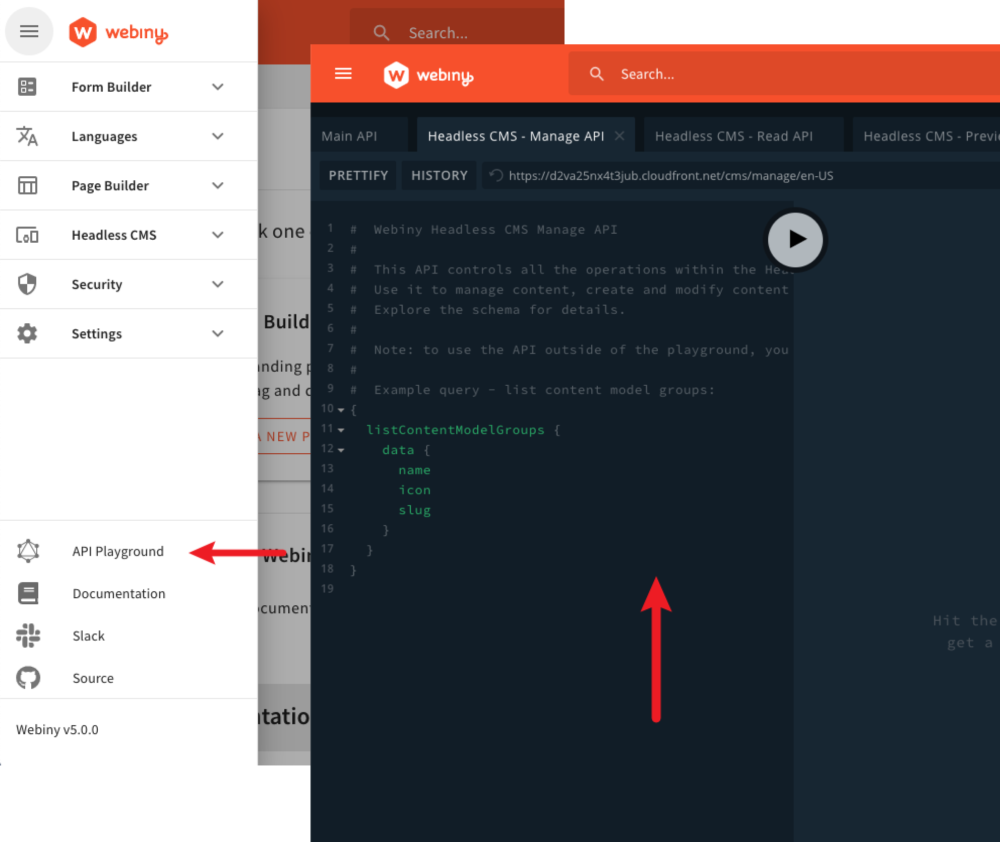

import { Alert } from "@/components/Alert";

<Alert type="success" title="What you'll learn">

- what is API Playground and what are its main features

</Alert>

## Overview

By default, the Webiny Admin Area application includes a tool called API Playground.

In short, the tool represents a simple GraphQL client which you can use to:

- explore your existing GraphQL API schema(s)
- perform GraphQL queries and mutations

This may be handy in a couple of different scenarios, like for example when in need to manually execute a particular GraphQL query or mutation, or even while actively developing a custom application.

To access it, simply open the main menu and click on the **API Playground** menu item, located in the bottom section:

## Default GraphQL APIs

By default, when you open the API Playground, you get to interact with four different GraphQL APIs.

### Main API

This is the main GraphQL API, which is being utilized by all of the default Webiny applications, for example Page Builder, Headless CMS, File Manager, and so on. Of course, the GraphQL API can be extended on your behalf, if need be.

<Alert type="info">

If you want to learn more about the main GraphQL API and how it works on the cloud infrastructure level, check out the [GraphQL Requests](../../architecture/api/graphql-requests) page of the [Cloud Infrastructure - API](../../architecture/api/overview) key topics section.

</Alert>

### Headless CMS (Read, Preview, Manage)

The API Playground can also be used to access all three Headless CMS GraphQL API types. These GraphQL APIs can also be extended on your behalf, if need be.

<Alert type="info">

To learn more about the Headless CMS GraphQL API, different API types, support for multiple locales, and more, make sure to check out the [Headless CMS GraphQL API](../../headless-cms/basics/graphql-api) key topic.

</Alert>

## Security

The API Playground automatically performs all of the GraphQL operations as you - the currently logged in identity (user).

Which means that, despite the fact that you can actually see and explore all of the present GraphQL API schemas, you will only be able to perform queries and mutations for which you possess necessary security permissions.

## FAQ

### Can I execute a GraphQL operation as an anonymous user (not logged in)?

The most straightforward way to do it would be by using a standalone GraphQL client, for example the [GraphQL Playground](https://github.com/graphql/graphql-playground).
