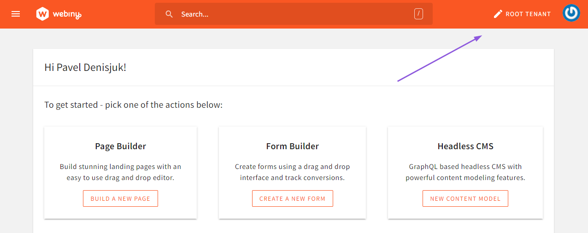

import { Alert } from "@/components/Alert";

<Alert type="info" title="Can I use this?">

** A Webiny Control Panel account is required to use this feature.**

</Alert>

<Alert type="success" title="What you'll learn">

- how to enable multi-tenancy in the existing Webiny project
- how to assign custom domains to each tenant

</Alert>

## Overview

There are a few steps involved in enabling multi-tenancy:

- connecting your project to Webiny Control Panel
- creating a certificate in AWS ACM, and linking it with CloudFront distribution

Cloudfront will be used for TLS termination, and AWS ACM for certificate management. Customers may use other 3rd party CDNs for those steps. If that’s the case, please get in touch, so we can support you through the setup.

The following sections guide you through the process in a step-by-step manner.

## 1) Prepare the Project

Your project needs to be created starting with version `5.29.0` to use this feature.
You can use an existing project, or create a new one by running:

```shell
npx create-webiny-project my-project
```

## 2) Connect Your Project with Webiny Control Panel

First, you will need a Webiny Control Panel account. If you don't have one, please contact us at `sales@webiny.com`.

Once you have your account, connect your project by running the following command:

```shell
yarn webiny login
```

From here, follow the onscreen instructions.

## 3) Create a Certificate in AWS ACM

<Alert type="info" title="Please note">

Configuration of a custom domain is optional. If you just want to have a multi-tenant GraphQL API,
a custom domain is not required. If that's what you're looking for, you can skip to [project
deployment](#5-deploy-your-project).

However, if you want to build websites for each tenant using the [Page Builder](/docs/{version}/overview/applications/page-builder), you will have
to setup custom domains. If so, please read on.

</Alert>

Before we modify the infrastructure setup, and deploy the project, we'll need to have a valid certificate in AWS ACM. Go to https://console.aws.amazon.com/acm/home?region=us-east-1#/certificates/request and request a new certificate, or import an existing one.

Once the domains in the certificate are verified, we can proceed to Webiny configuration. For more information on creating certificates and validating hostnames, please go to [What Is AWS Certificate Manager? - AWS Certificate Manager](https://docs.aws.amazon.com/acm/latest/userguide/acm-overview.html)

## 4) Configure `website` Infrastructure

To configure the `website` app with your custom domain(s), navigate to `apps/website/webiny.application.ts` and modify it to look like this:

```ts apps/website/webiny.application.ts
import { createWebsiteApp } from "@webiny/serverless-cms-aws";

export default createWebsiteApp({
  domains() {
    return {
      domains: ["my.domain.com"],
      sslSupportMethod: "sni-only",
      acmCertificateArn:
        "arn:aws:acm:us-east-1:111111111111:certificate/5931d8b4-a39b-4a3a-a4e7-f5bbdd78d599"
    };
  }
});
```

For the `acmCertificateArn`, use the ARN of the certificate you created in step 3).

For `domains`, enter the custom domains supported by your certificate. You can use wildcards to support multiple subdomains.

<Alert type="info" title="Recommendation">

Every tenant _must_ have a corresponding custom domain to enable Webiny to route website requests correctly. Usually we recommend having a wildcard domain, like `*.domain.com`, and have each tenant use a subdomain, like `tenant1.domain.com`. This setup is then easily managed using, for example, CloudFlare, to route real tenant domains to your internal ones.

</Alert>

## 5) Deploy Your Project

Now it's time to deploy the entire project. We need to deploy everything: `api`, `admin`, and `website`. The easiest way to do all 3 at once, is by running the following:

```shell
yarn webiny deploy --env=dev
```

## 6) Configure Custom Domains for Tenants

Once your project is deployed, open your `admin` app. To configure a custom domain for the root tenant, hover over the `Root Tenant` label in the top app bar, and click it. This will open a settings dialog, where you can configure custom domains for your root tenant.




<Alert type="danger" title="Important">

If you don't have a custom domain for your root tenant, you should enter your CloudFront CDN domain here. Otherwise, the Lambda@Edge router will not be able to route the request to your root tenant website.

To find your CloudFront website domain, run `yarn webiny info --env=dev` and look for the `Website URL`.

</Alert>

For your sub-tenants, domain configuration is located in the tenant form:


## FAQ

### I'm receiving a Pulumi error saying something about CloudFront request headers.

You may occasionally run into an error that goes something like this:

```
error: deleting urn:pulumi:dev::website::aws:cloudfront/distribution:Distribution::delivery: 1 error occurred:
* CloudFront Distribution E36AOIOBR5JHMQ cannot be deleted: PreconditionFailed: The request failed because it didn't meet the preconditions in one or more request-header fields.
status code: 412
```

This one is usually resolved by refreshing the Pulumi state of the `website` project application:

```shell
 yarn webiny pulumi apps/website --env=dev -- refresh --yes
```

> NOTE: there's a space between `--` and `refresh`.

After this, running the `deploy` command goes back to normal.

### Pulumi throws an error while deleting my Lambda@Edge function

You're probably seeing the following error:


Lambda@Edge functions are replicated to all AWS Edge locations. This means that this particular function will not be deleted until AWS removes it from all the Edge locations. Even thought this error looks terrible, your deploy went just fine. Give it a couple of minutes, and re-deploy. You'll see that, after some time, your old Lambda@Edge function will be deleted successfully.

### Pulumi throws an error when creating the website Cloudfront distribution

You can't have the same FQDN configured in more than 1 CF distribution under the same account. If you do, then you will see the following error.

```shell
 +  aws:cloudfront:Distribution delivery **creating failed** error: 1 error occurred:
 +  pulumi:pulumi:Stack website-dev creating error: update failed
 +  pulumi:pulumi:Stack website-dev **creating failed** 1 error

Diagnostics:
  pulumi:pulumi:Stack (website-dev):
    error: update failed

  aws:cloudfront:Distribution (delivery):
    error: 1 error occurred:
    	* error creating CloudFront Distribution: CNAMEAlreadyExists: One or more of the CNAMEs you provided are already associated with a different resource.
    	status code: 409, request id: 0ad55a32-0a28-4411-abee-326808393fb9
```

Go back to the CF distribution where that hostname is configured, remove it - if it's safe to do so - and re-run the webiny deploy command.

### What if I want to serve all tenants from a wildcard domain or from a custom domain, without needing to make infrastructure changes or redeploy my project?

Say you have the Webiny `website` app installed on `x.cloudfront.com`. To that CloudFront you need to add a wildcard certificate with a wildcard domain, say `*.example.com`.
When you create a tenant inside Webiny, you need to give them an FQDN. Add one and make sure it matches the wildcard. Example: `foo.example.com`.
This way when you create a new tenant with a custom domain, you don't need to make any updates to CloudFront.

Say that the same tenant has a custom domain of `www.bar.com`. To support fully custom FQDN without any CloudFront changes, you need to do the next step. 

On the DNS of `bar.com` add a CNAME to `foo.example.com` (has to match the wildcard domain on CloudFront) for the `www` entry. On the same CDN make sure to overwrite the forward host header so that the CDN sends `foo.example.com` as the host header to CloudFront when it goes forward. This way the Lambda@Edge function will receive `foo.example.com` as the hostname name and will be able to resolve it to the correct tenant, although the client requested `www.bar.com`. 

**Note:** You will need to use a more advanced CDN for this, such as Fastly, Akamai, or a paid version of CloudFlaire as the ability to overwrite the forward host header is not supported in may other CDNs. 