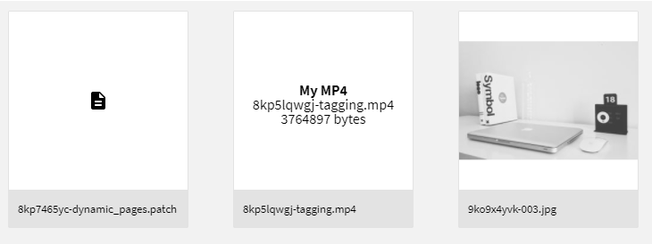

import { Alert } from "@/components/Alert"

<Alert type="info" title="Can I Use This?">

This feature is available since Webiny **v5.8.0**.

</Alert>

<Alert type="success" title="What you'll learn">

- how to customize file rendering within Webiny File Manager
- how to add custom actions to different file types
- how to create your own file type plugin class

</Alert>

## Overview

By default, the Webiny File Manager has a preconfigured plugin for image files, and a fallback plugin to render any other file type using a default icon. Out of the box, it looks like this:


In this guide, we go through ways of implementing your own renderers for file types of your choice.

## Using the Built-In Plugin

The easiest way is to use the built-in `FileManagerFileTypePlugin` class. Let's configure a plugin that will render files of type `video/mp4`:

```tsx Custom renderer for video/mp4 files
import React from "react";
import { FileManagerFileTypePlugin } from "@webiny/app-admin/plugins/FileManagerFileTypePlugin";

export default [
  new FileManagerFileTypePlugin({
    types: ["video/mp4"],
    render({ file }) {
      return (
        <div style={{ paddingTop: "40%" }}>
          <strong>My MP4</strong>
          <br />
          <span>{file.name}</span>
          <br />
          <span>{file.size} bytes</span>
        </div>
      );
    }
  })
];
```

<Alert type="info">

The code above can be placed in the [`/apps/admin/code/src/plugins/mp4Plugin.tsx`](https://github.com/webiny/webiny-examples/blob/master/extend-admin-area/apps/admin/code/src/plugins/mp4Plugin.tsx) file, which doesn't exist by default, so you will have to create it manually. Furthermore, once the file is created, make sure that it's actually imported and registered in the [`apps/admin/code/src/plugins/index.ts`](https://github.com/webiny/webiny-examples/blob/master/extend-admin-area/apps/admin/code/src/index.ts) entrypoint file.

</Alert>

Now your File Manager will display files like this:



## Using Glob Patterns

You can also define types using globs, which will be matched using the [minimatch](https://www.npmjs.com/package/minimatch) library.

```tsx Using globs to match file types
new FileManagerFileTypePlugin({
  types: ["video/*", "image/*"],
  render({ file }) {
    return (
      <div style={{ paddingTop: "40%" }}>
        <strong>My {file.type.split("/").pop()}</strong>
        <br />
        <span>{file.name}</span>
        <br />
        <span>{file.size} bytes</span>
      </div>
    );
  }
});
```

You can define multiple file type plugins, and your plugins may have overlapping types definitions. Webiny will go through all of your plugins, and the last one to match wins.

## Custom File Actions

When you open the file details sidebar, you'll notice there are several actions available out of the box:


You can add your own actions here using the same file type plugin you used to define the custom renderer:

```tsx Adding Custom Actions to Your File Type Plugin
import { FileManagerFileTypePlugin } from "@webiny/app-admin/plugins/FileManagerFileTypePlugin";
import { Tooltip } from "@webiny/ui/Tooltip";
import { IconButton } from "@webiny/ui/Button";
import { ReactComponent as PlayIcon } from "./video.svg";

const PlayVideo = () => {
  return (
    <Tooltip content={<span>Play Video</span>} placement={"bottom"}>
      <IconButton icon={<PlayIcon />} onClick={() => alert("In the future, I'll be useful!")} />
    </Tooltip>
  );
};

new FileManagerFileTypePlugin({
  types: ["video/mp4"],
  actions: [PlayVideo],
  render({ file }) {
    return (
      <div style={{ paddingTop: "40%" }}>
        <strong>My MP4</strong>
        <br />
        <span>{file.name}</span>
        <br />
        <span>{file.size} bytes</span>
      </div>
    );
  }
});
```

Now your file details sidebar will contain this new custom action:


## Custom Plugin Classes

The `FileManagerFileTypePlugin` class can be used as is, but you can also extend it and create your own classes for different file types:

```tsx Creating a Custom File Type Plugin Class
import { plugins } from "@webiny/plugins";

class VideoFileTypePlugin extends FileManagerFileTypePlugin {
  get types() {
    return ["video/*"];
  }

  get actions() {
    return [PlayVideo];
  }

  render({ file }) {
    return (
      <div style={{ paddingTop: "40%" }}>
        <strong>My Video</strong>
        <br />
        <span>{file.name}</span>
        <br />
        <span>{file.size} bytes</span>
      </div>
    );
  }
}

// Register the new plugin
plugins.register(new VideoFileTypePlugin());
```
