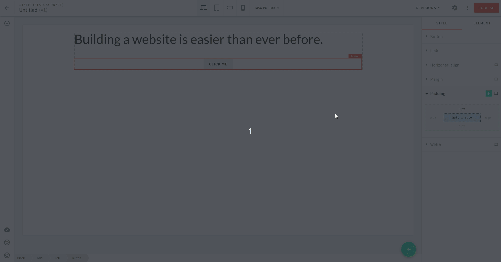
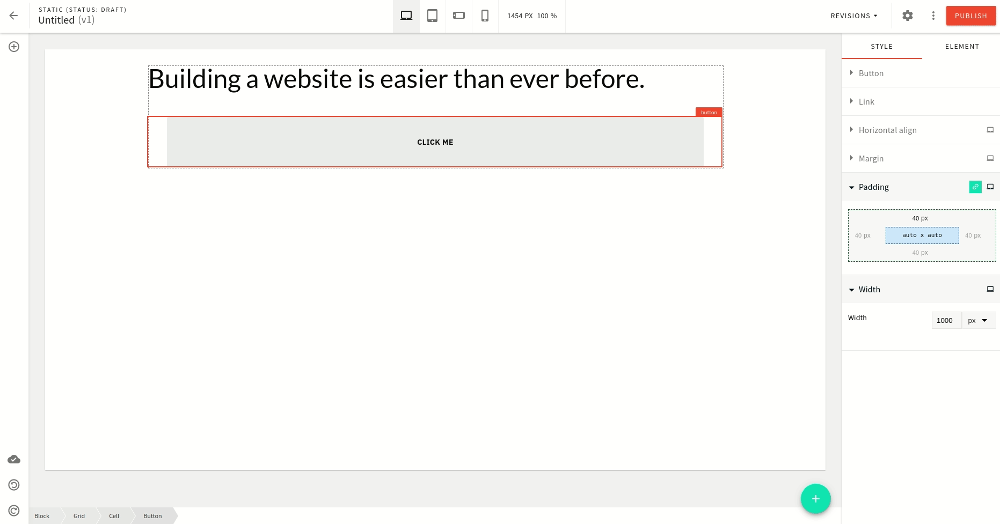

import { Alert } from "@/components/Alert";

<!-- Include this when needed (e.g. when explaining a feature that was introduced in a specific Webiny version) -->

<Alert type="info" title="Can I Use This?">

This feature is available since Webiny **v5.1.0**.

</Alert>

<!-- Always include this section on top of the page. -->

<Alert type="success" title="What You’ll Learn">

- how to customize an existing Page Builder element
- how to add settings to an existing element

</Alert>

## Overview

All Page Builder elements are plugins which means we can modify, override or even add new ones.

<!-- TODO: Add an info section about What are plugins? And how we use them in Webiny? -->

In this tutorial, you will learn how we can add two predefined settings which are `padding` and `width` to the `button` element.

## Plugin Type

There's only one plugin you need to modify to customize an element: [`PbEditorPageElementPlugin`](/docs/{version}/references/page-builder/plugins#pb-editor-page-element).

Plugins of this type require a `create` function (to create an element data structure), and a `render` function that returns a React element that gets rendered in the editor.

All element plugins are registered as a factory so you can customize them by passing the following options:

```ts @webiny/app-page-builder/types
type PbEditorElementPluginArgs = {
  // A function to create an element data structure.
  create?: (defaultValue: Partial<PbEditorElement>) => PbEditorElement;
  // Array of element settings plugin names.
  settings?: (
    defaultValue: PbEditorPageElementPluginSettings
  ) => Array<string | Array<string | any>>;
  // A function that return the toolbar properties of the element plugin.
  toolbar?: (defaultValue: PbEditorPageElementPluginToolbar) => React.ReactNode;
  elementType?: string;
};
```

## Add Settings in an Element

Head over to the `apps/admin/src/plugins/pageBuilder/` folder where all the plugins related to the Page Builder app are located.

As you can see there are two core sets of plugins:

1. `editor` plugins: needed for Page Builder editor
2. `render` plugins: needed for Page Builder page preview and to render the actual page in the Website app

For this tutorial, we only need to focus on the editor plugin.

By default, the button element settings look as shown below:


### Add Settings

To add the `padding` and `width` settings to the `button` element we pass the `settings` as the argument to the `button` element plugin factory.

<Alert type="info">

As shown earlier, `settings` is a function that gets the `defaultSettings` of the element as an argument and returns the list of element settings.

</Alert>

Let's make the following change.

```ts apps/admin/src/plugins/pageBuilder/editorPlugins.ts
// Some code is removed for the sake of brevity.
export default [
  ...
  button({
    settings: (defaultValue?: string[]) => [
      ...(Array.isArray(defaultValue) ? defaultValue : []),
      "pb-editor-page-element-style-settings-padding",
      "pb-editor-page-element-style-settings-width"
    ]
  }),
  ...
]
//
// Other element plugins.
//
```

<Alert type="info">

`"pb-editor-page-element-style-settings-padding"` and `"pb-editor-page-element-style-settings-width"`
are the name of plugins.

Both are of type: [`PbEditorPageElementStyleSettingsPlugin`](/docs/{version}/references/page-builder/plugins#pb-editor-page-element-style-settings).

</Alert>

After saving these changes, the `button` element settings will have `padding` and `width` settings as shown below:


Hurray!

The `padding` and `width` settings are now available to the `button` element. And, we're done here...

Not really! If you try changing these settings in the editor no visible change will happen to the button element as shown below:



This is because the `button` element has specific styles applied to it in the theme ([`SCSS`](https://github.com/webiny/webiny-js/blob/next/apps/theme/pageBuilder/styles/elements/button.scss#L50) file)
which overrides the styles applied by these settings via the editor.

### Update Stylesheet

To fix this, we need to update the `button` element style within the theme
so that it takes those settings applied via the editor.

<!-- TODO: Add link to the theme article. -->

The styles for the `button` element are written in the `.webiny-pb-page-element-button` CSS class.
And, we need to make the following changes to it:

- remove `padding` property
- update `width` property

```scss apps/theme/pageBuilder/styles/elements/button.scss
// Some code is removed for the sake of brevity.

.webiny-pb-page-element-button {
  // For the "width" settings in editor sidebar to work
  // The element needs to have "width: 100%"
  width: 100%;
  // padding: 14px 20px !important; <--- comment out or remove this
  //
  // More style definition.
  //
}

//
// More style definition.
//
```

After saving these changes the previously applied changes will show in the editor.



All seems to work well, right? Let's see:

Now that we have removed the `padding` property from the button element (`SCSS` file),
a new button dropped into the page doesn't look good with the default settings as shown below:


We can fix this by adding the default values for both `padding` and `width` properties.

For this, we pass the `create` argument to the plugin factory.
It is a function that gets the default value as the argument and returns the data for that element.

Let's see the example below:

```diff-js apps/admin/src/plugins/pageBuilder/editorPlugins.ts
import { set } from 'dot-prop-immutable'
import { createInitialPerDeviceSettingValue } from '@webiny/app-page-builder/editor/plugins/elementSettings/elementSettingsUtils'
import { DisplayMode } from '@webiny/app-page-builder/types'

// Some code is removed for the sake of brevity.

button({
  settings: (defaultValue) => [
    ...defaultValue,
    'pb-editor-page-element-style-settings-padding',
    'pb-editor-page-element-style-settings-width',
  ],
+ create: (defaultValue) => {
+    // Set default value for the padding property
+    let elementData = set(
+      defaultValue,
+      'data.settings.padding',
+      createInitialPerDeviceSettingValue(
+        { advanced: true, top: '12px', right: '16px', bottom: '12px', left: '16px' }+,
+        DisplayMode.DESKTOP
+      )
+    )
+
+    // Set default value for the width property
+    elementData = set(
+      elementData,
+      'data.settings.width',
+      createInitialPerDeviceSettingValue({ value: '150px' }, DisplayMode.DESKTOP)
+    )
+
+    return elementData
+  },
})

//
// Other element plugins.
//
```

<Alert type="info">

The `create` function defines the initial value for element `settings` and `data` property which can hold any data you might need.

</Alert>

Now if you drop a new `button` element to the editor it will look much better as shown below:


This is because now the `padding` and `width` settings have a default value for it.

<Alert type="info">

Here we've used the `create` function for setting the default value for `padding` and `width` properties.
However, using a similar principle you can do whatever logic you need.

</Alert>

## Conclusion

Congratulations!

You have added predefined settings to an existing Page Builder element.
Use a similar approach to customize other elements for the Page Builder app.

You can also check out the full code example in our repo. If you have further questions, feel free to [ask](https://www.webiny.com/slack/) for additional help.
