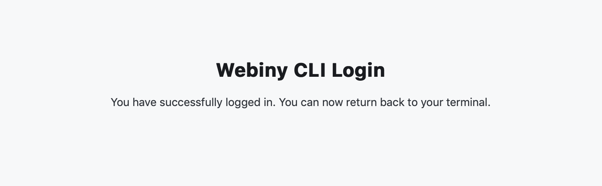
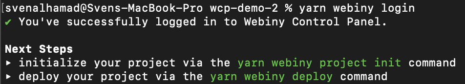

import { Alert } from "@/components/Alert";

<Alert type="info" title="Can I use this?">

Webiny Control Panel ("WCP") is currently in an open beta testing. If you wish to join the Beta testing program, register your interest on our [waiting list](https://site.webiny.com/forms/business-waiting-list/).

</Alert>

<Alert type="success" title="What you'll learn">

- why you need to link your project with WCP
- steps to link your project with WCP

</Alert>

## Prerequisites

For this guide you will need to have:

- A Webiny Control Panel account
- A Webiny CMS instance

## Why you need to link your Webiny CMS to WCP?

When you install Webiny CMS, by default, it's managed as an Open-Source instance. To upgrade your instance to Webiny Business or Enterprise tier you will need to provide a license. The license is created inside Webiny Control Panel ("WCP"). When you create a project in WCP, the project automatically gets a license. You then need to link the WCP project to your Webiny CMS project, which automatically upgrades your Webiny CMS instance to the correct tier. It will also unlock features such as multi-tenancy and access to the additional add-ons. If you make any changes to your WCP project license, they will automatically reflect on your Webiny CMS side for the linked projects.

## How to invite a user to your WCP project?

Any developer working on your Webiny CMS project that requires to build and run Webiny CMS inside their personal development environment will need to have a WCP acount and be assigned to your WCP project.

To invite a team member to a WCP project, a user with `owner` rights has to perform the following actions. Inside the WCP project navigate to the **Team Members** tab:


Click the `Invite team member` button and fill out the form:


**Note**: A user with a role of `Member` can access the project, see the dashboard, and retrieve the license, but they can't invite other members or change project settings, for that you need to assign the user a role of `Owner`.

Once the form is submitted, the user will receive an invite. If needed, you can revoke the invite by pressing the `Revoke` button.


The invited user now just follows a link in the invite to join your project. If the invited user doesn't already have a WCP account, they will be asked to create one.

## How to link your project

Depending if you're a developer working on Webiny CMS project and you need to make some code changes and test them within your own personal development environment, or if you're looking at retrieving a license inside a CI/CD environment, there are different steps you will need to take.

### Personal development environment

As a user with an access to a WCP project, open your terminal and navigate to your Webiny CMS project folder, inside the Webiny CMS project, run the following command:

```shell
yarn webiny login
```

<Alert type="info" title="Where's my Webiny CMS project folder?">

If you don't have a Webiny CMS project, you will need to check out one from your teams version control. If you're just creating a new project, you can follow the [get started tutorial](/docs/{version}/get-started/install-webiny).

</Alert>

This will bring up the WCP login page:


Type in your username and password and you should see a success message in your browser:



You can now return back to your terminal, and you'll see another success message in there as well:



At this point your Webiny CMS project is linked to WCP, now you just need to link it to a specific WCP Project so the license can be retrieved. To do that, run the following command which will display a list of all the WCP projects you have access to:

```shell
yarn webiny project link
```

And all it's left to do is to select a project from the list. **Note**: if you have access to only one WCP project, the command will automatically link you to that one.


Once you select your project, you are pretty much done, all you need to do, is to [deploy it](/docs/core-development-concepts/basics/project-deployment).

<Alert type="info" title="Project already defined">

If the project owner previously linked the project, the `id` of the project will already be present in the root `webiny.project.ts` file, meaning other users don't need to link the project themselves here. Once they're logged in, they're good to go.

</Alert>

### CI/CD Environment

<Alert type={"info"}>

Before proceeding with the following steps, make sure your Webiny project is linked and that your `webiny.project.ts` configuration file contains the ID of your WCP project.  
  
  If you've successfully completed the steps outlined in the [previous section](#personal-development-environment), the ID should already be assigned. If not, the ID of your WCP project should be assigned manually, via the `id` property. For example:
  
  
```diff-ts
// Import statements removed for brevity.

export default {
    // A WCP project ID uses the {orgId}/{projectId} structure.
+   id: "webiny-test/webiny-test-project", // 
    template: "@webiny/cwp-template-aws@5.34.6-beta.1",
    name: "beta5346-1-es",
    cli: {
        // ...
    },
    appAliases: {
        core: "apps/core",
        api: "apps/api",
        admin: "apps/admin",
        website: "apps/website"
    }
};
```

  To retrieve the ID, within the WCP application, simply navigate to your project and copy/paste the ID from the URL.  
</Alert>

Inside a CI/CD environment, linking a Webiny project with WCP is done via a CI/CD environment's **API key**.

To retrieve the API key, within the WCP application, navigate to your project and click on the **CI/CD Environments** tab. In the CI/CD environments list, click on the **Copy API key** button, next to the appropriate environment.


Once copied, the API key needs to be assigned to the `WCP_PROJECT_ENVIRONMENT_API_KEY` environment variable, for example:

```bash
WCP_PROJECT_ENVIRONMENT_API_KEY=732e4630-af5d-sample-key-22fc89e2dca9
```

<Alert type="warning" title="Don't share API keys between environments">

Each CI/CD environment must be using its own environment API key. Sharing keys between different environments will cause WCP to record your monitoring data incorrectly and certain environments might run into API call limits where they shouldn't. Read more about the limits [here](./overview).

</Alert>
