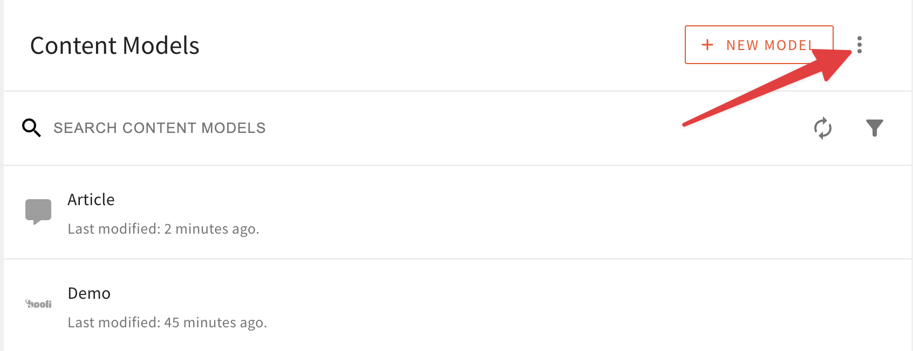
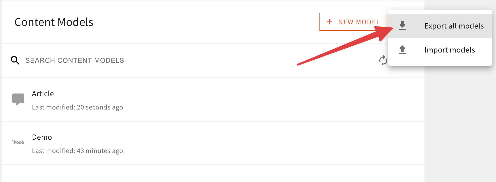
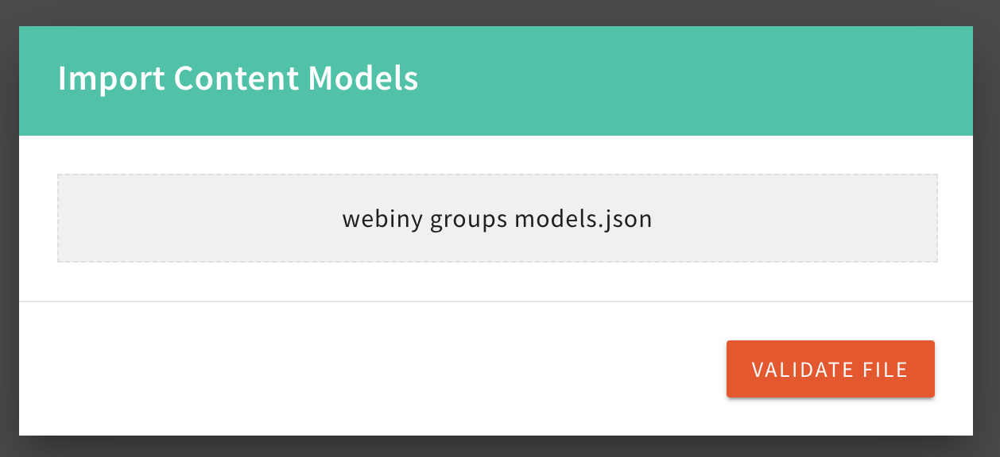
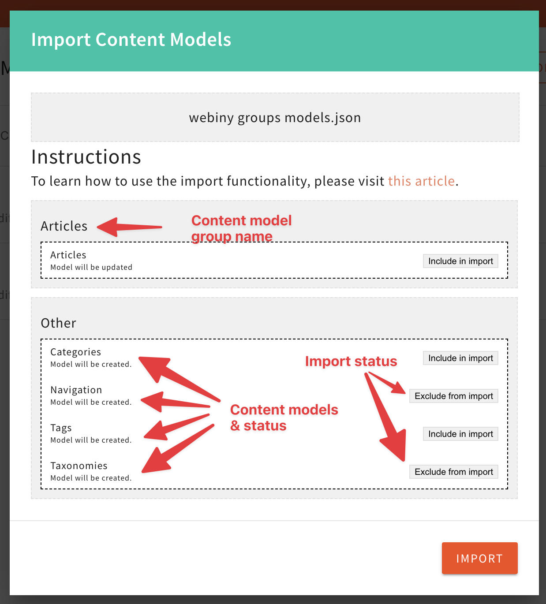
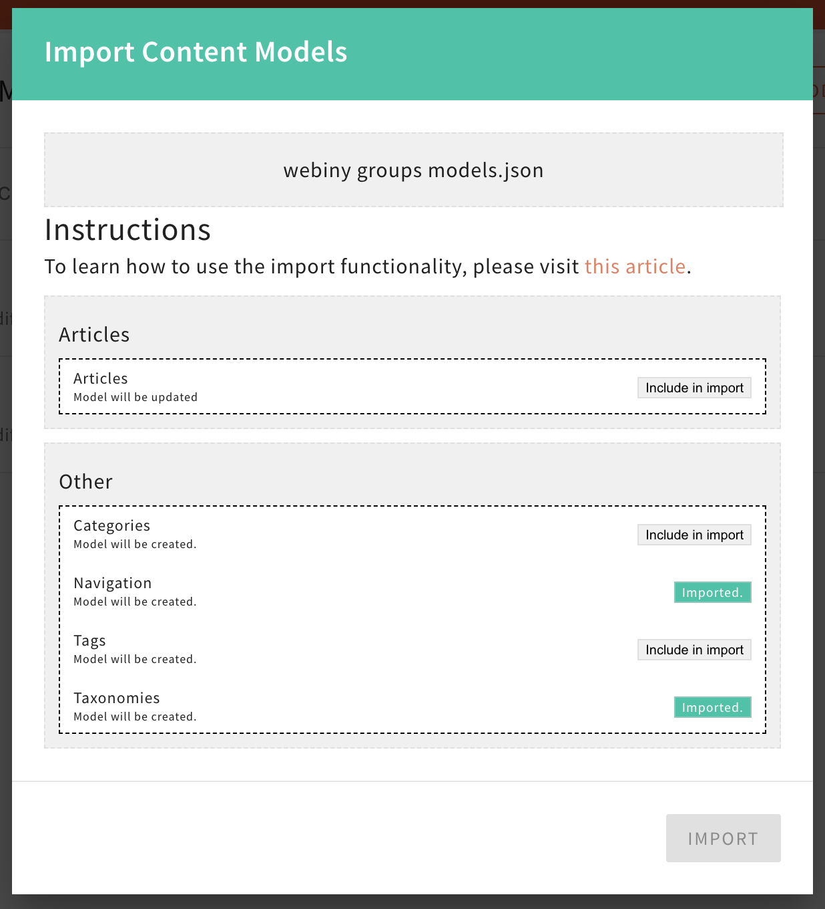

import { Alert } from "@/components/Alert";
import contentLocalization from "./assets/content-localization/content-localization.mp4";

<Alert type="success" title="WHAT YOU'LL LEARN">

- how to export content models
- how to import content models

</Alert>

Webiny Headless CMS allows you to export all your content models as a JSON file. This is useful if you want to migrate your content models to another project or if you want to share them with other developers.

Similarly, you can use the generated JSON file to import those same content models into your project. 

This article will guide you through the process of exporting and importing content models.

## Exporting Content Models

To export one or more content models navigate to your Content Models view inside the Headless CMS application. In the list of your content models on the top under the additional menu options, you'll find the action to export all your content models. 

The export action will generate a JSON file containing all your content models. 

## Importing Content Models

To import content models, navigate to your Content Models view inside the Headless CMS application. In the list of your content models on the top under the additional menu options, you'll find the action to import content models.

The system will ask you to provide an export file. Select the file you want to import and click the **Validate file** button.

The validation action will check the file and display a list of content models that can be imported. From the list you can choose which content model you want to import and which ones you want to skip. 

<Alert type="success" title="Auto select referenced models">

Note that if you select to import a specific content model that references one or more content models that are also part of the export file, the system will automatically select those referenced content models as well. If you wish to skip them, you can just go back and exclude them from the import.

</Alert>

All the content models are grouped in their respective content model groups. Those groups will be automatically created for you upon importing the file if such a group already doesn't exist. 

Inside the group section, you will have a list of individual content models that belong to that group. You can select which content models you want to import and which ones you want to skip by clicking the button on the right-hand side. 

Also, underneath the content model name you will have a status for the content model. This status tells you if this content model will be `updated` (meaning the content model already exists) or `created` (meaning the content model currently doesn't exist). 

Finally, once you have selected which content models you want to import, click the "Import" button to start the import process.

The import process can take a few seconds to finish as it needs to validate all the information. Once the process is done you will see the status screen with the results of the import process.

From the same status screen, you can proceed to import additional content models just by selecting them and clicking the "Import" button again. In case you want to finish the import process, just click outside the content model dialog. 