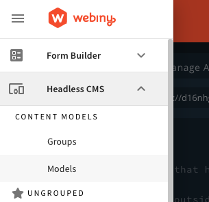
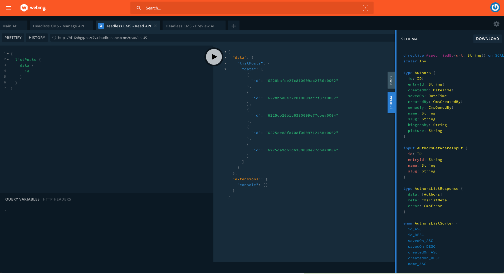

import { Alert } from '@/components/Alert'

<Alert type="success" title="What you'll learn">

- How to fetch data from Webiny
- How to parse data including rich text
- how to use preview mode

</Alert>

## Overview

Webiny works really well as a headless CMS with [NextJS](http://nextjs.org), especially is that so when using static rendering and the new Preview mode available in NextJS version 9.3.

The easiest way to get started is to use the [official starter](https://github.com/vercel/next.js/tree/canary/examples/cms-webiny), but we're going to walk through a similar custom implementation here.

<Alert type="info">

Use the [official starter](https://github.com/vercel/next.js/tree/canary/examples/cms-webiny) for 1-click install on Vercel.

</Alert>

For this tutorial, we're going to assume you have already done the following:

1. [Set up your AWS credentials locally](https://www.webiny.com/docs/infrastructure/aws/configure-aws-credentials)
2. [Deployed a Webiny instance to a `dev` environment](https://www.webiny.com/docs/core-development-concepts/basics/project-deployment)

Once you have an app up and running, click into the "HeadlessCMS" app in the sidebar, click on *models*.



Add the following models and fields: (Skip this step if you already have content models defined)

### Authors

- A `text` field with the value "name"
- A `text` field with the value "slug" (optionally add a validator using this regex which will make sure you have valid urls: `^(?!.*--)[a-z0-9\-]+$`)
- a `files` field with the value "picture"

### Posts

- A `text` field with the value "title"
- A `text` field with the value "slug" (optionally use the regex above as a validator)
- A `files` field with the value "featured image"
- A `rich text` field with the value "body"
- A `reference` field with the value "Author"

Next, add some content by going to Headless CMS > Ungrouped and choosing a content model.

Before we spin up our NextJS project, let's go to the API playrgound and see how our GraphQL API is structured. In the sidebar menu, choose "API Playground" to open the GraphQL explorer.



Notice that there are four APIs listed in the tabs at the top of the page. Choose **HeadlessCMS - Read API**. From here you can explore your content structure and the schema (via the right side panel). Directly below the tabs is a URL string. That's the URL you can use to fetch data. 

Make a note of this URL, you'll need it soon.

Let's configure API credentials. Choose **API Keys** in the sidebar. Add an API key with any name and description. Select "Headless CMS" and choose a Custom access level for all content model groups with the values `read` and `preview`. Make sure to leave "manage" unchecked. This will help secure our Webiny instance.

Save the API token and the Token itself will be revealed. You can use the same API token for both published and draft posts.

## Set up a NextJS project

You can [follow the "Getting Started" page on the NextJS site](https://nextjs.org/docs/getting-started), or run `yarn create next-app` to spin up a basic project. 

Once you've done one of these, add a new file **.env.local** to the project root. NextJS will look for environment variables in that location.

[You can read more about how NextJS uses Environment Variables here](https://nextjs.org/docs/basic-features/environment-variables).

Add the API endpoint URL (maybe call it `NEXT_PUBLIC_WEBINY_API_URL`), and the API token (maybe as `WEBINY_API_SECRET`). Make sure you don't commit this file to your project's git repository otherwise anyone could gain access to your API.


## Fetching data

Once you have your `.env.local` file set up in the project root (see above), you can try to connect to the API. Here's some sample code for the connection:

```js
async function fetchAPI(query, { variables } = {} ) {
  const res = await fetch(process.env.NEXT_PUBLIC_WEBINY_API_URL, {
    method: 'POST',
    headers: {
      'Content-Type': 'application/json',
      'Authorization': `Bearer ${process.env.WEBINY_API_SECRET}`
    },
    body: JSON.stringify({
      query,
      variables,
    }),
  })

  const json = await res.json()
  if (json.errors) {
    console.error(json.errors)
    throw new Error('Failed to fetch API')
  }

  return json.data
}
```

The `POST` verb is used to post the query we want our GraphQL API to return. Also please note in the `'Authorization'` header, you need to ensure you have `Bearer ` before the API secret. This specifies the method of authentication.

Here's a basic query you can use to fetch all content for the model `posts` and return only the `slug` field:

```js
export async function getAllPostsWithSlug() {
  const data = await fetchAPI(`
    query PostSlugs {
      listPosts {
        data {
          slug
        }
      }
    }
  `)
  return data.listPosts.data
}
```
There's [more information about using GraphQL here](https://www.webiny.com/docs/headless-cms/basics/using-graphql-api).

Here's a more detailed query which uses variables and sorting to fetch multiple groups of data:

```js
export async function getPostBySlug(slug) {
  const data = await fetchAPI(

    `
      query PostBySlug( $PostsGetWhereInput: PostsGetWhereInput!) {
        post: getPosts( where: $PostsGetWhereInput ) {
          data {
            id
            title
            slug
            description
            createdOn
            featuredImage
            body
            author {
              name
              slug
              picture
            }
          }
        }
        morePosts: listPosts(limit: 2, sort: createdOn_ASC) {
          data {
            id
            title
            slug
            description
            createdOn
            featuredImage
            author {
              name
              picture
      
            }
          }
        }
      }
    `,
      {
        variables: {
          PostsGetWhereInput:{
            slug: slug
          }
        }
      },
      preview
  )
  return data
}
```

Hopefully with this information you will be able to use the data from Webiny to render your pages.

To create static pages, create a file in the **/posts/** directory called **[slug].js**, and add this function at the bottom:

```js
export async function getStaticPaths() {
  const allPosts = await getAllPostsWithSlug()

  return {
    paths: allPosts.map((post) => {
      return {
        params: {
          slug: `/posts/${post.slug}`,
        },
      }
    }),
    fallback: true,
  }
}
```

This will render all of the posts as static pages.

To get data for each statically generated page add the following to the bottom of the page:

```js
export async function getStaticProps(context) {
  const { params } = context
  const data = await getPostBySlug(params.slug)

  return {
    props: {
      preview,
      post: {
        ...data.post.data,
      },
      morePosts: data?.morePosts
    },
  }
}
```

Now you will be able to access `props.post` in the render and build out your UI:

```jsx

export default function Post({ post, morePosts, preview }) {
  return (
    <h1>{post.title}</h1>
  )
}
```


## Using NextJS preview mode

NextJS provides an API for previewing content that hasn't been published yet, and is in a "Draft" state. For more information, [see the documentation on NextJS website](https://nextjs.org/docs/advanced-features/preview-mode). Here's how to use Preview mode with Webiny.

Webiny has a separate API for **published** and **draft** content. Although we can use the same API token to connect to both APIs, we need to fetch from the correct API endpoint.

Choose **API Keys** in the sidebar, and ensure that **preview** is checked in the API key you are using. Then go to **API Playground** and choose **Headless CMS - Preview API** on the tabs at the top of the main window.

Copy the URL and save that into your `.env.local` file (perhaps call it `NEXT_PUBLIC_WEBINY_PREVIEW_API_URL`).

First, we're going to extract whether the user has `preview` mode enabled from the `getStaticProps()` function:


```js
export async function getStaticProps(context) {
  const { params, preview } = context
  const data = await getPostBySlug(params.slug, preview)

  return {
    props: {
      preview,
      post: {
        ...data.post.data,
      },
      morePosts: data?.morePosts
    },
  }
}
```

Now we can pass that variable to our `fetchAPI()` function

```js
export async function getPostBySlug(slug, preview) {
  const data = await fetchAPI(

    `
      query PostBySlug( $PostsGetWhereInput: PostsGetWhereInput!) {
        post: getPosts( where: $PostsGetWhereInput ) {
          data {
            id
            title
            slug
            description
            createdOn
            featuredImage
            body
            author {
              name
              slug
              picture
            }
          }
        }
        morePosts: listPosts(limit: 2, sort: createdOn_ASC) {
          data {
            id
            title
            slug
            description
            createdOn
            featuredImage
            author {
              name
              picture
      
            }
          }
        }
      }
    `,
      {
        variables: {
          PostsGetWhereInput:{
            slug: slug
          }
        }
      },
      preview
  )
  return data
}
```

Next modify your `fetchAPI` function to add the `preview` parameter:

```js
async function fetchAPI(query, { variables } = {}, preview ) {
 const url = preview ? process.env.NEXT_PUBLIC_WEBINY_PREVIEW_API_URL : process.env.NEXT_PUBLIC_WEBINY_API_URL
 
  const res = await fetch(url, {
    method: 'POST',
    headers: {
      'Content-Type': 'application/json',
      'Authorization': `Bearer ${process.env.WEBINY_API_SECRET}`
    },
    body: JSON.stringify({
      query,
      variables,
    }),
  })

  const json = await res.json()
  if (json.errors) {
    console.error(json.errors)
    throw new Error('Failed to fetch API')
  }

  return json.data
}
```

To complete the setup, you can [follow the steps from "Securely accessing it from your Headless CMS" on the NextJS documentation site](https://nextjs.org/docs/advanced-features/preview-mode#securely-accessing-it-from-your-headless-cms).

## Conclusion

Using Webiny for a Headless CMS using NextJS is an easy, cost-effective and scalable solution.

As well as the basics we've discussed here, you have virtually no limit on the amount of records you store, or even the amount of images you store inside Webiny. You can also have multiple locales to support multiple languages, and other apps are included such as the [page builder](https://www.webiny.com/docs/page-builder/theming/introduction). Also, we have [pricing plans that scale](https://www.webiny.com/pricing) if you're a small business owner or enterprise customer.

We hope you enjoy using Webiny to create your next website!
