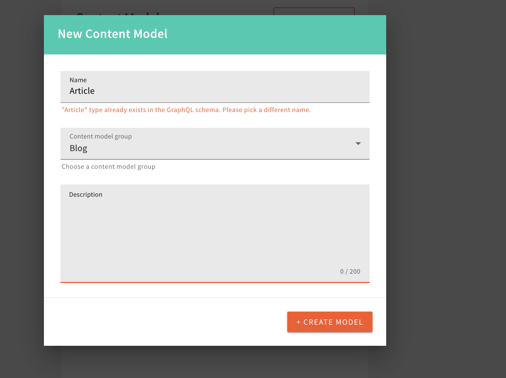

# Changes

## File Manager

### Fixed Tagging of Files ([#2381](https://github.com/webiny/webiny-js/pull/2381))

In some cases, trying to tag an uploaded file in the File Manager would cause the app to break. This has now been addressed.

### Changing the File Upload Limits Is Now Propagated Immediately ([#2385](https://github.com/webiny/webiny-js/pull/2385))

Prior to this release, changes to File Manager settings would not take immediate effect. 

More specifically, if a user tried to upload a file and received the "Max file exceeded." error message, even after incrementing the maximum file upload size limit, and then trying to re-upload the file would not work. Only after a complete page reload the user would be able to continue with the upload. 

 

This has now been addressed. Changes to File Manager settings will take immediate effect and doing a page reload is no longer needed. 

## Headless CMS

### Validate Model Name Against The Existing Models ([#2324](https://github.com/webiny/webiny-js/pull/2324))

We added a check in the UI when creating a new model to verify that the model with same name does not exist in the system already.
The check is still being run on the API side, but this way we do not need to call the API to check for the existing model.

## Development

### Customize The Elasticsearch Index Settings And Mappings For Your Deployment ([#2316](https://github.com/webiny/webiny-js/pull/2316))

We added plugins to customize your Elasticsearch Index creation for any of our applications.
To find out more, read [How To Customize Elasticsearch Index](/docs/core-development-concepts/extending-and-customizing/how-to-customize-elasticsearch-index).

### Split The Elasticsearch Index For Each Of The Locales ([#2323](https://github.com/webiny/webiny-js/pull/2323))

We added an option to split each Elasticsearch Index to per-locale one.
In all new Webiny deployments where the Elasticsearch is used, it is the default behavior.

On all old systems, if you want to change how the indexes are created, and change the existing ones, please read [How To Change Elasticsearch Index Name To Contain Locale](/docs/core-development-concepts/extending-and-customizing/how-to-change-elasticsearch-index-name-to-contain-locale).

### Added Japanese Elasticsearch Index Configuration ([#2326](https://github.com/webiny/webiny-js/pull/2326))

We added the Japanese Elasticsearch Index configuration for all of our applications.

## Page Builder

### New IFrame Component ([#2319](https://github.com/webiny/webiny-js/pull/2319))

A new element is available under the "Media" section of the page builder elements. Choose an iFrame source (which must be a valid URL) to render an iFrame. You can also set different properties at different breakpoints as you can in other elements.

